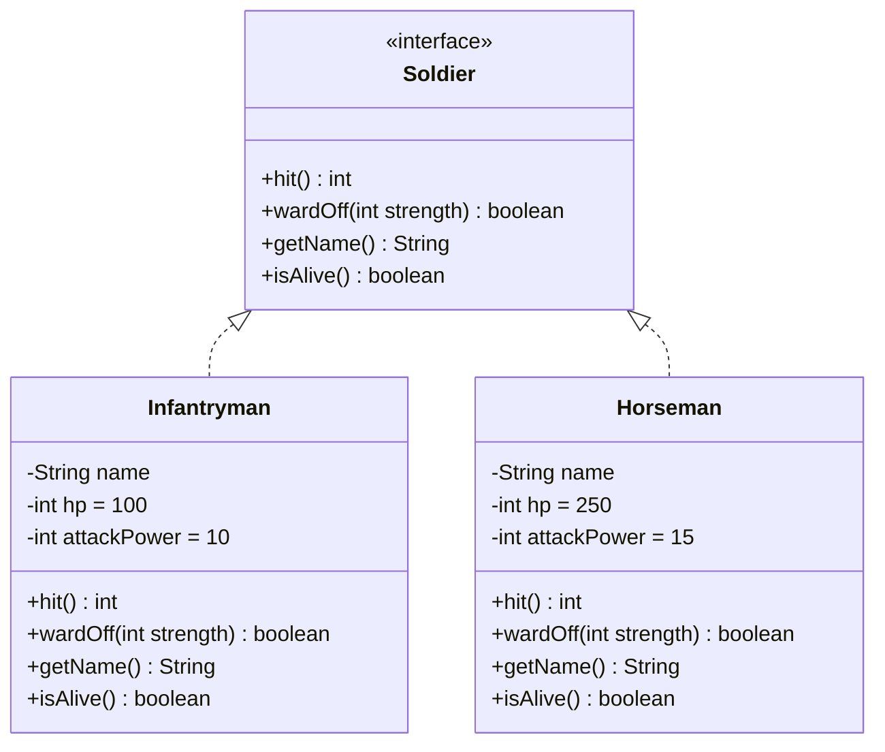
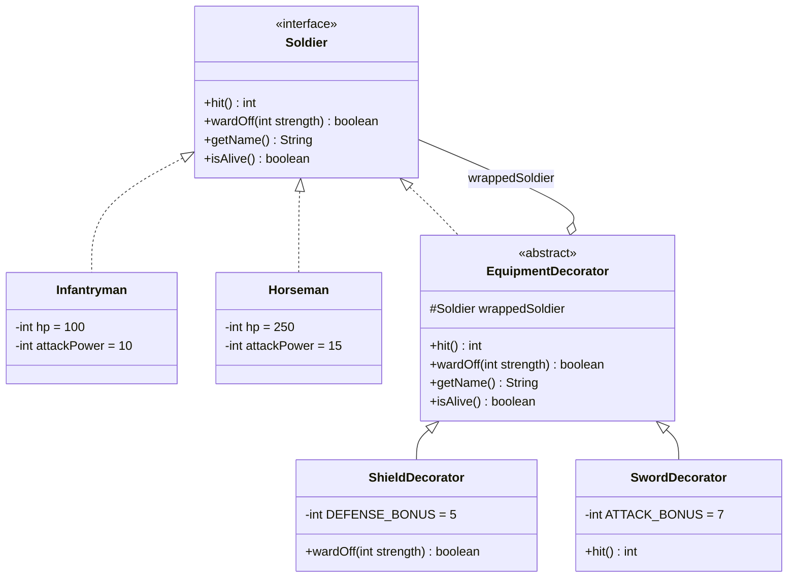
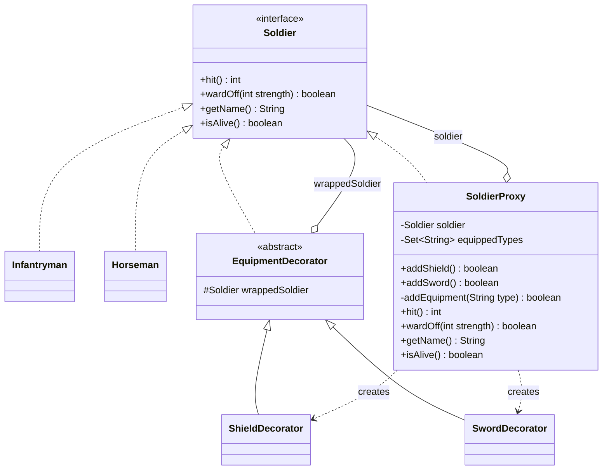
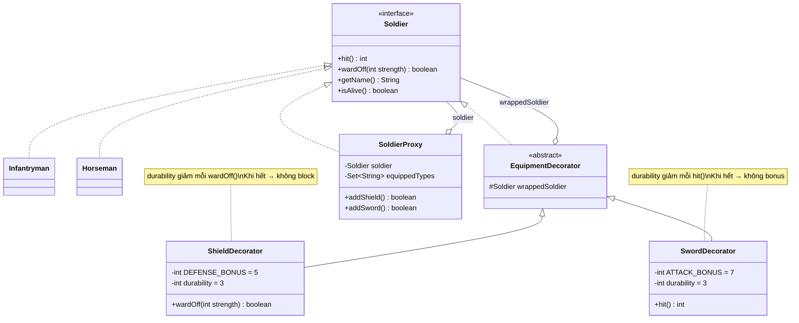
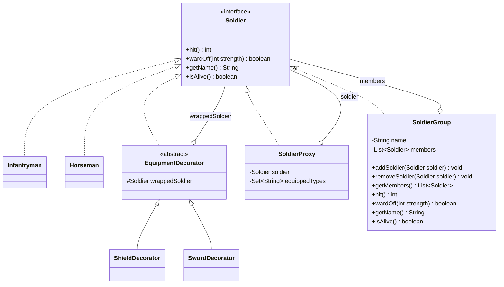
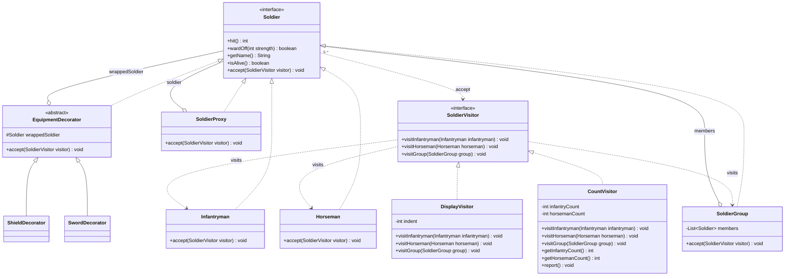
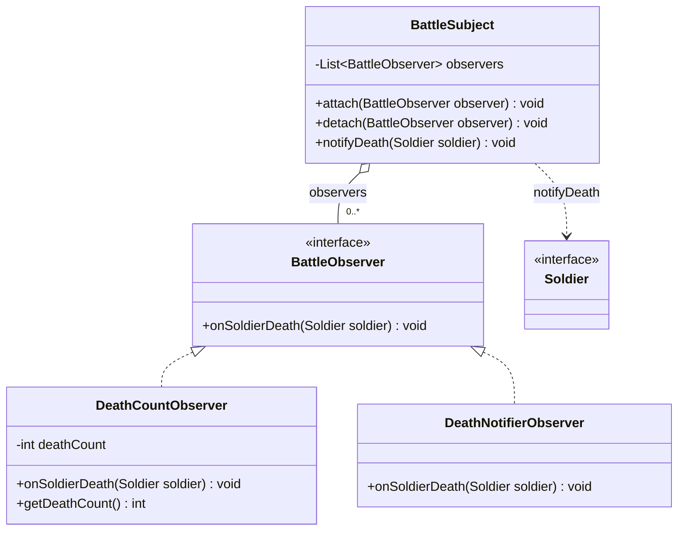
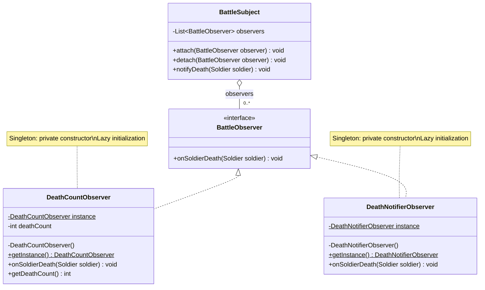
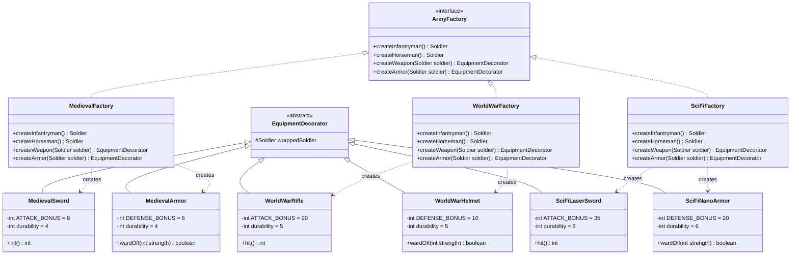

# System Design — Class Diagrams by Phase

> Mỗi phase thể hiện incremental design. Diagram phản ánh đúng code đã implement.

---

## Phase 1 — Soldier Base

**Scope:** Định nghĩa `Soldier` interface và 2 concrete class `Infantryman`, `Horseman` với các hành động cơ bản `hit()` và `wardOff()`.

---

## Phase 2 — Decorator Equipment

**Scope:** Thêm `EquipmentDecorator` (abstract) wrap `Soldier`. `ShieldDecorator` tăng phòng thủ, `SwordDecorator` tăng tấn công. In chuỗi gọi phương thức.

---

## Phase 3 — Proxy Constraint

**Scope:** Thêm `SoldierProxy` implement `Soldier`, cung cấp `addShield()`/`addSword()` với ràng buộc không trùng lặp trang bị bằng `Set<String>`.

---

## Phase 4 — Equipment Durability

**Scope:** Thêm `durability` vào `ShieldDecorator` và `SwordDecorator`. Trang bị giảm hiệu quả sau mỗi lần sử dụng, transparent với client code.

---

## Phase 5 — Composite Army

**Scope:** Thêm `SoldierGroup` implement `Soldier` — chứa `List<Soldier>`. `hit()` = tổng attack, `wardOff()` = chia đều damage. Hỗ trợ nested groups.

---

## Phase 6 — Visitor Operations

**Scope:** Thêm `accept(SoldierVisitor)` vào `Soldier` interface. Tạo `SoldierVisitor` interface + `DisplayVisitor` (in danh sách) và `CountVisitor` (đếm loại).

---

## Phase 7 — Observer Monitoring

**Scope:** Thêm `BattleObserver` interface + `BattleSubject` quản lý observers. `DeathCountObserver` đếm tử trận, `DeathNotifierObserver` thông báo + gửi email mô phỏng.

---

## Phase 8 — Singleton Observers

**Scope:** Chuyển `DeathCountObserver` và `DeathNotifierObserver` thành Singleton: private constructor + static `getInstance()`.

---

## Phase 9 — Abstract Factory Generations

**Scope:** `ArmyFactory` interface + 3 concrete factories (Medieval, WorldWar, SciFi). Mỗi factory tạo binh lính + trang bị tương thích thế hệ. Equipment là `EquipmentDecorator` subclass.

---

## Final System Overview

**Scope:** Toàn bộ hệ thống với 7 design patterns: Decorator, Proxy, Composite, Visitor, Observer, Singleton, Abstract Factory.

```mermaid
classDiagram
    %% === CORE ===
    class Soldier {
        <<interface>>
        +hit() int
        +wardOff(int strength) boolean
        +getName() String
        +isAlive() boolean
        +accept(SoldierVisitor visitor) void
    }

    class Infantryman {
        -String name
        -int hp = 100
        -int attackPower = 10
        +hit() int
        +wardOff(int strength) boolean
        +accept(SoldierVisitor visitor) void
    }

    class Horseman {
        -String name
        -int hp = 250
        -int attackPower = 15
        +hit() int
        +wardOff(int strength) boolean
        +accept(SoldierVisitor visitor) void
    }

    %% === DECORATOR ===
    class EquipmentDecorator {
        <<abstract>>
        #Soldier wrappedSoldier
        +hit() int
        +wardOff(int strength) boolean
        +accept(SoldierVisitor visitor) void
    }

    class ShieldDecorator {
        -int DEFENSE_BONUS = 5
        -int durability = 3
        +wardOff(int strength) boolean
    }

    class SwordDecorator {
        -int ATTACK_BONUS = 7
        -int durability = 3
        +hit() int
    }

    %% === PROXY ===
    class SoldierProxy {
        -Soldier soldier
        -Set~String~ equippedTypes
        +addShield() boolean
        +addSword() boolean
        -addEquipment(String type) boolean
        +hit() int
        +wardOff(int strength) boolean
        +accept(SoldierVisitor visitor) void
    }

    %% === COMPOSITE ===
    class SoldierGroup {
        -String name
        -List~Soldier~ members
        +addSoldier(Soldier soldier) void
        +removeSoldier(Soldier soldier) void
        +getMembers() List~Soldier~
        +hit() int
        +wardOff(int strength) boolean
        +accept(SoldierVisitor visitor) void
    }

    %% === VISITOR ===
    class SoldierVisitor {
        <<interface>>
        +visitInfantryman(Infantryman) void
        +visitHorseman(Horseman) void
        +visitGroup(SoldierGroup) void
    }

    class DisplayVisitor {
        -int indent
        +visitInfantryman(Infantryman) void
        +visitHorseman(Horseman) void
        +visitGroup(SoldierGroup) void
    }

    class CountVisitor {
        -int infantryCount
        -int horsemanCount
        +visitInfantryman(Infantryman) void
        +visitHorseman(Horseman) void
        +visitGroup(SoldierGroup) void
        +getInfantryCount() int
        +getHorsemanCount() int
        +report() void
    }

    %% === OBSERVER ===
    class BattleObserver {
        <<interface>>
        +onSoldierDeath(Soldier soldier) void
    }

    class BattleSubject {
        -List~BattleObserver~ observers
        +attach(BattleObserver) void
        +detach(BattleObserver) void
        +notifyDeath(Soldier) void
    }

    class DeathCountObserver {
        -DeathCountObserver instance$
        -int deathCount
        -DeathCountObserver()
        +getInstance()$ DeathCountObserver
        +onSoldierDeath(Soldier) void
        +getDeathCount() int
    }

    class DeathNotifierObserver {
        -DeathNotifierObserver instance$
        -DeathNotifierObserver()
        +getInstance()$ DeathNotifierObserver
        +onSoldierDeath(Soldier) void
    }

    %% === ABSTRACT FACTORY ===
    class ArmyFactory {
        <<interface>>
        +createInfantryman() Soldier
        +createHorseman() Soldier
        +createWeapon(Soldier) EquipmentDecorator
        +createArmor(Soldier) EquipmentDecorator
    }

    class MedievalFactory
    class WorldWarFactory
    class SciFiFactory

    class MedievalSword {
        -int ATTACK_BONUS = 8
        -int durability = 4
    }
    class MedievalArmor {
        -int DEFENSE_BONUS = 6
        -int durability = 4
    }
    class WorldWarRifle {
        -int ATTACK_BONUS = 20
        -int durability = 5
    }
    class WorldWarHelmet {
        -int DEFENSE_BONUS = 10
        -int durability = 5
    }
    class SciFiLaserSword {
        -int ATTACK_BONUS = 35
        -int durability = 6
    }
    class SciFiNanoArmor {
        -int DEFENSE_BONUS = 20
        -int durability = 6
    }

    %% === RELATIONSHIPS ===
    Soldier <|.. Infantryman
    Soldier <|.. Horseman
    Soldier <|.. EquipmentDecorator
    Soldier <|.. SoldierProxy
    Soldier <|.. SoldierGroup

    EquipmentDecorator o-- Soldier : wrappedSoldier
    EquipmentDecorator <|-- ShieldDecorator
    EquipmentDecorator <|-- SwordDecorator
    EquipmentDecorator <|-- MedievalSword
    EquipmentDecorator <|-- MedievalArmor
    EquipmentDecorator <|-- WorldWarRifle
    EquipmentDecorator <|-- WorldWarHelmet
    EquipmentDecorator <|-- SciFiLaserSword
    EquipmentDecorator <|-- SciFiNanoArmor

    SoldierProxy o-- Soldier : soldier
    SoldierGroup o-- "0..*" Soldier : members

    SoldierVisitor <|.. DisplayVisitor
    SoldierVisitor <|.. CountVisitor
    Soldier ..> SoldierVisitor : accept

    BattleObserver <|.. DeathCountObserver
    BattleObserver <|.. DeathNotifierObserver
    BattleSubject o-- "0..*" BattleObserver : observers

    ArmyFactory <|.. MedievalFactory
    ArmyFactory <|.. WorldWarFactory
    ArmyFactory <|.. SciFiFactory
    MedievalFactory ..> MedievalSword : creates
    MedievalFactory ..> MedievalArmor : creates
    WorldWarFactory ..> WorldWarRifle : creates
    WorldWarFactory ..> WorldWarHelmet : creates
    SciFiFactory ..> SciFiLaserSword : creates
    SciFiFactory ..> SciFiNanoArmor : creates
    ArmyFactory ..> Infantryman : creates
    ArmyFactory ..> Horseman : creates
```

