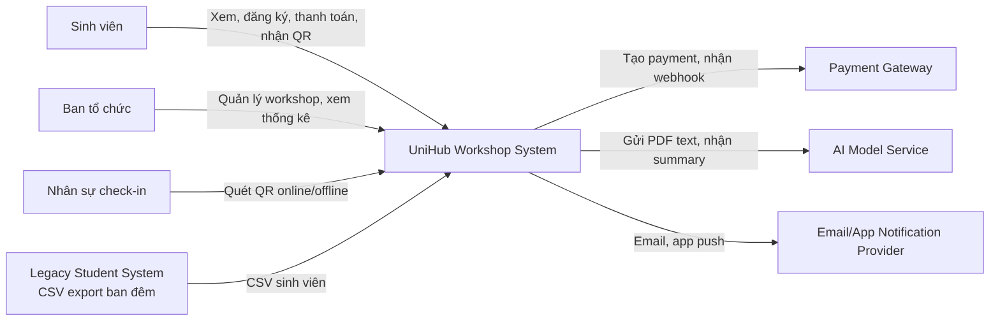
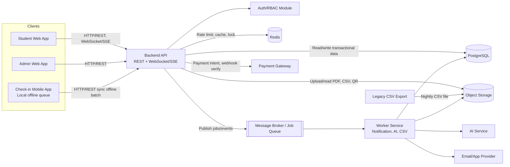
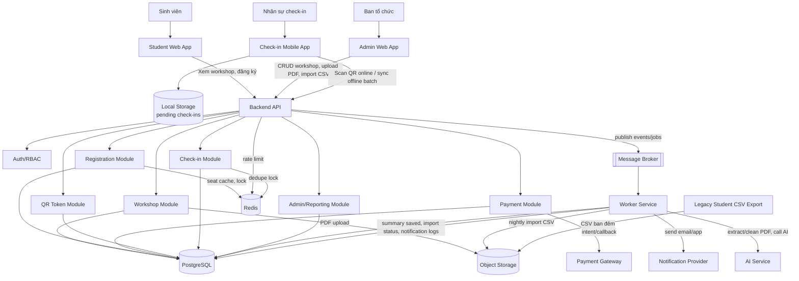
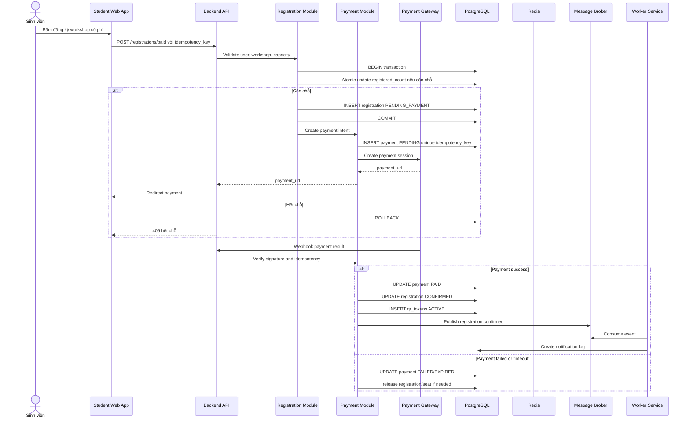
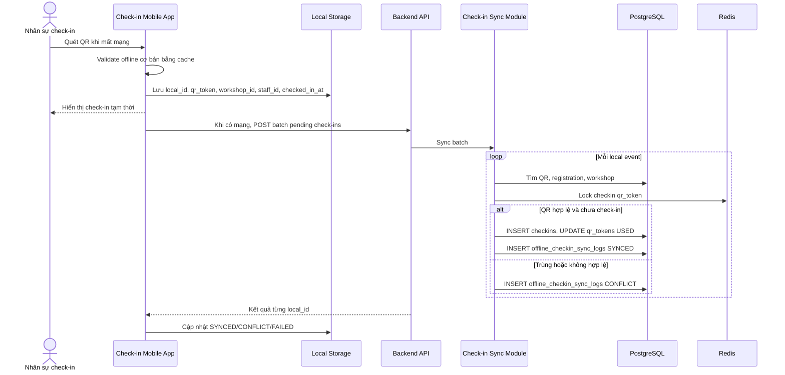
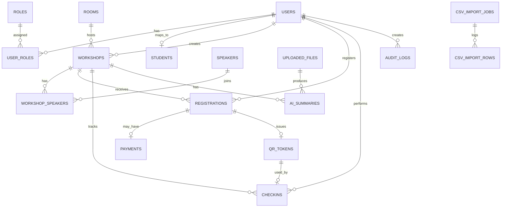

# UniHub Workshop — Technical Design

## Kiến trúc tổng thể

UniHub Workshop dùng **client-server architecture** với Backend API trung tâm. Các client không truy cập database trực tiếp; mọi dữ liệu đi qua API để kiểm soát xác thực, phân quyền, rate limiting, validation, transaction và audit log.

Kiến trúc đề xuất cho đồ án:

- **Student Web App**: sinh viên xem workshop, đăng ký, thanh toán, xem QR và nhận thông báo.
- **Admin Web App**: ban tổ chức quản lý workshop, upload PDF, xem thống kê và theo dõi import.
- **Check-in Mobile App**: nhân sự check-in quét QR, lưu offline queue và batch sync.
- **Backend API**: Node.js hoặc backend framework tương đương, expose REST API và realtime endpoint qua WebSocket/SSE.
- **PostgreSQL**: relational database chính cho users, workshops, registrations, payments, QR, check-ins, import jobs và audit logs.
- **Redis**: cache số chỗ, rate limiting, idempotency cache ngắn hạn, distributed lock khi cần.
- **Message Broker / Job Queue**: ưu tiên RabbitMQ hoặc tương đương để xử lý notification, AI summary, CSV import, payment reconciliation.
- **Worker Service**: xử lý job async, tách khỏi request thread để không làm chậm API.
- **Object Storage / Local Object Storage**: lưu PDF, CSV input, QR image, sơ đồ phòng và report export.
- **Local Storage trên mobile**: SQLite hoặc storage tương đương để lưu offline check-in event.

Lý do chọn kiến trúc này:

- Dễ triển khai trong đồ án vì vẫn có Backend API trung tâm, không bắt buộc vận hành microservice phức tạp.
- Tách rõ nghiệp vụ đồng bộ và bất đồng bộ: đăng ký, payment callback, check-in cần transaction; notification, AI, CSV import chạy async.
- Dễ mở rộng notification và AI processing bằng worker.
- Payment Gateway hoặc AI Service lỗi không làm sập chức năng xem workshop, admin CRUD hoặc check-in offline.
- PostgreSQL đảm bảo consistency cho các điểm nhạy cảm như overbooking, payment state và QR used state.

## Thuật ngữ kỹ thuật

| Thuật ngữ | Giải thích trong UniHub |
| --- | --- |
| Rate Limiting | Giới hạn số request theo user/IP/endpoint trong một khoảng thời gian để bảo vệ Backend API khi 12.000 sinh viên truy cập dồn dập. |
| Circuit Breaker | Cơ chế ngắt tạm thời các lời gọi tới Payment Gateway khi gateway lỗi liên tiếp, tránh backend bị treo vì retry vô hạn. |
| Idempotency Key | Khóa định danh một thao tác có thể retry. Retry cùng key phải trả cùng kết quả hoặc no-op, không tạo thanh toán/đăng ký/check-in trùng. |
| Message Broker | Hàng đợi sự kiện/job giúp API publish công việc async và worker xử lý sau, ví dụ gửi email hoặc xử lý PDF. |
| Worker | Tiến trình nền consume job từ broker, không phục vụ request trực tiếp từ người dùng. |
| RBAC | Role-Based Access Control: kiểm soát quyền theo vai trò STUDENT, ORGANIZER, CHECKIN_STAFF, ADMIN. |

## C4 Diagram

### Level 1 — System Context



### Level 2 — Container



Giao tiếp chính:

- Frontend và mobile gọi Backend API qua HTTP/REST; realtime số chỗ dùng WebSocket/SSE hoặc polling ngắn.
- Backend đọc/ghi PostgreSQL trong transaction cho đăng ký, payment callback và check-in.
- Backend dùng Redis cho rate limit, cache số chỗ, distributed lock và idempotency cache ngắn hạn.
- Backend publish job vào Message Broker cho notification, AI summary, CSV import và reconciliation.
- Worker xử lý job async rồi cập nhật PostgreSQL.
- Mobile app sync offline check-in qua API bằng batch request.

## High-Level Architecture Diagram



## Luồng nghiệp vụ quan trọng

### Luồng đăng ký workshop có phí



### Luồng check-in offline và đồng bộ



## Thiết kế cơ sở dữ liệu

### Lựa chọn database

**PostgreSQL** là database chính vì:

- Dữ liệu có quan hệ rõ ràng: user, student, workshop, room, registration, payment, QR, check-in.
- Cần transaction mạnh để chống overbooking.
- Cần consistency cho payment callback, trạng thái QR và check-in.
- Hỗ trợ unique constraint, foreign key, index và query thống kê.

**Redis** dùng cho:

- Rate limiting theo user/IP/endpoint.
- Cache số chỗ còn lại.
- Idempotency key cache nếu phù hợp.
- Distributed lock cho một số critical path ngắn.

**Message Broker / RabbitMQ** dùng cho:

- Notification gửi email/app.
- AI summary job từ PDF.
- CSV import job.
- Payment reconciliation hoặc retry async.

**Object Storage / local object storage** dùng cho:

- PDF upload.
- File CSV import ban đêm.
- QR image nếu pre-generate.
- Sơ đồ phòng và file export.

### Schema chính

| Bảng | Mục đích | PK | FK | Unique | Index quan trọng |
| --- | --- | --- | --- | --- | --- |
| `users` | Lưu tài khoản hệ thống | `id` | - | `email` | `status`, `created_at` |
| `roles` | Danh mục vai trò RBAC | `id` | - | `name` | `name` |
| `permissions` | Danh mục quyền chi tiết | `id` | - | `code` | `code` |
| `user_roles` | Gán nhiều role cho user nếu cần | `id` | `user_id`, `role_id` | `user_id + role_id` | `user_id`, `role_id` |
| `students` | Hồ sơ sinh viên import từ CSV | `id` | `user_id` nullable | `student_code`, `email` | `student_code`, `major`, `import_batch_id` |
| `rooms` | Phòng tổ chức workshop | `id` | - | `name` | `capacity`, `status` |
| `speakers` | Diễn giả | `id` | - | - | `full_name` |
| `workshops` | Lưu workshop, lịch, phòng, capacity | `id` | `room_id`, `created_by` | `slug` | `start_time`, `room_id`, `status`, `category` |
| `workshop_speakers` | Liên kết workshop và speaker | `id` | `workshop_id`, `speaker_id` | `workshop_id + speaker_id` | `workshop_id`, `speaker_id` |
| `registrations` | Lưu đăng ký workshop | `id` | `user_id`, `workshop_id` | `user_id + workshop_id`, `idempotency_key` | `workshop_id + status`, `user_id` |
| `payments` | Lưu payment attempt | `id` | `registration_id` | `idempotency_key`, `provider_transaction_id` | `status`, `provider_order_id` |
| `payment_callbacks` | Log webhook/callback payment | `id` | `payment_id` | `provider + event_id` | `provider_transaction_id`, `received_at` |
| `qr_tokens` | QR token cho registration | `id` | `registration_id` | `registration_id`, `token_hash` | `status`, `expires_at` |
| `checkins` | Ghi nhận check-in thành công | `id` | `qr_token_id`, `workshop_id`, `staff_id` | `qr_token_id`, `idempotency_key` | `workshop_id`, `checked_in_at` |
| `offline_checkin_sync_logs` | Log sync offline từng local event | `id` | `checkin_id` nullable, `workshop_id` | `device_id + local_id` | `sync_status`, `synced_at` |
| `notifications` | Notification cần gửi/đã gửi | `id` | `user_id`, `workshop_id` nullable | `dedupe_key` | `status`, `event_type`, `created_at` |
| `uploaded_files` | File PDF, CSV, sơ đồ phòng | `id` | `uploaded_by` nullable | `content_hash` optional | `file_type`, `created_at` |
| `ai_summaries` | Kết quả tóm tắt AI | `id` | `workshop_id`, `uploaded_file_id` | `workshop_id + uploaded_file_id` | `status`, `updated_at` |
| `csv_import_jobs` | Trạng thái job import sinh viên | `id` | `file_id`, `created_by` nullable | `file_hash + import_type` | `status`, `started_at` |
| `csv_import_rows` | Log từng dòng CSV | `id` | `job_id` | `job_id + row_number` | `status`, `student_code` |
| `audit_logs` | Lịch sử thao tác quan trọng | `id` | `actor_id` nullable | - | `entity_type + entity_id`, `created_at` |

### ERD rút gọn



### Chống overbooking

Overbooking phải được xử lý trong PostgreSQL transaction. Redis có thể hỗ trợ cache/lock nhưng không phải source of truth.

Ví dụ atomic update:

```sql
UPDATE workshops
SET registered_count = registered_count + 1
WHERE id = :workshop_id
  AND registered_count < capacity;
-- chỉ tạo registration nếu số dòng bị ảnh hưởng = 1, trong cùng transaction
```

Quy trình:

1. Backend bắt đầu transaction.
2. Chạy atomic update trên `workshops`.
3. Nếu số dòng bị ảnh hưởng = 0, workshop đã hết chỗ; rollback và trả 409.
4. Nếu số dòng bị ảnh hưởng = 1, tạo `registrations`.
5. Với workshop miễn phí: tạo `qr_tokens` trong cùng transaction hoặc ngay sau commit với recovery job.
6. Với workshop có phí: tạo registration `PENDING_PAYMENT`; chỉ tạo QR khi payment webhook hợp lệ xác nhận PAID.
7. Commit transaction.

Trade-off:

- Atomic update đơn giản, hiệu quả, phù hợp MVP.
- Nếu cần logic phức tạp hơn như waitlist/seat hold timeout, có thể dùng bảng `seat_holds` và cleanup job.

## Thiết kế kiểm soát truy cập

### Role

- `STUDENT`: xem workshop, đăng ký, xem QR của mình, xem notification của mình.
- `ORGANIZER`: tạo/sửa/hủy workshop, upload PDF, xem thống kê workshop phụ trách.
- `CHECKIN_STAFF`: quét QR, tạo check-in online, sync offline check-in cho workshop được phân công.
- `ADMIN`: quản lý user/role, xem toàn bộ thống kê, xem audit/import logs.

### Kiểm tra quyền

- **API endpoint**: backend middleware/guard xác thực JWT, kiểm tra role/permission và ownership.
- **Admin web route**: route guard ẩn/chặn trang admin nếu user không có ORGANIZER/ADMIN.
- **Mobile app route**: chỉ CHECKIN_STAFF/ORGANIZER/ADMIN được vào màn hình scan/sync.
- **Backend service layer**: kiểm tra lại quyền ở service để tránh bypass qua API khác.

Ví dụ rule:

- Student chỉ xem `qr_tokens` thuộc registration của mình.
- Organizer chỉ sửa workshop do mình tạo hoặc được phân quyền.
- Check-in staff chỉ sync check-in cho workshop/phòng được phân công.
- Admin có quyền override nhưng mọi thao tác quan trọng phải ghi audit log.

## Thiết kế các cơ chế bảo vệ hệ thống

### Kiểm soát tải đột biến

**Token Bucket** hoặc **Sliding Window Rate Limiting** được lưu trong Redis:

- Giới hạn theo `user_id` khi đã đăng nhập.
- Giới hạn theo IP cho unauthenticated request.
- Endpoint đăng ký có limit riêng thấp hơn endpoint xem workshop.
- Endpoint payment intent có limit riêng để tránh spam cổng thanh toán.
- Khi vượt ngưỡng, API trả HTTP 429 kèm `Retry-After`.
- Với đợt mở đăng ký lớn, có thể dùng waiting-room nhẹ: sinh viên lấy slot ngắn hạn trước khi gọi endpoint đăng ký.

Chính sách gợi ý:

| Endpoint | Limit gợi ý | Lý do |
| --- | --- | --- |
| `GET /workshops` | Cao, cacheable | 12.000 sinh viên xem lịch cùng lúc. |
| `GET /workshops/:id` | Cao, cacheable | Trang chi tiết cần mượt. |
| `POST /registrations` | Thấp hơn, theo user | Bảo vệ transaction giữ chỗ. |
| `POST /payments/intents` | Thấp, theo user/workshop | Bảo vệ gateway và chống spam. |
| `POST /checkins/sync` | Theo device/staff | Tránh sync loop khi mạng chập chờn. |

### Xử lý cổng thanh toán không ổn định

Dùng **Circuit Breaker** với 3 trạng thái:

- **Closed**: gateway bình thường, request đi qua.
- **Open**: gateway lỗi liên tiếp vượt ngưỡng; hệ thống tạm ngừng tạo payment intent.
- **Half-Open**: sau thời gian nghỉ, thử một số request nhỏ để kiểm tra gateway hồi phục.

Hành vi:

- Khi gateway timeout/lỗi liên tiếp, circuit chuyển Open.
- Sinh viên vẫn xem workshop, xem QR cũ và đăng ký workshop miễn phí bình thường.
- Workshop có phí trả thông báo “Cổng thanh toán tạm thời không khả dụng, vui lòng thử lại sau”.
- Backend không retry vô hạn trong request thread.
- Payment reconciliation worker xử lý các payment PENDING lâu bất thường.

### Chống trừ tiền hai lần

Dùng **Idempotency Key**:

- Backend hoặc client sinh `idempotency_key` cho mỗi payment attempt.
- Lưu key trong `payments.idempotency_key` với unique constraint.
- Nếu client retry cùng key, API trả lại payment attempt cũ thay vì tạo attempt mới.
- TTL logic ở Redis có thể là 24 giờ để tăng tốc lookup, nhưng PostgreSQL unique constraint vẫn là nguồn bảo vệ cuối cùng.
- Webhook từ gateway cũng phải idempotent theo `provider_event_id` hoặc `provider_transaction_id`.

### Check-in offline

Mobile app lưu local event:

- `local_id`
- `device_id`
- `qr_token`
- `workshop_id`
- `checked_in_at`
- `staff_id`
- `sync_status`

Khi có mạng:

1. App gửi batch pending events.
2. Backend xử lý từng event trong transaction ngắn.
3. Unique (`device_id`, `local_id`) giúp retry sync không tạo dòng trùng.
4. Unique `qr_token_id` trong `checkins` đảm bảo một QR chỉ check-in thành công một lần.
5. Nếu QR không hợp lệ, đã dùng, workshop đã hủy hoặc sai workshop, backend ghi `offline_checkin_sync_logs` với conflict reason.

### CSV import

Worker chạy theo lịch hoặc admin trigger:

1. Đọc file CSV từ Object Storage/thư mục import.
2. Validate file tồn tại, encoding, header và schema.
3. Validate từng dòng: `student_code`, email, họ tên, ngành/lớp.
4. Upsert `students` theo `student_code` hoặc email unique.
5. Ghi `csv_import_jobs` và `csv_import_rows`.
6. Dòng lỗi không rollback toàn bộ job; job kết thúc `DONE_WITH_ERRORS`.
7. File lỗi hoặc sai schema không ảnh hưởng API đang chạy.

## Các quyết định kỹ thuật quan trọng — ADR

### ADR-001: Chọn PostgreSQL thay vì NoSQL làm database chính

- **Context:** Registration, payment và check-in cần consistency mạnh, unique constraint và transaction.
- **Decision:** Dùng PostgreSQL cho dữ liệu giao dịch chính.
- **Consequences:** Dễ đảm bảo không overbooking, dễ truy vấn báo cáo và audit.
- **Trade-offs:** Cần thiết kế index/transaction cẩn thận; scale write phức tạp hơn NoSQL nếu tải cực lớn, nhưng đủ phù hợp cho đồ án và quy mô sự kiện.

### ADR-002: Chọn Redis cho rate limit/cache/lock

- **Context:** 12.000 sinh viên truy cập trong 10 phút đầu, cần counter tốc độ cao và TTL.
- **Decision:** Dùng Redis cho rate limiting, cache số chỗ và lock ngắn hạn.
- **Consequences:** API giảm tải PostgreSQL, phản hồi nhanh hơn trong cao điểm.
- **Trade-offs:** Redis là dữ liệu tạm; cần resync từ PostgreSQL nếu cache lệch.

### ADR-003: Chọn Message Broker/Job Queue cho notification, AI summary, CSV import

- **Context:** Gửi email, xử lý PDF và import CSV không nên chặn request người dùng.
- **Decision:** Dùng RabbitMQ hoặc broker tương đương, Worker Service consume job.
- **Consequences:** Hệ thống resilient hơn; lỗi provider không rollback nghiệp vụ chính.
- **Trade-offs:** Tăng độ phức tạp vận hành; cần retry, dead-letter và monitoring job.

### ADR-004: Chọn RBAC cho phân quyền

- **Context:** Có bốn nhóm quyền rõ ràng: sinh viên, ban tổ chức, staff check-in, admin.
- **Decision:** Dùng RBAC ở backend guard và client route guard.
- **Consequences:** Dễ kiểm soát quyền và audit.
- **Trade-offs:** Nếu cần phân quyền rất chi tiết theo từng workshop/phòng, phải bổ sung permission/assignment table.

### ADR-005: Chọn Idempotency Key cho payment

- **Context:** Payment Gateway có thể timeout, retry, callback lặp; không được trừ tiền hai lần.
- **Decision:** Mỗi payment attempt có idempotency key lưu ở PostgreSQL và cache Redis nếu cần.
- **Consequences:** Retry an toàn, callback duplicate không gây side effect mới.
- **Trade-offs:** Cần quản lý lifecycle key và định nghĩa rõ khi nào tạo payment attempt mới.

### ADR-006: Chọn offline-first local storage cho check-in app

- **Context:** Wi-Fi tại cửa phòng có thể mất hoặc yếu; check-in không được dừng.
- **Decision:** Mobile app lưu offline queue cục bộ và batch sync khi online.
- **Consequences:** Nhân sự check-in tiếp tục làm việc khi mất mạng, dữ liệu không mất nếu app được lưu bền vững.
- **Trade-offs:** Offline validation chỉ tương đối; backend phải xử lý conflict khi sync.

## Tài liệu tham khảo

- OpenSpec gợi ý artifact `proposal.md`, `specs/`, `design.md`, `tasks.md`: https://github.com/Fission-AI/OpenSpec
- Mermaid flowchart/sequence/ER diagram syntax: https://mermaid.ai/open-source/syntax/flowchart.html
- PostgreSQL documentation: https://www.postgresql.org/docs/current/
- Redis rate limiter use case: https://redis.io/docs/latest/develop/use-cases/rate-limiter/
- Circuit Breaker pattern: https://learn.microsoft.com/en-us/azure/architecture/patterns/circuit-breaker
- Idempotent requests concept: https://docs.stripe.com/api/idempotent_requests
