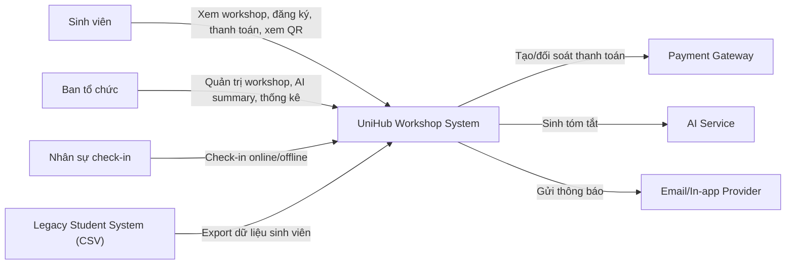
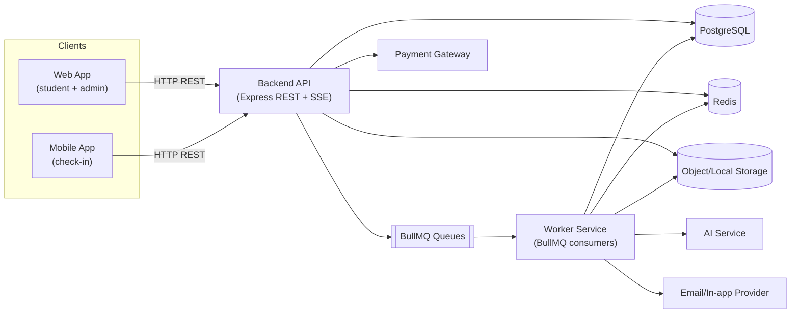
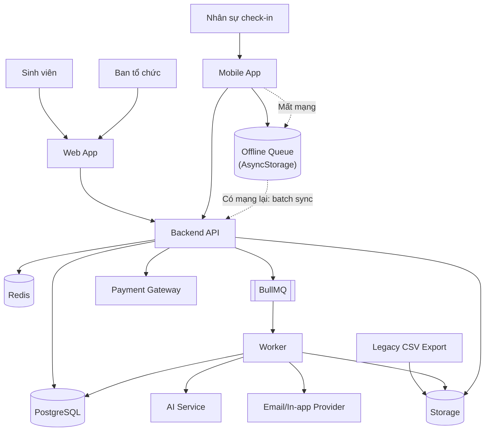

# UniHub Workshop — Technical Design

## Kiến trúc tổng thể
UniHub Workshop triển khai theo mô hình client-server, với backend API làm trung tâm điều phối nghiệp vụ.

Các thành phần chính:
- Web app (`apps/web`): dành cho student và admin (xem workshop, đăng ký, thanh toán, xem QR, quản trị).
- Mobile app (`apps/mobile`): dành cho check-in online/offline và đồng bộ hàng đợi offline.
- Backend API (`apps/api`): xử lý auth, RBAC, workshop, registration, payment, check-in, notification API, admin API.
- Worker (`apps/worker`): xử lý tác vụ bất đồng bộ (notification, AI summary, student import, payment reconcile, workshop status).
- PostgreSQL: dữ liệu giao dịch chính.
- Redis: rate limit, pub/sub, và hạ tầng kết nối queue.
- BullMQ queues: điều phối job bất đồng bộ.
- Object/local storage: lưu PDF và file nhập liệu.

Giao tiếp:
- Web/Mobile gọi API qua HTTP REST.
- API enqueue job vào BullMQ.
- Worker consume job và cập nhật PostgreSQL.
- Seat updates stream qua SSE endpoint.

## C4 Diagram

### Level 1 — System Context

```mermaid
flowchart LR
  Student["Sinh viên"] -->|"Xem workshop, đăng ký, thanh toán, xem QR"| UniHub["UniHub Workshop System"]
  Organizer["Ban tổ chức"] -->|"Quản trị workshop, AI summary, thống kê"| UniHub
  Staff["Nhân sự check-in"] -->|"Check-in online/offline"| UniHub

  UniHub -->|"Tạo/đối soát thanh toán"| PaymentGateway["Payment Gateway"]
  UniHub -->|"Sinh tóm tắt"| AIService["AI Service"]
  LegacyCSV["Legacy Student System (CSV)"] -->|"Export dữ liệu sinh viên"| UniHub
  UniHub -->|"Gửi thông báo"| NotifyProvider["Email/In-app Provider"]
```

### Level 2 — Container

```mermaid
flowchart LR
  subgraph Clients["Clients"]
    Web["Web App\n(student + admin)"]
    Mobile["Mobile App\n(check-in)"]
  end

  API["Backend API\n(Express REST + SSE)"]
  Worker["Worker Service\n(BullMQ consumers)"]
  DB[("PostgreSQL")]
  Redis[("Redis")]
  Queue[["BullMQ Queues"]]
  Storage[("Object/Local Storage")]

  PaymentGateway["Payment Gateway"]
  AIService["AI Service"]
  NotifyProvider["Email/In-app Provider"]

  Web -->|"HTTP REST"| API
  Mobile -->|"HTTP REST"| API

  API --> DB
  API --> Redis
  API --> Queue
  API --> Storage
  API --> PaymentGateway

  Queue --> Worker
  Worker --> DB
  Worker --> Redis
  Worker --> Storage
  Worker --> AIService
  Worker --> NotifyProvider
```

## High-Level Architecture Diagram

```mermaid
flowchart TB
  Student["Sinh viên"] --> Web["Web App"]
  Organizer["Ban tổ chức"] --> Web
  Staff["Nhân sự check-in"] --> Mobile["Mobile App"]

  Mobile --> LocalQ[("Offline Queue\n(AsyncStorage)")]

  Web --> API["Backend API"]
  Mobile --> API

  API --> PG[("PostgreSQL")]
  API --> Redis[("Redis")]
  API --> Queue[["BullMQ"]]

  API --> Pay["Payment Gateway"]

  Queue --> Worker["Worker"]
  Worker --> PG
  Worker --> AI["AI Service"]
  Worker --> Notify["Email/In-app Provider"]

  Legacy["Legacy CSV Export"] --> Storage[("Storage")]
  Worker --> Storage
  API --> Storage

  Mobile -. Mất mạng .-> LocalQ
  LocalQ -. Có mạng lại: batch sync .-> API
```

## Thiết kế cơ sở dữ liệu
Loại database:
- PostgreSQL được chọn làm source of truth vì cần transaction mạnh, unique constraints và quan hệ dữ liệu rõ ràng.

Các nhóm entity chính:
- Auth/User: `users`, `student_profiles`.
- Workshop domain: `rooms`, `workshops`, `speakers`, `workshop_speakers`.
- Registration/Payment: `registrations`, `payments`, `payment_callbacks`, `qr_tokens`.
- Check-in: `checkins`, `offline_checkin_sync_logs`.
- Notification: `notifications`, `notification_preferences`, `notification_deliveries`.
- AI Summary: `uploaded_files`, `ai_summaries`.
- Student import: `student_import_runs`, `student_import_errors`.
- Audit: `audit_logs`.

Nguyên tắc nhất quán:
- Overbooking được chặn bằng transaction + atomic update seat count.
- Idempotency được đảm bảo bởi unique key và logic kiểm tra trùng.

## Thiết kế kiểm soát truy cập
Mô hình:
- RBAC với 4 role: `STUDENT`, `CHECKIN_STAFF`, `ORGANIZER`, `ADMIN`.

Điểm kiểm tra quyền:
- Backend: `requireAuth` + `requireRole` là lớp bảo vệ chính cho endpoint.
- Web: route guard để UX rõ ràng, nhưng không thay thế backend guard.
- Mobile: chỉ cho role check-in/admin dùng luồng check-in.

Nguyên tắc:
- Mọi nghiệp vụ nhạy cảm phải kiểm tra role tại backend.
- Frontend guard chỉ là lớp hỗ trợ điều hướng.

## Thiết kế các cơ chế bảo vệ hệ thống

### Kiểm soát tải đột biến
Giải pháp:
- Rate limiting qua Redis cho API.

Hành vi:
- Khi vượt ngưỡng: trả `429`.
- Endpoint nhạy cảm (đăng ký/check-in sync) có policy riêng chặt hơn endpoint đọc.

### Xử lý cổng thanh toán không ổn định
Giải pháp:
- Payment flow có cơ chế retry/reconcile bất đồng bộ bằng worker queue.
- Callback xử lý idempotent, không phụ thuộc redirect phía client.

Hành vi:
- Lỗi gateway không làm sập luồng xem workshop hoặc các luồng không liên quan.
- Trạng thái payment giữ nhất quán và có thể được reconcile.

### Chống trừ tiền hai lần
Giải pháp:
- Dùng idempotency key và unique constraints cho payment attempt/callback.
- Callback duplicate được xử lý no-op theo transaction id/event id.

Lưu trữ:
- Dữ liệu idempotency và callback lưu trong PostgreSQL.
- Redis hỗ trợ ở lớp điều phối/ngắn hạn (nếu cần), không thay PostgreSQL.

## Các quyết định kỹ thuật quan trọng (ADR)

- Chọn PostgreSQL làm source of truth.
  - Lý do: transaction mạnh, relational consistency.
  - Đánh đổi: cần thiết kế index/transaction cẩn thận khi tải cao.

- Chọn Redis cho rate limit và queue infrastructure support.
  - Lý do: xử lý counter và trạng thái ngắn hạn nhanh.
  - Đánh đổi: dữ liệu Redis không thay thế dữ liệu giao dịch trong PostgreSQL.

- Chọn BullMQ cho job bất đồng bộ.
  - Lý do: tách luồng nặng khỏi request sync (notification, AI, import, reconcile).
  - Đánh đổi: tăng độ phức tạp vận hành queue/worker.

- Chọn JWT + RBAC guard tại backend.
  - Lý do: đơn giản, phù hợp đa client (web/mobile), kiểm soát quyền tập trung.
  - Đánh đổi: cần quản lý vòng đời token và xử lý session hết hạn rõ ràng.

- Check-in mobile-first với offline queue.
  - Lý do: đảm bảo vận hành check-in khi mạng không ổn định tại điểm sự kiện.
  - Đánh đổi: cần cơ chế sync conflict/dedupe rõ ràng ở backend.
