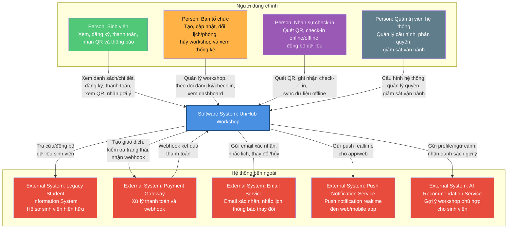

# UniHub Workshop - C4 Diagram

## 1. Tổng quan

UniHub Workshop là nền tảng quản lý workshop trong tuần lễ sự kiện của trường đại học. Hệ thống hỗ trợ sinh viên tìm kiếm và đăng ký workshop, thanh toán workshop có phí, nhận QR check-in, nhận thông báo, nhận gợi ý workshop phù hợp từ AI; đồng thời hỗ trợ ban tổ chức quản lý workshop, theo dõi thống kê và hỗ trợ nhân sự check-in hoạt động online/offline.

Tài liệu này mô tả hai cấp đầu của C4 Model:

- **Level 1 - System Context Diagram**: bức tranh tổng quan về actor, hệ thống UniHub Workshop và các hệ thống bên ngoài.
- **Level 2 - Container Diagram**: phân rã UniHub Workshop thành các container chính, công nghệ đề xuất và cách giao tiếp giữa các container.

Quy ước trong diagram container:

- **[Sync]**: giao tiếp đồng bộ request/response, thường qua HTTPS REST API, WebSocket/SSE hoặc webhook.
- **[Async]**: giao tiếp bất đồng bộ qua Message Broker/Event Bus.
- **[Data]**: truy cập hạ tầng dữ liệu nội bộ. Frontend và actor không truy cập database trực tiếp.

---

## 2. C4 Level 1 - System Context Diagram

### Giải thích Level 1

**Actors**

| Actor                  | Vai trò                                                                                                             |
| ---------------------- | ------------------------------------------------------------------------------------------------------------------- |
| Sinh viên              | Sử dụng web/app để xem danh sách workshop, xem chi tiết, đăng ký, thanh toán workshop có phí, nhận QR và thông báo. |
| Ban tổ chức            | Dùng admin web để tạo, cập nhật, đổi lịch/phòng, hủy workshop và xem thống kê đăng ký/check-in.                     |
| Nhân sự check-in       | Dùng mobile app để quét QR, ghi nhận tham dự; khi mất mạng có thể lưu offline và đồng bộ sau.                       |
| Quản trị viên hệ thống | Quản lý cấu hình, phân quyền, cấu hình tích hợp và theo dõi vận hành.                                               |

**Giá trị UniHub Workshop cung cấp**

UniHub Workshop là hệ thống trung tâm quản lý toàn bộ vòng đời workshop: công bố thông tin, đăng ký, thanh toán, phát hành QR, check-in, thông báo, thống kê và gợi ý workshop. Hệ thống giúp giảm thao tác thủ công cho ban tổ chức, tránh overbooking, tăng tốc check-in và cải thiện trải nghiệm sinh viên.

**External systems**

| Hệ thống ngoài                    | Mục đích sử dụng                                                                                    |
| --------------------------------- | --------------------------------------------------------------------------------------------------- |
| Legacy Student Information System | Tra cứu hoặc đồng bộ hồ sơ sinh viên, bao gồm MSSV, email, lớp, ngành học.                          |
| Payment Gateway                   | Xử lý thanh toán workshop có phí và gửi webhook kết quả thanh toán về UniHub.                       |
| Email Service                     | Gửi email xác nhận đăng ký, hóa đơn/biên nhận, nhắc lịch và thông báo workshop thay đổi/hủy.        |
| Push Notification Service         | Gửi thông báo realtime đến web/mobile app, ví dụ seat update, reminder, workshop changed/cancelled. |
| AI Recommendation Service         | Nhận profile/ngữ cảnh sinh viên và trả về danh sách workshop được gợi ý.                            |

---

## 3. C4 Level 2 - Container Diagram

```mermaid
graph TB
    subgraph Client["Client / Frontend"]
        StudentApp["Container: Student App / Student Web App<br/>React / Next.js<br/>Xem workshop, đăng ký, thanh toán,<br/>xem QR, nhận gợi ý"]
        AdminWeb["Container: Admin Web App<br/>React / Next.js<br/>Quản lý workshop, phòng/giờ,<br/>hủy workshop, dashboard"]
        CheckinMobile["Container: Check-in Mobile App<br/>Flutter<br/>Quét QR, check-in offline,<br/>sync batch khi online"]
        LocalSQLite["Local Data Store: SQLite<br/>Lưu pending offline check-ins<br/>trên thiết bị check-in"]
    end

    subgraph UniHubBoundary["Software System: UniHub Workshop"]
        subgraph Backend["Backend / Application Layer"]
            APIGateway["Container: API Gateway / Backend API<br/>Node.js<br/>REST API, WebSocket/SSE,<br/>routing, rate limit, CORS"]
            AuthModule["Container: Authentication / Authorization Module<br/>Node.js + JWT/OAuth2<br/>Đăng nhập, phân quyền,<br/>kiểm tra role"]
            WorkshopService["Container: Workshop Management Service<br/>Node.js<br/>Quản lý workshop, speaker,<br/>room, schedule, capacity"]
            RegistrationService["Container: Registration Service<br/>Node.js<br/>Đăng ký workshop, seat control,<br/>idempotency, phát hành ticket"]
            PaymentService["Container: Payment Integration Service<br/>Node.js<br/>Tạo payment order,<br/>xử lý webhook/idempotency"]
            QRService["Container: QR Code Service<br/>Node.js<br/>Tạo QR payload/image,<br/>quản lý trạng thái ticket"]
            CheckinSyncService["Container: Check-in Sync Service<br/>Node.js<br/>Validate QR, nhận sync offline,<br/>deduplicate check-in"]
            NotificationService["Container: Notification Service<br/>Node.js<br/>Consume event, gửi email/push,<br/>retry delivery"]
            AIAdapter["Container: AI Recommendation Adapter<br/>Python FastAPI<br/>Chuẩn hóa profile/context,<br/>gọi AI Recommendation Service"]
        end

        subgraph DataInfra["Data / Infrastructure"]
            PostgreSQL["Container: PostgreSQL<br/>Core transactional database<br/>Source of truth cho users,<br/>workshops, registrations,<br/>payments, tickets, check-ins"]
            Redis["Container: Redis<br/>Cache, session, seat availability,<br/>distributed lock, short-lived data"]
            MessageBroker["Container: Message Broker / Event Bus<br/>RabbitMQ hoặc Kafka<br/>Async events: registration,<br/>payment, notification, sync"]
            ObjectStorage["Container: Cloudinary<br/>Image/File Management & Delivery<br/>Ảnh workshop, sơ đồ phòng,<br/>QR image, PDF tài liệu workshop"]
        end
    end

    subgraph ExternalSystems["External Systems"]
        LegacySIS["External: Legacy Student<br/>Information System"]
        PaymentGateway["External: Payment Gateway"]
        EmailService["External: Email Service"]
        PushService["External: Push Notification Service"]
        AIRecommendation["External: AI Recommendation Service"]
    end

    StudentApp -->|"[Sync] HTTPS REST API"| APIGateway
    StudentApp <-->|"[Sync] WebSocket/SSE<br/>seat availability, realtime notice"| APIGateway
    AdminWeb -->|"[Sync] HTTPS REST API"| APIGateway
    AdminWeb <-->|"[Sync] WebSocket/SSE<br/>dashboard/realtime updates"| APIGateway
    CheckinMobile -->|"[Sync] HTTPS REST API<br/>scan/sync batch"| APIGateway
    CheckinMobile <--> |"[Local] offline check-in queue"| LocalSQLite

    APIGateway -->|"[Sync] authenticate/authorize"| AuthModule
    APIGateway -->|"[Sync] workshop CRUD/search/detail"| WorkshopService
    APIGateway -->|"[Sync] register/cancel registration"| RegistrationService
    APIGateway -->|"[Sync] create payment/status"| PaymentService
    APIGateway -->|"[Sync] get/download QR"| QRService
    APIGateway -->|"[Sync] scan QR/sync offline"| CheckinSyncService
    APIGateway -->|"[Sync] notification preferences/history"| NotificationService
    APIGateway -->|"[Sync] get recommendations"| AIAdapter

    AuthModule -->|"[Sync] lookup student identity/profile"| LegacySIS
    AuthModule -->|"[Data] users, roles, permissions"| PostgreSQL
    AuthModule -->|"[Data] sessions/token blacklist"| Redis

    WorkshopService -->|"[Data] workshops, rooms, speakers"| PostgreSQL
    WorkshopService -->|"[Data] cache workshop list/detail"| Redis
    WorkshopService -->|"[Data] images, room layouts, docs"| ObjectStorage
    WorkshopService -->|"[Async] publish workshop.updated/cancelled"| MessageBroker

    RegistrationService -->|"[Data] registrations, tickets"| PostgreSQL
    RegistrationService -->|"[Data] seat counter, distributed lock"| Redis
    RegistrationService -->|"[Sync] generate ticket/QR"| QRService
    RegistrationService -->|"[Async] publish registration.created,<br/>seat.updated"| MessageBroker

    PaymentService -->|"[Data] payments, callbacks"| PostgreSQL
    PaymentService -->|"[Sync] charge/payment status API"| PaymentGateway
    PaymentGateway -->|"[Sync] webhook callback"| APIGateway
    APIGateway -->|"[Sync] route payment webhook"| PaymentService
    PaymentService -->|"[Async] publish payment.completed/failed"| MessageBroker

    QRService -->|"[Data] ticket status"| PostgreSQL
    QRService -->|"[Data] QR images"| ObjectStorage

    CheckinSyncService -->|"[Data] check-ins, offline sync log"| PostgreSQL
    CheckinSyncService -->|"[Data] QR/check-in lock, duplicate guard"| Redis
    CheckinSyncService -->|"[Async] publish checkin.recorded,<br/>checkin.offline.synced"| MessageBroker

    NotificationService -->|"[Async] consume registration/payment/<br/>workshop/check-in events"| MessageBroker
    NotificationService -->|"[Data] notification log, templates,<br/>preferences"| PostgreSQL
    NotificationService -->|"[Sync] send email"| EmailService
    NotificationService -->|"[Sync] send push"| PushService

    AIAdapter -->|"[Data] student profile, registrations,<br/>workshop metadata"| PostgreSQL
    AIAdapter -->|"[Data] recommendation cache"| Redis
    AIAdapter -->|"[Sync] recommendation request"| AIRecommendation

    style APIGateway fill:#4A90E2,color:#fff
    style AuthModule fill:#4A90E2,color:#fff
    style WorkshopService fill:#9B59B6,color:#fff
    style RegistrationService fill:#9B59B6,color:#fff
    style PaymentService fill:#9B59B6,color:#fff
    style QRService fill:#9B59B6,color:#fff
    style CheckinSyncService fill:#9B59B6,color:#fff
    style NotificationService fill:#9B59B6,color:#fff
    style AIAdapter fill:#9B59B6,color:#fff
    style PostgreSQL fill:#E67E22,color:#fff
    style Redis fill:#E67E22,color:#fff
    style MessageBroker fill:#C0392B,color:#fff
    style ObjectStorage fill:#E67E22,color:#fff
```

### Container catalog

#### Client / Frontend

| Container                     | Vai trò                                                                                                     | Công nghệ đề xuất | Giao tiếp                                                                                          |
| ----------------------------- | ----------------------------------------------------------------------------------------------------------- | ----------------- | -------------------------------------------------------------------------------------------------- |
| Student App / Student Web App | Cho sinh viên xem danh sách/chi tiết workshop, đăng ký, thanh toán, xem QR, nhận thông báo và xem gợi ý AI. | React             | Gọi API Gateway qua HTTPS REST API; nhận realtime seat availability qua WebSocket/SSE.             |
| Admin Web App                 | Cho ban tổ chức tạo/cập nhật/hủy workshop, quản lý phòng/giờ, theo dõi đăng ký/check-in và dashboard.       | React             | Gọi API Gateway qua HTTPS REST API; có thể nhận realtime dashboard/notification qua WebSocket/SSE. |
| Check-in Mobile App           | Cho nhân sự check-in quét QR, ghi nhận check-in online/offline, đồng bộ batch khi có mạng.                  | React Native      | Gọi API Gateway qua HTTPS REST API; lưu tạm offline scan vào SQLite nội bộ.                        |
| Local SQLite                  | Lưu pending offline check-in trên thiết bị mobile để không mất dữ liệu khi mất mạng.                        | SQLite embedded   | Chỉ Check-in Mobile App truy cập local; không phải source of truth toàn hệ thống.                  |

#### Backend / Application Layer

| Container                             | Vai trò                                                                                                  | Công nghệ đề xuất    | Giao tiếp                                                                                                    |
| ------------------------------------- | -------------------------------------------------------------------------------------------------------- | -------------------- | ------------------------------------------------------------------------------------------------------------ |
| API Gateway / Backend API             | Entry point cho frontend/mobile, routing, rate limit, CORS, WebSocket/SSE endpoint, route webhook.       | Node.js              | Nhận HTTPS từ client; gọi các service nội bộ đồng bộ; route webhook từ Payment Gateway.                      |
| Authentication / Authorization Module | Xác thực, phát hành/verify JWT, quản lý role và permission.                                              | Node.js + JWT/OAuth2 | Gọi PostgreSQL cho users/roles; Redis cho session/token blacklist; tích hợp Legacy SIS khi cần profile.      |
| Workshop Management Service           | Quản lý workshop, speaker, room, schedule, capacity rule, trạng thái published/cancelled.                | Node.js              | Đọc/ghi PostgreSQL; cache Redis; lưu ảnh/tài liệu/sơ đồ phòng vào Cloudinary; publish event bất đồng bộ. |
| Registration Service                  | Xử lý đăng ký, idempotency, seat availability, tránh overbooking, tạo ticket sau khi đăng ký thành công. | Node.js              | Đọc/ghi PostgreSQL; dùng Redis lock/counter; gọi QR Code Service đồng bộ; publish event qua broker.          |
| Payment Integration Service           | Tạo payment order, gọi Payment Gateway, nhận webhook, đảm bảo idempotency.                               | Node.js              | Gọi Payment Gateway qua HTTPS API; nhận webhook qua API Gateway; ghi PostgreSQL; publish payment events.     |
| QR Code Service                       | Tạo QR payload/image, quản lý QR/ticket status, hỗ trợ download QR.                                      | Node.js              | Đọc/ghi ticket status trong PostgreSQL; lưu QR image vào Cloudinary.                                     |
| Check-in Sync Service                 | Validate QR, ghi nhận check-in online, nhận batch offline sync, xử lý duplicate/conflict.                | Node.js              | Đọc/ghi PostgreSQL; dùng Redis lock/dedup; publish check-in events qua broker.                               |
| Notification Service                  | Gửi email/push dựa trên event, retry delivery và lưu notification log.                                   | Node.js              | Consume Message Broker bất đồng bộ; đọc template/preference từ PostgreSQL; gọi Email/Push service đồng bộ.   |
| AI Recommendation Adapter             | Adapter nội bộ để chuẩn hóa input, cache kết quả và gọi AI Recommendation Service.                       | Python FastAPI       | Đọc profile/workshop metadata từ PostgreSQL; cache Redis; gọi AI Recommendation Service qua HTTPS/gRPC.      |

#### Data / Infrastructure

| Container                  | Vai trò                                                                                                                       | Công nghệ đề xuất     | Giao tiếp                                                                                           |
| -------------------------- | ----------------------------------------------------------------------------------------------------------------------------- | --------------------- | --------------------------------------------------------------------------------------------------- |
| PostgreSQL                 | Nguồn dữ liệu chính cho transactional data: users, workshops, registrations, payments, tickets, check-ins, notification logs. | PostgreSQL            | Chỉ backend services truy cập. Frontend/actor không truy cập trực tiếp.                             |
| Redis                      | Cache, session, seat availability, distributed lock, duplicate guard.                                                         | Redis                 | Backend services truy cập. Redis không phải source of truth; PostgreSQL vẫn là nguồn dữ liệu chính. |
| Message Broker / Event Bus | Giao tiếp bất đồng bộ cho notification, payment events, registration events, check-in sync events.                            | RabbitMQ              | Services publish/consume event; hỗ trợ retry/dead-letter nếu cần.                                   |
| Cloudinary             | Lưu file không cấu trúc: ảnh workshop, sơ đồ phòng, tài liệu workshop, QR image.                                              | Cloudinary API | Backend services truy cập qua Cloudinary SDK/API; client chỉ nhận URL đã kiểm soát từ backend.  |

#### External Systems

| Hệ thống ngoài                    | Vai trò                                                | Giao tiếp                                                              |
| --------------------------------- | ------------------------------------------------------ | ---------------------------------------------------------------------- |
| Legacy Student Information System | Nguồn hồ sơ sinh viên hiện hữu.                        | Auth Module hoặc backend gọi qua HTTPS/API nội bộ để tra cứu profile.  |
| Payment Gateway                   | Xử lý thanh toán workshop có phí.                      | Payment Service gọi HTTPS API; gateway gửi webhook về API Gateway.     |
| Email Service                     | Gửi email xác nhận, nhắc lịch, thông báo thay đổi/hủy. | Notification Service gọi SMTP/API.                                     |
| Push Notification Service         | Gửi push notification realtime đến web/mobile.         | Notification Service gọi FCM/APNs hoặc provider tương đương.           |
| AI Recommendation Service         | Tính toán/gợi ý workshop phù hợp cho sinh viên.        | AI Recommendation Adapter gọi HTTPS/gRPC và cache kết quả trong Redis. |
