# Thiết Kế Kiến Trúc Hệ Thống UniHub Workshop

## 1. Tổng Quan Kiến Trúc

UniHub Workshop là một nền tảng quản lý workshop trong tuần lễ sự kiện của trường đại học, hỗ trợ các chức năng:

- **Sinh viên**: Xem/tìm kiếm workshop, đăng ký miễn phí hoặc có thu phí, quản lý vé/QR, nhận thông báo.
- **Ban tổ chức**: Tạo, cập nhật, hủy workshop, tải PDF để tạo tóm tắt AI, theo dõi dashboard/thống kê.
- **Nhân sự check-in**: Quét QR check-in online/offline, đồng bộ dữ liệu.
- **AI summarization**: Tự động tóm tắt nội dung workshop từ tài liệu PDF.
- **Notification & payment operations**: Gửi thông báo đa kênh, xử lý thanh toán, refund và reconciliation.

Kiến trúc tuân theo các nguyên tắc:

- **Cloud-native**: Có khả năng scale ngang, mở rộng dễ dàng.
- **Modular services / Microservices-ready**: Các module/service có trách nhiệm rõ ràng; MVP có thể triển khai modular monolith, sau đó tách service khi cần scale.
- **Event-driven**: Xử lý bất đồng bộ thông qua RabbitMQ.
- **API-first**: Giao tiếp qua REST/WebSocket.
- **Database per service**: Dữ liệu được phân chia phù hợp.

---

## 2. C4 Level 1 – System Context Diagram

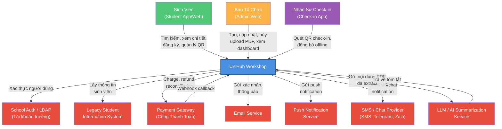

### Giải thích các thành phần:

| Thành phần              | Vai trò                                                | Tương tác chính                                                         |
| ----------------------- | ------------------------------------------------------ | ----------------------------------------------------------------------- |
| **Sinh viên**           | User chính sử dụng app/web để xem, đăng ký, quản lý vé | Xem danh sách/chi tiết, đăng ký, thanh toán, xem QR, nhận thông báo     |
| **Ban tổ chức**         | Admin tạo, cập nhật, hủy workshop và xem thống kê      | Quản lý workshop, upload PDF, theo dõi dashboard, export báo cáo        |
| **Nhân sự check-in**    | Sử dụng mobile app để quét QR, hỗ trợ offline          | Quét QR, ghi nhận check-in, đồng bộ dữ liệu khi có mạng                 |
| **School Auth / LDAP**  | Hệ thống xác thực tài khoản trường                     | Xác thực email/MSSV, hỗ trợ provisioning user                           |
| **Legacy Student Info** | Hệ thống tích hợp cung cấp thông tin sinh viên         | Cung cấp tên, email, khóa, ngành học để xác thực profile                |
| **Payment Gateway**     | Xử lý thanh toán/refund cho workshop có phí            | Nhận charge/refund request, gửi webhook callback, hỗ trợ reconciliation |
| **Email Service**       | Gửi thông báo email                                    | Gửi xác nhận đăng ký, reminder, thay đổi/hủy workshop                   |
| **Push Notification**   | Gửi push notification                                  | Gửi reminder, workshop changed/cancelled, kết quả check-in              |
| **SMS / Chat Provider** | Kênh thông báo mở rộng                                 | Gửi SMS/Telegram/Zalo theo preference của sinh viên                     |
| **LLM / AI Summary**    | Dịch vụ AI tóm tắt PDF                                 | Nhận text đã extract từ PDF, trả về summary tiếng Việt                  |

---

## 3. C4 Level 2 – Container Diagram

```mermaid
graph TB
    subgraph client["Client Layer"]
        StudentApp["Student Web/App<br/>(React/Next.js)"]
        AdminWeb["Admin Web<br/>(React/Next.js)"]
        CheckinApp["Check-in Mobile App<br/>(Flutter/React Native)"]
    end

    subgraph api["API & Gateway Layer"]
        APIGateway["API Gateway<br/>(Kong/Nginx)"]
        AuthService["Authentication Service<br/>(Node.js + JWT)"]
    end

    subgraph business["Business Service Layer"]
        WorkshopService["Workshop Service<br/>(Node.js)"]
        RegistrationService["Registration Service<br/>(Node.js)"]
        PaymentService["Payment Service<br/>(Node.js)"]
        RefundWorker["Refund & Reconciliation<br/>Worker"]
        NotificationService["Notification Service<br/>(Node.js)"]
        CheckinService["Check-in Service<br/>(Node.js)"]
        CheckinSyncService["Check-in Sync Service<br/>(Node.js)"]
        QRService["QR Code Service<br/>(Node.js)"]
        AISummaryWorker["AI Summary Worker<br/>(Python/FastAPI)"]
        ReportingService["Reporting / Analytics<br/>Service"]
        RealtimeService["Realtime Seat<br/>Service"]
    end

    subgraph data["Data Layer"]
        PostgreSQL["PostgreSQL<br/>(Core Data)"]
        Redis["Redis<br/>(Cache & Locks)"]
        ObjectStorage["Cloudinary<br/>(Images, Docs, Layouts, QR)"]
        SearchIndex["Elasticsearch<br/>(Optional Search Index)"]
        AnalyticsReadModel["Analytics Read Model<br/>(Materialized Views)"]
    end

    subgraph integration["Integration & Async Layer"]
        MessageBroker["RabbitMQ<br/>(Message Broker)"]
        JobQueue["Background Job Queue"]
        EventBus["Event Schema & Routing"]
    end

    subgraph external["External Services"]
        SchoolAuth["School Auth / LDAP"]
        LegacyStudent["Legacy Student System"]
        PaymentGateway["Payment Gateway"]
        EmailService["Email Service"]
        PushService["Push Notification Service"]
        SMSChatService["SMS / Chat Provider"]
        LLMService["LLM / AI Summary Service"]
    end

    StudentApp -->|REST API| APIGateway
    AdminWeb -->|REST API| APIGateway
    CheckinApp -->|REST API| APIGateway

    APIGateway -->|Authenticate| AuthService
    AuthService -->|Verify account| SchoolAuth
    AuthService -->|Fetch profile| LegacyStudent

    APIGateway -->|Route| WorkshopService
    APIGateway -->|Route| RegistrationService
    APIGateway -->|Route| PaymentService
    APIGateway -->|Route| CheckinService
    APIGateway -->|Route| CheckinSyncService
    APIGateway -->|Route| QRService
    APIGateway -->|Route| ReportingService
    APIGateway -->|WebSocket/SSE| RealtimeService

    WorkshopService -->|Query/Update| PostgreSQL
    WorkshopService -->|Cache| Redis
    WorkshopService -->|Read Seats| Redis
    WorkshopService -->|Index workshop| SearchIndex
    WorkshopService -->|Store PDF/Image/Layout| ObjectStorage
    WorkshopService -->|Publish Event| MessageBroker
    WorkshopService -->|Queue PDF Job| JobQueue

    RegistrationService -->|Query/Update| PostgreSQL
    RegistrationService -->|Lock & Seat Counter| Redis
    RegistrationService -->|Generate Ticket| QRService
    RegistrationService -->|Publish Event| MessageBroker

    PaymentService -->|Query/Update| PostgreSQL
    PaymentService -->|Charge/Verify| PaymentGateway
    PaymentService -->|Publish Event| MessageBroker
    PaymentService -->|Queue refund/reconcile| JobQueue
    RefundWorker -->|Consume refund jobs| JobQueue
    RefundWorker -->|Refund/Reconcile| PaymentGateway
    RefundWorker -->|Update payment/refund| PostgreSQL
    RefundWorker -->|Publish Event| MessageBroker

    CheckinService -->|Query/Update| PostgreSQL
    CheckinService -->|Lock & Cache| Redis
    CheckinService -->|Publish Event| MessageBroker

    CheckinSyncService -->|Batch Sync API| PostgreSQL
    CheckinSyncService -->|Conflict Lock| Redis
    CheckinSyncService -->|Publish Event| MessageBroker

    QRService -->|Generate & Store| ObjectStorage
    QRService -->|Read/Write Ticket| PostgreSQL

    AISummaryWorker -->|Consume pdf_uploaded| JobQueue
    AISummaryWorker -->|Read PDF| ObjectStorage
    AISummaryWorker -->|Call LLM| LLMService
    AISummaryWorker -->|Save AISummary| PostgreSQL
    AISummaryWorker -->|Cache summary| Redis
    AISummaryWorker -->|Publish summary_done/error| MessageBroker

    NotificationService -->|Consume Events| MessageBroker
    NotificationService -->|Send Email| EmailService
    NotificationService -->|Send Push| PushService
    NotificationService -->|Send SMS/Chat| SMSChatService
    NotificationService -->|Read Preferences/Templates| PostgreSQL
    NotificationService -->|Log| PostgreSQL

    ReportingService -->|Read transactional data| PostgreSQL
    ReportingService -->|Read precomputed metrics| AnalyticsReadModel
    ReportingService -->|Cache dashboard| Redis
    ReportingService -->|Export report| ObjectStorage
    MessageBroker -->|Project events| AnalyticsReadModel

    CheckinApp -->|Offline Data| CheckinAppLocal["Local Storage<br/>(SQLite)"]
    CheckinAppLocal -->|Sync| CheckinApp
    RealtimeService -->|Consume seat.updated| MessageBroker
    RealtimeService -->|Pub/Sub| Redis

    style StudentApp fill:#50C878,color:#fff
    style AdminWeb fill:#FFB347,color:#fff
    style CheckinApp fill:#9B59B6,color:#fff
    style APIGateway fill:#4A90E2,color:#fff
    style AuthService fill:#4A90E2,color:#fff
    style PostgreSQL fill:#E67E22,color:#fff
    style Redis fill:#E67E22,color:#fff
    style ObjectStorage fill:#E67E22,color:#fff
    style SearchIndex fill:#E67E22,color:#fff
    style AnalyticsReadModel fill:#E67E22,color:#fff
    style MessageBroker fill:#C0392B,color:#fff
    style JobQueue fill:#C0392B,color:#fff
```

### Giải thích các Container:

#### **Client Layer**

| Container               | Công nghệ            | Mô tả                                                                                   |
| ----------------------- | -------------------- | --------------------------------------------------------------------------------------- |
| **Student Web/App**     | React/Next.js        | App web cho sinh viên xem danh sách, đăng ký workshop, xem QR check-in. SSR để SEO tốt. |
| **Admin Web**           | React/Next.js        | Web admin nội bộ cho ban tổ chức quản lý workshop, thống kê.                            |
| **Check-in Mobile App** | Flutter/React Native | App mobile cho nhân sự check-in, quét QR, hỗ trợ offline với local SQLite.              |

#### **API & Gateway Layer**

| Container                  | Công nghệ     | Mô tả                                                    |
| -------------------------- | ------------- | -------------------------------------------------------- |
| **API Gateway**            | Kong/Nginx    | Route request, enforce rate limit, API versioning, CORS. |
| **Authentication Service** | Node.js + JWT | Xác thực người dùng, cấp JWT token, manage session.      |

#### **Business Service Layer**

| Container                          | Công nghệ             | Mô tả                                                                                                                                                         |
| ---------------------------------- | --------------------- | ------------------------------------------------------------------------------------------------------------------------------------------------------------- |
| **Workshop Service**               | Node.js               | Quản lý workshop, session, speaker, room, file PDF, trạng thái draft/published/cancelled. Validate room/time conflict và publish event khi workshop thay đổi. |
| **Registration Service**           | Node.js               | Xử lý đăng ký miễn phí/có phí: kiểm tra sức chứa, idempotency, lock ghế, tạo registration/ticket sau khi đủ điều kiện.                                        |
| **Payment Service**                | Node.js               | Tạo payment intent/order, gọi payment gateway, verify webhook signature, cập nhật payment state.                                                              |
| **Refund & Reconciliation Worker** | Node.js               | Xử lý refund async khi workshop bị hủy và đối soát định kỳ với payment gateway.                                                                               |
| **Notification Service**           | Node.js               | Consume event từ broker, render template, đọc preference, gửi email/push/SMS/chat theo channel abstraction. Có retry/throttling.                              |
| **Check-in Service**               | Node.js               | Xác thực QR, kiểm tra expiry/used status, ghi nhận check-in online, publish check-in event.                                                                   |
| **Check-in Sync Service**          | Node.js               | Nhận batch sync offline từ mobile app, kiểm tra conflict/duplicate, ghi nhận check-in vào DB.                                                                 |
| **QR Code Service**                | Node.js               | Tạo QR code/ticket, lưu ảnh QR vào Cloudinary, expose URL/download QR.                                                                                        |
| **AI Summary Worker**              | Python FastAPI/Celery | Consume `pdf_uploaded`, extract text từ PDF, gọi LLM để tóm tắt, lưu AISummary.                                                                               |
| **Reporting / Analytics Service**  | Node.js               | Cung cấp dashboard, show-up rate, revenue, no-show, export Excel/CSV dựa trên read model.                                                                     |
| **Realtime Seat Service**          | Node.js               | Quản lý WebSocket/SSE subscription và broadcast `seat.updated` cho danh sách/chi tiết workshop.                                                               |

#### **Data Layer**

| Container                 | Công nghệ                           | Mô tả                                                                                                                              |
| ------------------------- | ----------------------------------- | ---------------------------------------------------------------------------------------------------------------------------------- |
| **PostgreSQL**            | PostgreSQL 14+                      | Lưu trữ transactional data: users, workshops, registrations, payments/refunds, check-ins, notifications, AI summaries, audit logs. |
| **Redis**                 | Redis 7+                            | Cache seat availability, session JWT, notification preferences, AI summary cache, distributed lock cho registration/check-in.      |
| **File & Image Delivery** | Cloudinary                          | Lưu ảnh workshop, tài liệu PDF, sơ đồ phòng, QR code, export reports với CDN toàn cầu.                                             |
| **Elasticsearch**         | Elasticsearch/OpenSearch            | Optional full-text search cho workshop name/description/category.                                                                  |
| **Analytics Read Model**  | PostgreSQL materialized view / OLAP | Pre-computed metrics cho dashboard, export và báo cáo sau sự kiện.                                                                 |

#### **Integration & Async Layer**

| Container                | Công nghệ           | Mô tả                                                                                                                                                                            |
| ------------------------ | ------------------- | -------------------------------------------------------------------------------------------------------------------------------------------------------------------------------- |
| **Message Broker** | RabbitMQ | Event pub/sub: registration.created, payment.completed, refund.completed, checkin.recorded, workshop.updated/cancelled, pdf_uploaded, summary_done. Cho phép retry, dead-letter. |
| **Background Job Queue** | RabbitMQ | Chạy job dài: PDF processing, refund, reconciliation, batch reporting. |
| **Event Bus**            | Trong broker        | Định nghĩa event schema, routing rule, versioning và idempotency key.                                                                                                            |

#### **External Services Integration**

| Service                      | Giao thức                      | Mô tả                                                                             |
| ---------------------------- | ------------------------------ | --------------------------------------------------------------------------------- |
| **School Auth / LDAP**       | OAuth2/LDAP/SAML               | Xác thực tài khoản trường bằng email/MSSV.                                        |
| **Legacy Student System**    | REST API                       | Fetch student info: name, email, class, major. Cache result trong Redis.          |
| **Payment Gateway**          | REST API webhook               | Charge, refund, callback, reconciliation, verify signature.                       |
| **Email Service**            | SMTP/API (SendGrid)            | Gửi email transactional (xác nhận đăng ký, reminder, workshop changed/cancelled). |
| **Push Notification**        | Firebase Cloud Messaging (FCM) | Gửi push notification, handle token refresh.                                      |
| **SMS / Chat Provider**      | Twilio/Zalo/Telegram API       | Kênh thông báo mở rộng theo notification preference.                              |
| **LLM / AI Summary Service** | REST API/gRPC                  | Tạo tóm tắt tiếng Việt từ nội dung PDF đã extract.                                |

---

## 4. High-Level Architecture Diagram

### 4.1 Tổng Quan Luồng Dữ Liệu

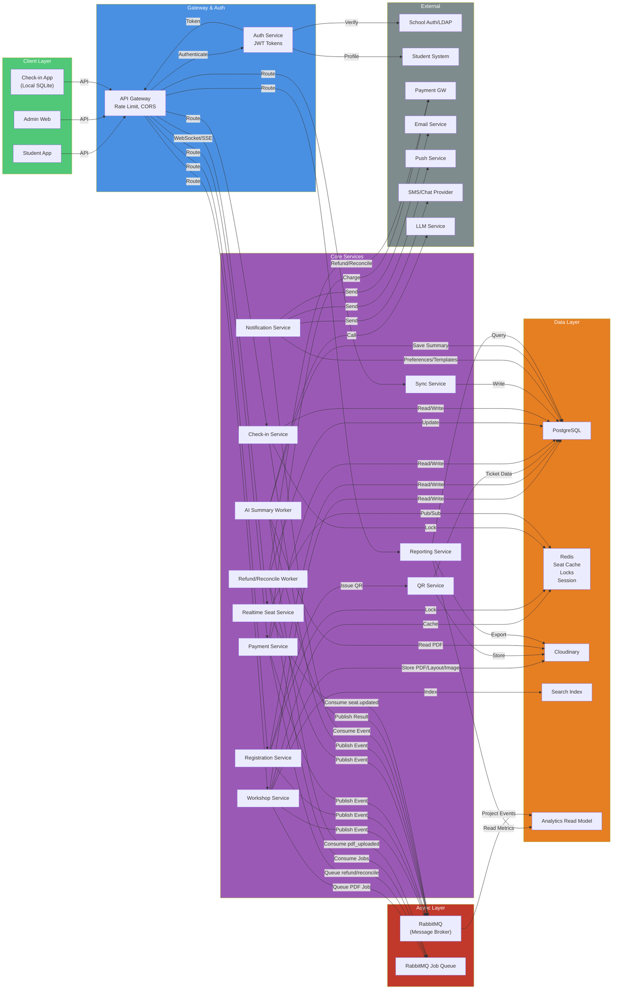

### 4.2 Luồng Đăng Ký Workshop (Registration Flow)

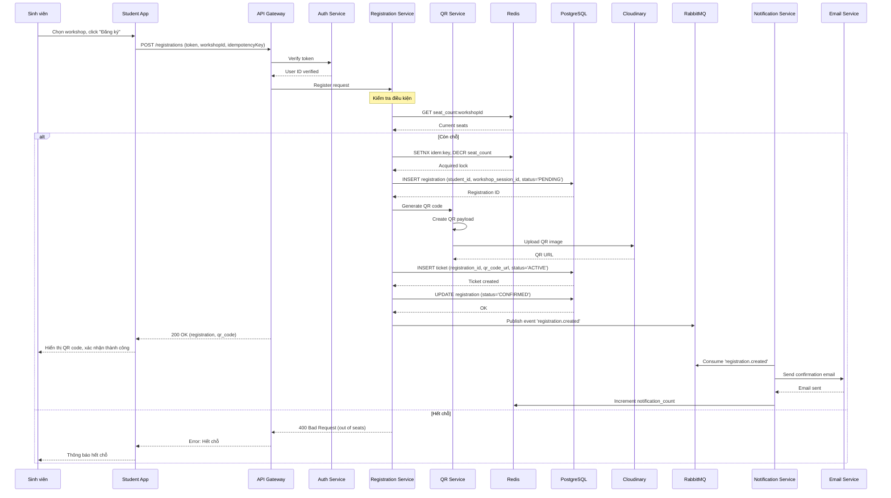

### 4.3 Luồng Thanh Toán (Payment Flow)

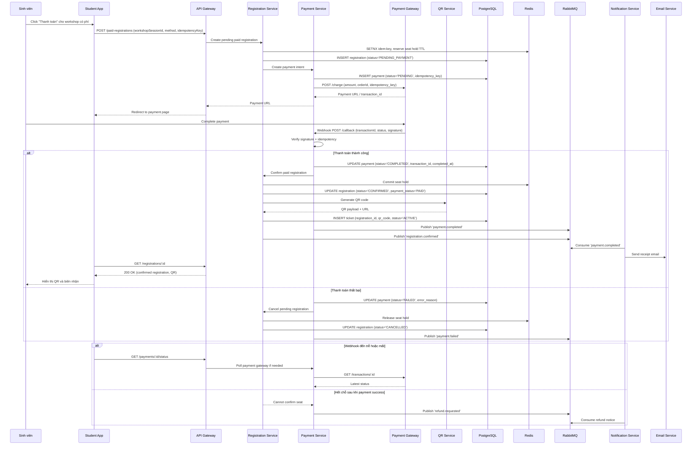

### 4.4 Luồng Check-in Online (Real-time)

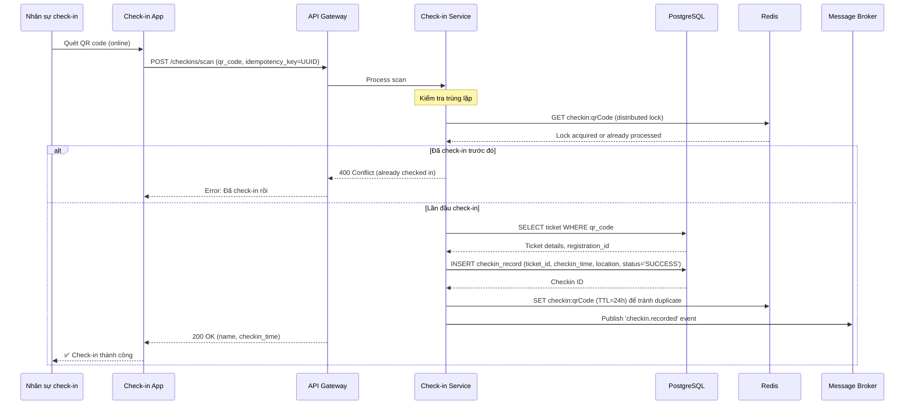

### 4.5 Luồng Check-in Offline (Offline Sync)

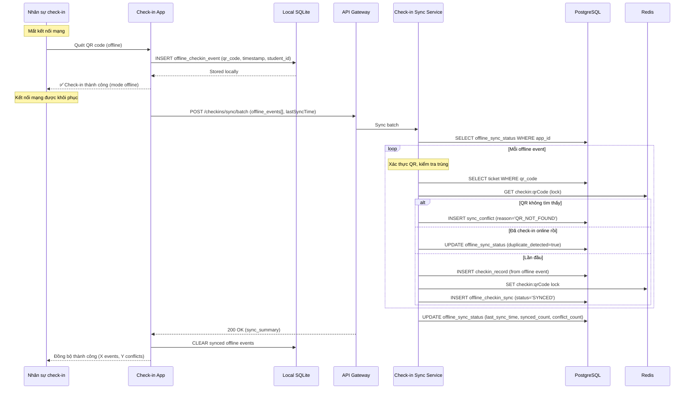

### 4.6 Luồng Cập Nhật Seat Realtime

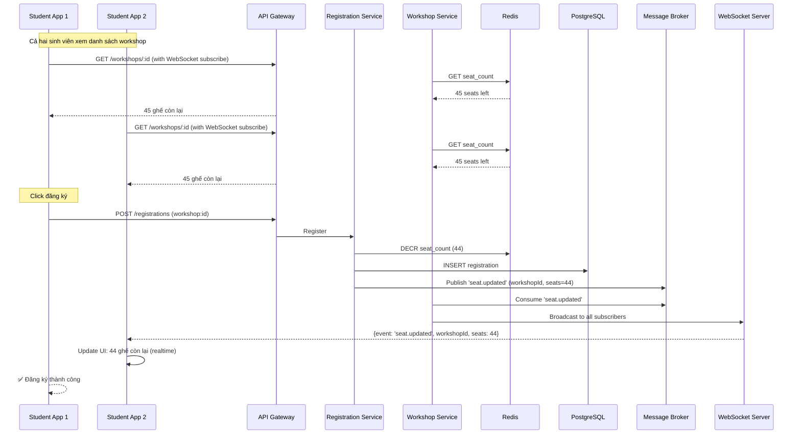

### 4.7 Luồng Tạo/Cập Nhật Workshop và AI Summary

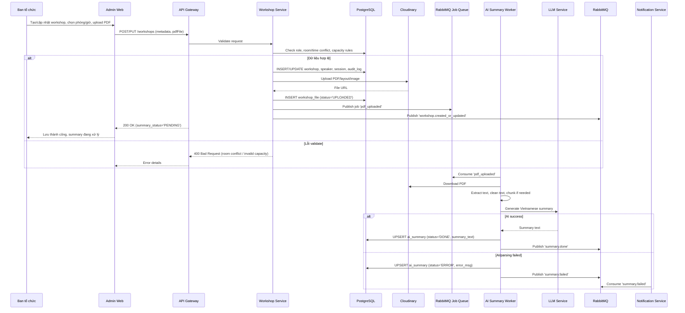

### 4.8 Luồng Hủy Workshop và Refund

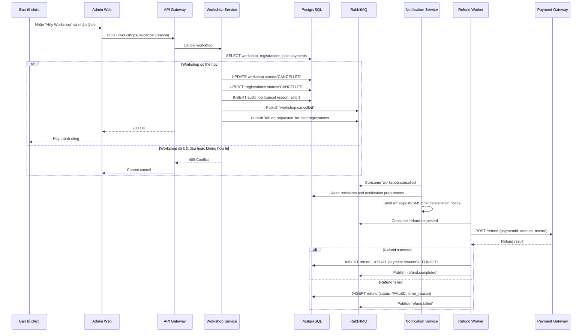

### 4.9 Luồng Dashboard / Reporting

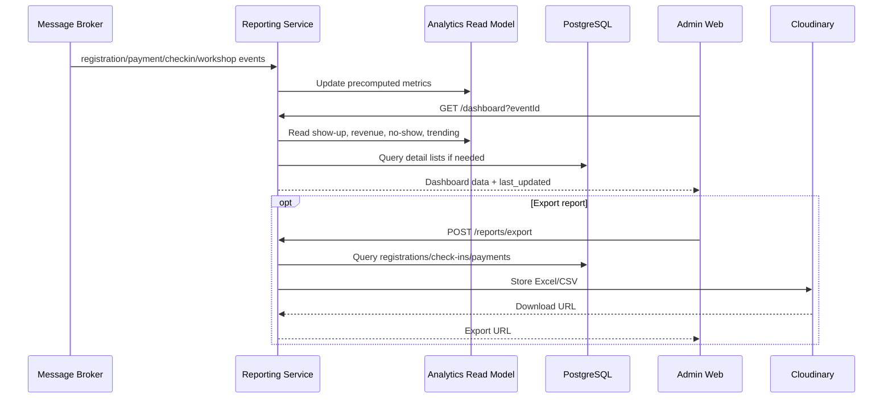

---

## 5. Giải Thích Các Luồng Chính

### 5.1 Luồng Đăng Ký (Registration)

**Trình tự:**

1. Sinh viên chọn workshop trong app, click "Đăng ký"
2. Client gửi `POST /registrations` với token xác thực
3. API Gateway route đến Registration Service
4. Registration Service:
   - Kiểm tra seat availability từ Redis cache (atomic)
   - Insert registration record vào DB (status='PENDING')
   - Gọi QR Code Service để generate QR
   - Insert ticket record vào DB
   - Update registration status='CONFIRMED'
   - Publish event 'registration.created' vào message broker
5. Notification Service consume event và gửi confirmation email
6. Client nhận QR code, hiển thị cho sinh viên

**Đảm bảo:**

- **Không đăng ký vượt quá sức chứa**: Sử dụng Redis DECR atomic operation + database trigger constraint
- **Không đăng ký trùng**: Unique constraint (student_id, workshop_session_id) trong DB
- **Consistency**: Sử dụng transaction, lock Redis seat_count

---

### 5.2 Luồng Thanh Toán (Payment)

**Trình tự:**

1. Sinh viên nhấn "Thanh toán" cho workshop có phí
2. Client gửi `POST /paid-registrations` với workshop session và idempotency key
3. Registration Service tạo registration tạm `PENDING_PAYMENT` và giữ chỗ có TTL
4. Payment Service tạo payment intent, gọi Payment Gateway với idempotency key
5. Payment Gateway gửi webhook callback về Payment Service
6. Nếu thanh toán thành công:
   - Verify signature và idempotency
   - Update payment status='COMPLETED'
   - Confirm registration, commit seat hold
   - Generate QR ticket
   - Publish `payment.completed` và `registration.confirmed`
7. Nếu thanh toán thất bại hoặc timeout:
   - Release seat hold
   - Cancel pending registration
   - Publish `payment.failed`
8. Nếu payment success nhưng không còn confirm được seat: publish `refund.requested`

**Xử lý callback từ Payment Gateway:**

- Gateway gửi webhook callback
- Payment Service verify signature, transaction ID và idempotency key
- Nếu chưa xử lý: update status, publish event
- Nếu đã xử lý: return 200 OK (idempotent response)
- Nếu webhook chậm/mất: client hoặc reconciliation worker poll gateway để đồng bộ trạng thái

**Đảm bảo:**

- **Idempotency**: Sử dụng idempotency key, check trước khi update
- **Consistency**: Registration/payment dùng state machine rõ ràng; QR chỉ phát hành khi paid registration được confirm
- **Financial safety**: Không lưu raw credit card data; refund/reconciliation xử lý async

---

### 5.3 Luồng Check-in Online

**Trình tự:**

1. Nhân sự check-in quét QR code từ sinh viên
2. Check-in App gửi `POST /checkins/scan` với QR data
3. Check-in Service:
   - Lấy distributed lock từ Redis (key=checkin:qrCode)
   - Query ticket từ DB validate QR
   - Insert checkin_record vào DB
   - Set lock trong Redis (TTL=24h) để tránh duplicate trong cùng ngày
4. Return success, hiển thị tên sinh viên + thời gian check-in

**Đảm bảo:**

- **Không check-in trùng**: Distributed lock + cache TTL
- **Realtime**: Synchronous API response

---

### 5.4 Luồng Check-in Offline

**Phase 1: Check-in Offline**

1. Nhân sự quét QR nhưng mất mạng
2. Check-in App lưu vào local SQLite: `offline_checkin_events`
3. Hiển thị "✅ Check-in thành công (chế độ offline)"

**Phase 2: Sync When Online**

1. Khi có mạng, app tự động call `POST /checkins/sync/batch`
2. Gửi danh sách offline events + lastSyncTime
3. Check-in Sync Service:
   - Loop qua mỗi event
   - Validate QR code có tồn tại không
   - Kiểm tra conflict: đã check-in online trước đó?
   - Nếu không conflict: insert checkin_record
   - Nếu conflict: insert sync_conflict record
   - Update offline_sync_status
4. Return sync_summary (synced_count, conflict_count)
5. App xóa offline events đã sync từ local DB

**Đảm bảo:**

- **Không duplicate**: Check distributed lock + existing checkin record
- **Bảo toàn dữ liệu**: Log tất cả conflict vào DB, admin có thể review
- **Idempotency**: Sync request có lastSyncTime, tránh re-sync

---

### 5.5 Luồng Cập Nhật Seat Realtime

**Trình tự:**

1. Sinh viên A và B cùng xem workshop có 50 chỗ
2. Sinh viên A đăng ký
3. Registration Service giảm seat count trong Redis (50→49)
4. Publish event 'seat.updated'
5. Workshop Service consume event
6. Broadcast qua WebSocket/SSE đến tất cả client đang xem workshop
7. UI của sinh viên B cập nhật realtime: 49 ghế

**Implementation:**

- Backend: WebSocket + Redis Pub/Sub
- Frontend: WebSocket client subscribe khi mở chi tiết workshop
- Cache: Redis lưu seat count, invalidate khi có registration/cancellation

---

### 5.6 Luồng AI Summary từ PDF

**Trình tự:**

1. Ban tổ chức tạo/cập nhật workshop và upload PDF
2. Workshop Service validate file type/size, lưu PDF vào Cloudinary
3. Tạo `workshop_files` record và publish job `pdf_uploaded`
4. AI Summary Worker:
   - Download PDF từ Cloudinary
   - Extract text, clean text, chunk nếu PDF dài
   - Gọi LLM Service để tạo tóm tắt 3-5 câu tiếng Việt
   - Lưu `ai_summaries` với status `DONE` hoặc `ERROR`
   - Publish `summary.done` hoặc `summary.failed`
5. Khi sinh viên xem chi tiết workshop:
   - Nếu summary `DONE`: hiển thị summary
   - Nếu `PENDING/PROCESSING`: hiển thị trạng thái đang tạo
   - Nếu `ERROR`: fallback về mô tả gốc

**Đảm bảo:**

- **Async processing**: Không block request tạo/cập nhật workshop
- **Retry & fallback**: Retry LLM/PDF parsing theo backoff; lỗi được lưu vào `ai_summaries.error_msg`
- **Manual override**: Ban tổ chức có thể chỉnh summary sau khi AI tạo xong
- **Cost/latency tracking**: Log latency, token usage và trạng thái job

---

### 5.7 Luồng Ban Tổ Chức Cập Nhật / Hủy Workshop

**Cập nhật workshop:**

1. Organizer sửa room/time/capacity/PDF trong Admin Web
2. Workshop Service validate role, room conflict, capacity không nhỏ hơn số đăng ký
3. Nếu room/time thay đổi: publish `workshop.updated`
4. Notification Service gửi thông báo đến sinh viên đã đăng ký theo preference
5. Audit log ghi old/new values, actor và thời điểm

**Hủy workshop:**

1. Organizer nhập lý do hủy
2. Workshop Service set `workshops.status='cancelled'`, cancel registrations/tickets
3. Publish `workshop.cancelled`
4. Notification Service gửi thông báo hủy đa kênh
5. Nếu có payment đã hoàn tất: publish `refund.requested`
6. Refund Worker gọi Payment Gateway, cập nhật `refunds` và `payments.status='REFUNDED'`

**Đảm bảo:**

- **Soft delete**: Không xóa workshop để giữ audit/data retention
- **Refund policy**: Full/partial/no refund được encode bằng refund record và audit trail
- **Idempotency**: Cancel/refund event có idempotency key để tránh refund trùng

---

### 5.8 Luồng Dashboard / Reporting

**Trình tự:**

1. Các event `registration.*`, `payment.*`, `checkin.*`, `workshop.*` được project vào Analytics Read Model
2. Admin Web gọi Reporting Service để xem:
   - Tổng số workshop theo trạng thái
   - Số đăng ký, số check-in, show-up rate, no-show
   - Revenue, refund amount, payment success rate
   - Workshop hot/trending
3. Reporting Service đọc materialized view/read model, fallback query PostgreSQL khi cần chi tiết
4. Export report tạo file CSV/Excel trong Cloudinary

**Đảm bảo:**

- **Không ảnh hưởng OLTP**: Dashboard ưu tiên read model/materialized view
- **Staleness rõ ràng**: Response kèm `last_updated`
- **Data privacy**: Export detail bị giới hạn theo role và audit log

---

## 6. Thiết Kế Cơ Sở Dữ Liệu

### 6.1 Phân Loại Dữ Liệu

| Loại dữ liệu                                                                                 | Đặc điểm                                | Database                   | Lý do                                                   |
| -------------------------------------------------------------------------------------------- | --------------------------------------- | -------------------------- | ------------------------------------------------------- |
| **Transactional** (users, workshops, registrations, payments, refunds, check-ins, summaries) | ACID, relational, high consistency      | PostgreSQL                 | Strong ACID guarantee, complex queries                  |
| **Cache** (seat availability, session, locks, preferences, summary cache)                    | Ephemeral, fast access, high throughput | Redis                      | In-memory, atomic operations, TTL                       |
| **Files** (QR images, room layouts, PDF materials, report exports)                           | Unstructured, large size                | Cloudinary                 | Auto-optimized, CDN-friendly, integrated transformation |
| **Events/Jobs** (registration, payment, refund, PDF processing, notification)                | Async, durable, retryable               | Message Broker / Job Queue | Guarantees delivery, supports replay and DLQ            |
| **Search** (workshop fulltext search, filtering)                                             | Optional, fulltext index                | Elasticsearch (optional)   | Fast search, aggregation                                |
| **Analytics Read Model** (dashboard metrics, exports)                                        | Precomputed/read-heavy                  | Materialized views / OLAP  | Avoid heavy analytical load on OLTP tables              |

### 6.2 Đề Xuất Loại Database

#### **PostgreSQL (Primary)**

- **Khi nào dùng**: Core transactional data
- **Tại sao**:
  - ACID transaction đảm bảo consistency
  - Complex query: JOIN, GROUP BY cho thống kê
  - Foreign key constraints tự động maintain referential integrity
  - JSONB support cho flexible data
- **Loại dữ liệu**:
  - Users, students, organizers
  - Workshops, sessions, speakers, rooms
  - Registrations, tickets
  - Payments, payment callbacks, refunds
  - Check-in records
  - Notifications, preferences, AI summaries, audit logs

#### **Redis (Cache & Locks)**

- **Khi nào dùng**: Seat count, session, distributed lock
- **Tại sao**:
  - In-memory, sub-millisecond latency
  - Atomic operations (INCR, DECR) ensure consistency
  - Distributed lock support (SET with NX + TTL)
  - Pub/Sub cho realtime update
- **Loại dữ liệu**:
  - Seat availability counter (key: `seat_count:{workshopSessionId}`)
  - Session tokens, JWT blacklist
  - AI summary cache (key: `ai_summary:{workshopId}`)
  - Notification preference cache (key: `notif_pref:{userId}`)
  - Distributed locks (key: `lock:{resource}`)
  - Realtime notification queue

#### **Cloudinary**

- **Khi nào dùng**: QR code, images, documents
- **Tại sao**:
  - Scalable, không ảnh hưởng database
  - CDN-friendly
  - Support versioning, lifecycle policy
- **Loại dữ liệu**:
  - QR code images
  - Workshop images, banners
  - Room layout diagrams
  - Workshop PDF documents, materials
  - Dashboard export files

#### **Message Broker (RabbitMQ/Kafka)**

- **Khi nào dùng**: Event-driven async processing
- **Tại sao**:
  - Decoupling services
  - Guaranteed delivery, replay capability
  - Ordered processing (per partition)
- **Event types**:
  - `registration.created`
  - `payment.completed`
  - `payment.failed`
  - `refund.requested`
  - `refund.completed`
  - `checkin.recorded`
  - `checkin.offline.synced`
  - `workshop.updated`
  - `seat.updated`
  - `workshop.cancelled`
  - `pdf_uploaded`
  - `summary.done`
  - `summary.failed`

#### **Elasticsearch (Optional)**

- **Khi nào dùng**: Advanced workshop search
- **Tại sao**:
  - Fulltext search workshop name, description
  - Aggregation: workshop per category, popular speakers
- **Loại dữ liệu**:
  - Indexed workshops (copy từ PostgreSQL)

---

### 6.3 Thiết Kế Schema

#### **1. Users & Authentication**

```sql
CREATE TABLE users (
    id UUID PRIMARY KEY DEFAULT gen_random_uuid(),
    email VARCHAR(255) NOT NULL UNIQUE,
    phone VARCHAR(20),
    password_hash VARCHAR(255) NOT NULL,
    full_name VARCHAR(255) NOT NULL,
    avatar_url TEXT,
    role_id UUID NOT NULL REFERENCES roles(id),
    is_active BOOLEAN DEFAULT true,
    last_login_at TIMESTAMP,
    created_at TIMESTAMP DEFAULT CURRENT_TIMESTAMP,
    updated_at TIMESTAMP DEFAULT CURRENT_TIMESTAMP,
    INDEX idx_email (email),
    INDEX idx_role_id (role_id)
);

CREATE TABLE roles (
    id UUID PRIMARY KEY DEFAULT gen_random_uuid(),
    name VARCHAR(50) NOT NULL UNIQUE,
    description TEXT,
    created_at TIMESTAMP DEFAULT CURRENT_TIMESTAMP
);

INSERT INTO roles (name) VALUES ('student'), ('organizer'), ('checkin_staff'), ('admin');

CREATE TABLE user_permissions (
    id UUID PRIMARY KEY DEFAULT gen_random_uuid(),
    role_id UUID NOT NULL REFERENCES roles(id),
    permission_name VARCHAR(100) NOT NULL,
    created_at TIMESTAMP DEFAULT CURRENT_TIMESTAMP,
    UNIQUE (role_id, permission_name)
);
```

**Giải thích:**

- `users`: Tất cả người dùng trong hệ thống
- `roles`: Vai trò (student, organizer, checkin_staff, admin)
- `user_permissions`: Phân quyền chi tiết
- Index email để login nhanh

---

#### **2. Students**

```sql
CREATE TABLE students (
    id UUID PRIMARY KEY DEFAULT gen_random_uuid(),
    user_id UUID NOT NULL UNIQUE REFERENCES users(id),
    student_id VARCHAR(20) NOT NULL UNIQUE,
    major VARCHAR(100),
    class_name VARCHAR(50),
    academic_year INT,
    legacy_student_id VARCHAR(50),
    is_verified BOOLEAN DEFAULT false,
    created_at TIMESTAMP DEFAULT CURRENT_TIMESTAMP,
    updated_at TIMESTAMP DEFAULT CURRENT_TIMESTAMP,
    INDEX idx_student_id (student_id),
    INDEX idx_major (major)
);
```

**Giải thích:**

- `legacy_student_id`: Tham chiếu đến hệ thống cũ
- `major`, `class_name`: Dùng cho xác thực profile và phân tích thống kê theo nhóm sinh viên
- Index major để query/report nhanh

---

#### **3. Workshops & Sessions**

```sql
CREATE TABLE workshops (
    id UUID PRIMARY KEY DEFAULT gen_random_uuid(),
    title VARCHAR(255) NOT NULL,
    description TEXT,
    category VARCHAR(100),
    image_url TEXT,
    materials_url TEXT,
    organizer_id UUID NOT NULL REFERENCES users(id),
    is_free BOOLEAN DEFAULT true,
    base_price DECIMAL(10,2),
    max_capacity INT NOT NULL,
    status VARCHAR(50) DEFAULT 'draft', -- draft, published, cancelled
    cancelled_at TIMESTAMP,
    cancelled_by UUID REFERENCES users(id),
    cancellation_reason TEXT,
    created_at TIMESTAMP DEFAULT CURRENT_TIMESTAMP,
    updated_at TIMESTAMP DEFAULT CURRENT_TIMESTAMP,
    published_at TIMESTAMP,
    INDEX idx_organizer_id (organizer_id),
    INDEX idx_category (category),
    INDEX idx_status (status)
);

CREATE TABLE workshop_sessions (
    id UUID PRIMARY KEY DEFAULT gen_random_uuid(),
    workshop_id UUID NOT NULL REFERENCES workshops(id),
    session_number INT NOT NULL,
    start_time TIMESTAMP NOT NULL,
    end_time TIMESTAMP NOT NULL,
    room_id UUID NOT NULL REFERENCES rooms(id),
    current_capacity INT DEFAULT 0,
    max_capacity INT NOT NULL,
    status VARCHAR(50) DEFAULT 'scheduled', -- scheduled, in_progress, completed, cancelled
    created_at TIMESTAMP DEFAULT CURRENT_TIMESTAMP,
    updated_at TIMESTAMP DEFAULT CURRENT_TIMESTAMP,
    UNIQUE (workshop_id, session_number),
    INDEX idx_workshop_id (workshop_id),
    INDEX idx_room_id (room_id),
    INDEX idx_start_time (start_time),
    INDEX idx_status (status)
);

CREATE TABLE speakers (
    id UUID PRIMARY KEY DEFAULT gen_random_uuid(),
    workshop_id UUID NOT NULL REFERENCES workshops(id),
    name VARCHAR(255) NOT NULL,
    title VARCHAR(100),
    bio TEXT,
    avatar_url TEXT,
    email VARCHAR(255),
    position INT DEFAULT 0,
    created_at TIMESTAMP DEFAULT CURRENT_TIMESTAMP,
    INDEX idx_workshop_id (workshop_id)
);

CREATE TABLE rooms (
    id UUID PRIMARY KEY DEFAULT gen_random_uuid(),
    name VARCHAR(100) NOT NULL UNIQUE,
    building VARCHAR(100),
    floor INT,
    capacity INT NOT NULL,
    layout_url TEXT, -- URL sơ đồ phòng trong Cloudinary
    amenities JSONB, -- ['projector', 'mic', 'wifi']
    is_available BOOLEAN DEFAULT true,
    created_at TIMESTAMP DEFAULT CURRENT_TIMESTAMP,
    updated_at TIMESTAMP DEFAULT CURRENT_TIMESTAMP,
    INDEX idx_name (name),
    INDEX idx_capacity (capacity)
);
```

**Giải thích:**

- `workshops`: Thông tin chung workshop
- `workshop_sessions`: Một workshop có thể có nhiều session (lần)
- `current_capacity`: Số người đã đăng ký (dùng cho cache)
- `speakers`: Diễn giả, position để sắp xếp
- `rooms`: Phòng học, layout_url lưu ảnh sơ đồ
- Status tracking: draft → published → cancelled

---

#### **4. Registrations & Tickets**

```sql
CREATE TABLE registrations (
    id UUID PRIMARY KEY DEFAULT gen_random_uuid(),
    student_id UUID NOT NULL REFERENCES students(id),
    workshop_session_id UUID NOT NULL REFERENCES workshop_sessions(id),
    status VARCHAR(50) DEFAULT 'PENDING', -- PENDING, PENDING_PAYMENT, CONFIRMED, CANCELLED
    payment_status VARCHAR(50) DEFAULT 'NOT_REQUIRED', -- NOT_REQUIRED, PENDING, PAID, REFUNDED, FAILED
    idempotency_key VARCHAR(255),
    registration_time TIMESTAMP DEFAULT CURRENT_TIMESTAMP,
    created_at TIMESTAMP DEFAULT CURRENT_TIMESTAMP,
    updated_at TIMESTAMP DEFAULT CURRENT_TIMESTAMP,
    UNIQUE (student_id, workshop_session_id), -- Tránh đăng ký trùng
    UNIQUE (idempotency_key),
    INDEX idx_student_id (student_id),
    INDEX idx_workshop_session_id (workshop_session_id),
    INDEX idx_status (status),
    CONSTRAINT chk_registration_before_session
        CHECK (registration_time < (
            SELECT start_time FROM workshop_sessions WHERE id = workshop_session_id
        ))
);

CREATE TABLE tickets (
    id UUID PRIMARY KEY DEFAULT gen_random_uuid(),
    registration_id UUID NOT NULL UNIQUE REFERENCES registrations(id),
    qr_code VARCHAR(500) NOT NULL UNIQUE, -- payload hoặc URL
    qr_image_url TEXT, -- URL image QR trong Cloudinary
    status VARCHAR(50) DEFAULT 'ACTIVE', -- ACTIVE, USED, EXPIRED, CANCELLED
    generated_at TIMESTAMP DEFAULT CURRENT_TIMESTAMP,
    used_at TIMESTAMP,
    expiry_at TIMESTAMP,
    created_at TIMESTAMP DEFAULT CURRENT_TIMESTAMP,
    INDEX idx_qr_code (qr_code),
    INDEX idx_status (status)
);
```

**Giải thích:**

- `registrations`: Mỗi sinh viên đăng ký 1 workshop session = 1 record
- Constraint UNIQUE (student_id, workshop_session_id) tránh đăng ký trùng
- `tickets`: QR code sinh ra sau khi đăng ký
- `qr_code` là UNIQUE, dùng để check-in validate
- Status tracking: ACTIVE → USED (khi check-in) → EXPIRED

---

#### **5. Payments**

```sql
CREATE TABLE payments (
    id UUID PRIMARY KEY DEFAULT gen_random_uuid(),
    registration_id UUID NOT NULL REFERENCES registrations(id),
    amount DECIMAL(10,2) NOT NULL,
    currency VARCHAR(3) DEFAULT 'VND',
    status VARCHAR(50) DEFAULT 'PENDING', -- PENDING, COMPLETED, FAILED, REFUNDED
    payment_method VARCHAR(50), -- credit_card, e_wallet, bank_transfer
    idempotency_key VARCHAR(255) NOT NULL UNIQUE,
    transaction_id VARCHAR(255),
    error_reason TEXT,
    payment_gateway_response JSONB,
    created_at TIMESTAMP DEFAULT CURRENT_TIMESTAMP,
    updated_at TIMESTAMP DEFAULT CURRENT_TIMESTAMP,
    completed_at TIMESTAMP,
    INDEX idx_registration_id (registration_id),
    INDEX idx_idempotency_key (idempotency_key),
    INDEX idx_status (status),
    INDEX idx_transaction_id (transaction_id)
);

CREATE TABLE payment_callbacks (
    id UUID PRIMARY KEY DEFAULT gen_random_uuid(),
    payment_id UUID NOT NULL REFERENCES payments(id),
    callback_timestamp TIMESTAMP NOT NULL,
    status VARCHAR(50),
    transaction_id VARCHAR(255),
    callback_data JSONB,
    signature_verified BOOLEAN,
    processed_at TIMESTAMP,
    created_at TIMESTAMP DEFAULT CURRENT_TIMESTAMP,
    INDEX idx_payment_id (payment_id),
    INDEX idx_transaction_id (transaction_id)
);

CREATE TABLE refunds (
    id UUID PRIMARY KEY DEFAULT gen_random_uuid(),
    payment_id UUID NOT NULL REFERENCES payments(id),
    registration_id UUID NOT NULL REFERENCES registrations(id),
    amount DECIMAL(10,2) NOT NULL,
    status VARCHAR(50) DEFAULT 'PENDING', -- PENDING, COMPLETED, FAILED
    reason TEXT,
    idempotency_key VARCHAR(255) NOT NULL UNIQUE,
    gateway_refund_id VARCHAR(255),
    error_reason TEXT,
    requested_by UUID REFERENCES users(id),
    created_at TIMESTAMP DEFAULT CURRENT_TIMESTAMP,
    completed_at TIMESTAMP,
    INDEX idx_payment_id (payment_id),
    INDEX idx_registration_id (registration_id),
    INDEX idx_status (status)
);
```

**Giải thích:**

- `idempotency_key`: Để xử lý idempotent payment
- `payment_gateway_response`: JSONB lưu full response từ gateway
- `payment_callbacks`: Log tất cả callback từ gateway, check signature, tránh replay attack
- `refunds`: Log refund khi workshop bị hủy hoặc không thể confirm seat sau payment

---

#### **6. Check-ins**

```sql
CREATE TABLE checkins (
    id UUID PRIMARY KEY DEFAULT gen_random_uuid(),
    ticket_id UUID NOT NULL REFERENCES tickets(id),
    student_id UUID NOT NULL REFERENCES students(id),
    workshop_session_id UUID NOT NULL REFERENCES workshop_sessions(id),
    checkin_time TIMESTAMP NOT NULL,
    checkin_location VARCHAR(100),
    staff_id UUID REFERENCES users(id), -- Nhân sự quét
    checkin_type VARCHAR(50) DEFAULT 'ONLINE', -- ONLINE, OFFLINE_SYNCED
    status VARCHAR(50) DEFAULT 'SUCCESS', -- SUCCESS, FAILED
    notes TEXT,
    created_at TIMESTAMP DEFAULT CURRENT_TIMESTAMP,
    INDEX idx_ticket_id (ticket_id),
    INDEX idx_student_id (student_id),
    INDEX idx_workshop_session_id (workshop_session_id),
    INDEX idx_checkin_time (checkin_time),
    UNIQUE (ticket_id, checkin_time) -- Tránh check-in duplicate trên cùng 1 QR
);

CREATE TABLE offline_checkin_events (
    id UUID PRIMARY KEY DEFAULT gen_random_uuid(),
    app_instance_id VARCHAR(255) NOT NULL, -- Device ID của check-in app
    qr_code VARCHAR(500) NOT NULL,
    student_id UUID,
    workshop_session_id UUID,
    local_timestamp TIMESTAMP NOT NULL,
    sync_attempt_count INT DEFAULT 0,
    sync_status VARCHAR(50) DEFAULT 'PENDING', -- PENDING, SYNCED, CONFLICT, FAILED
    conflict_reason TEXT,
    created_at TIMESTAMP DEFAULT CURRENT_TIMESTAMP,
    synced_at TIMESTAMP,
    INDEX idx_app_instance_id (app_instance_id),
    INDEX idx_qr_code (qr_code),
    INDEX idx_sync_status (sync_status)
);

CREATE TABLE offline_sync_status (
    id UUID PRIMARY KEY DEFAULT gen_random_uuid(),
    app_instance_id VARCHAR(255) NOT NULL UNIQUE,
    last_sync_time TIMESTAMP,
    last_sync_event_count INT,
    conflict_count INT DEFAULT 0,
    synced_count INT DEFAULT 0,
    failed_count INT DEFAULT 0,
    updated_at TIMESTAMP DEFAULT CURRENT_TIMESTAMP,
    INDEX idx_app_instance_id (app_instance_id)
);
```

**Giải thích:**

- `checkins`: Record check-in thành công
- Constraint UNIQUE (ticket_id, checkin_time) tránh check-in trùng trên QR
- `offline_checkin_events`: Event từ mobile app khi offline
- `offline_sync_status`: Track sync progress của mỗi thiết bị

---

#### **7. Notifications**

```sql
CREATE TABLE notification_channels (
    id UUID PRIMARY KEY DEFAULT gen_random_uuid(),
    name VARCHAR(50) NOT NULL UNIQUE, -- EMAIL, PUSH, SMS, TELEGRAM, ZALO
    is_enabled BOOLEAN DEFAULT true,
    config JSONB, -- Cấu hình channel-specific (API key, endpoint, etc)
    created_at TIMESTAMP DEFAULT CURRENT_TIMESTAMP,
    updated_at TIMESTAMP DEFAULT CURRENT_TIMESTAMP
);

CREATE TABLE notification_preferences (
    id UUID PRIMARY KEY DEFAULT gen_random_uuid(),
    user_id UUID NOT NULL REFERENCES users(id),
    channel_id UUID NOT NULL REFERENCES notification_channels(id),
    destination VARCHAR(255), -- email, phone, push token, telegram id
    is_enabled BOOLEAN DEFAULT true,
    quiet_hours JSONB,
    updated_at TIMESTAMP DEFAULT CURRENT_TIMESTAMP,
    UNIQUE (user_id, channel_id),
    INDEX idx_user_id (user_id),
    INDEX idx_channel_id (channel_id)
);

CREATE TABLE notification_templates (
    id UUID PRIMARY KEY DEFAULT gen_random_uuid(),
    name VARCHAR(100) NOT NULL UNIQUE,
    event_type VARCHAR(100) NOT NULL, -- registration.created, payment.completed, etc
    channel_id UUID NOT NULL REFERENCES notification_channels(id),
    subject VARCHAR(255),
    template_content TEXT, -- Handlebars template
    is_active BOOLEAN DEFAULT true,
    created_at TIMESTAMP DEFAULT CURRENT_TIMESTAMP,
    updated_at TIMESTAMP DEFAULT CURRENT_TIMESTAMP,
    INDEX idx_event_type (event_type),
    INDEX idx_channel_id (channel_id)
);

CREATE TABLE notifications (
    id UUID PRIMARY KEY DEFAULT gen_random_uuid(),
    recipient_id UUID NOT NULL REFERENCES users(id),
    channel_id UUID NOT NULL REFERENCES notification_channels(id),
    subject VARCHAR(255),
    content TEXT,
    event_type VARCHAR(100),
    event_id VARCHAR(255), -- registration_id, payment_id, etc
    status VARCHAR(50) DEFAULT 'PENDING', -- PENDING, SENT, FAILED, BOUNCED
    retry_count INT DEFAULT 0,
    last_retry_at TIMESTAMP,
    error_message TEXT,
    created_at TIMESTAMP DEFAULT CURRENT_TIMESTAMP,
    sent_at TIMESTAMP,
    INDEX idx_recipient_id (recipient_id),
    INDEX idx_status (status),
    INDEX idx_event_type (event_type),
    INDEX idx_created_at (created_at)
);

CREATE TABLE notification_deliveries (
    id UUID PRIMARY KEY DEFAULT gen_random_uuid(),
    notification_id UUID NOT NULL REFERENCES notifications(id),
    delivery_attempt INT,
    response_code INT,
    response_body TEXT,
    delivered_at TIMESTAMP,
    failed_reason TEXT,
    created_at TIMESTAMP DEFAULT CURRENT_TIMESTAMP,
    INDEX idx_notification_id (notification_id)
);
```

**Giải thích:**

- `notification_channels`: Loại kênh (EMAIL, PUSH, TELEGRAM, ZALO)
- `notification_preferences`: Opt-in/opt-out và destination theo từng kênh của user
- `notification_templates`: Template cho từng event + channel
- `notifications`: Record thông báo cần gửi
- Hỗ trợ retry, logging delivery attempt
- Dễ mở rộng thêm kênh mới

---

#### **8. Workshop Files & AI Summaries**

```sql
CREATE TABLE workshop_files (
    id UUID PRIMARY KEY DEFAULT gen_random_uuid(),
    workshop_id UUID NOT NULL REFERENCES workshops(id),
    file_type VARCHAR(50) DEFAULT 'PDF',
    file_url TEXT NOT NULL,
    file_name VARCHAR(255),
    file_size_bytes BIGINT,
    content_hash VARCHAR(128),
    upload_status VARCHAR(50) DEFAULT 'UPLOADED', -- UPLOADED, FAILED, DELETED
    uploader_id UUID REFERENCES users(id),
    uploaded_at TIMESTAMP DEFAULT CURRENT_TIMESTAMP,
    INDEX idx_workshop_id (workshop_id),
    INDEX idx_content_hash (content_hash)
);

CREATE TABLE ai_summaries (
    id UUID PRIMARY KEY DEFAULT gen_random_uuid(),
    workshop_id UUID NOT NULL REFERENCES workshops(id),
    workshop_file_id UUID REFERENCES workshop_files(id),
    status VARCHAR(50) DEFAULT 'PENDING', -- PENDING, PROCESSING, DONE, ERROR
    summary_text TEXT,
    language VARCHAR(20) DEFAULT 'vi',
    model_name VARCHAR(100),
    prompt_version VARCHAR(50),
    error_msg TEXT,
    manual_override_text TEXT,
    generated_at TIMESTAMP,
    created_at TIMESTAMP DEFAULT CURRENT_TIMESTAMP,
    updated_at TIMESTAMP DEFAULT CURRENT_TIMESTAMP,
    INDEX idx_workshop_id (workshop_id),
    INDEX idx_status (status)
);

CREATE TABLE ai_summary_jobs (
    id UUID PRIMARY KEY DEFAULT gen_random_uuid(),
    workshop_file_id UUID NOT NULL REFERENCES workshop_files(id),
    status VARCHAR(50) DEFAULT 'QUEUED', -- QUEUED, RUNNING, DONE, FAILED
    attempt_count INT DEFAULT 0,
    last_error TEXT,
    started_at TIMESTAMP,
    finished_at TIMESTAMP,
    created_at TIMESTAMP DEFAULT CURRENT_TIMESTAMP,
    INDEX idx_workshop_file_id (workshop_file_id),
    INDEX idx_status (status)
);
```

**Giải thích:**

- `workshop_files`: File PDF/materials do ban tổ chức upload
- `ai_summaries`: Kết quả tóm tắt AI, hỗ trợ trạng thái pending/processing/done/error và manual override
- `ai_summary_jobs`: Track retry, latency và lỗi của pipeline PDF → text → LLM

---

#### **9. Reporting Read Model**

```sql
CREATE TABLE reporting_snapshots (
    id UUID PRIMARY KEY DEFAULT gen_random_uuid(),
    event_id UUID,
    workshop_id UUID REFERENCES workshops(id),
    registered_count INT DEFAULT 0,
    checked_in_count INT DEFAULT 0,
    no_show_count INT DEFAULT 0,
    revenue_amount DECIMAL(12,2) DEFAULT 0,
    refund_amount DECIMAL(12,2) DEFAULT 0,
    payment_success_rate DECIMAL(5,2),
    last_updated TIMESTAMP DEFAULT CURRENT_TIMESTAMP,
    INDEX idx_event_id (event_id),
    INDEX idx_workshop_id (workshop_id)
);

CREATE TABLE report_exports (
    id UUID PRIMARY KEY DEFAULT gen_random_uuid(),
    requested_by UUID REFERENCES users(id),
    report_type VARCHAR(100),
    file_url TEXT,
    status VARCHAR(50) DEFAULT 'PENDING', -- PENDING, DONE, FAILED
    created_at TIMESTAMP DEFAULT CURRENT_TIMESTAMP,
    completed_at TIMESTAMP,
    INDEX idx_requested_by (requested_by),
    INDEX idx_status (status)
);
```

**Giải thích:**

- `reporting_snapshots`: Read model/materialized metrics cho dashboard để tránh query nặng trên OLTP
- `report_exports`: Theo dõi file export CSV/Excel cho ban tổ chức

---

#### **10. Audit & Logs**

```sql
CREATE TABLE audit_logs (
    id UUID PRIMARY KEY DEFAULT gen_random_uuid(),
    user_id UUID REFERENCES users(id),
    action VARCHAR(100) NOT NULL, -- create_workshop, update_registration, process_payment
    entity_type VARCHAR(50), -- workshop, registration, payment
    entity_id VARCHAR(255),
    old_values JSONB,
    new_values JSONB,
    ip_address INET,
    user_agent TEXT,
    created_at TIMESTAMP DEFAULT CURRENT_TIMESTAMP,
    INDEX idx_user_id (user_id),
    INDEX idx_action (action),
    INDEX idx_entity_type (entity_type),
    INDEX idx_created_at (created_at)
);

CREATE TABLE system_events (
    id UUID PRIMARY KEY DEFAULT gen_random_uuid(),
    event_type VARCHAR(100) NOT NULL,
    severity VARCHAR(20), -- info, warning, error, critical
    message TEXT,
    context JSONB,
    created_at TIMESTAMP DEFAULT CURRENT_TIMESTAMP,
    INDEX idx_event_type (event_type),
    INDEX idx_severity (severity),
    INDEX idx_created_at (created_at)
);
```

**Giải thích:**

- `audit_logs`: Log tất cả hành động của user (tuân thủ compliance)
- `system_events`: Log sự kiện hệ thống (errors, warnings)

---

### 6.4 Quan Hệ Giữa Các Entity

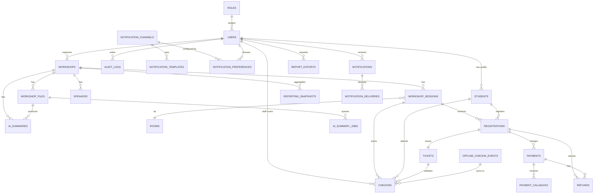

**Giải thích mối quan hệ:**

1. **Roles → Users**: 1 role có nhiều user, mỗi user có 1 role
2. **Workshops → Sessions**: 1 workshop có nhiều session (đợt tổ chức)
3. **Sessions → Room**: 1 session diễn ra tại 1 room (có thể chuyển room → update record)
4. **Students → Registrations**: 1 sinh viên đăng ký nhiều workshop
5. **Registrations → Tickets**: 1 registration sinh ra 1 ticket QR
6. **Tickets → Checkins**: 1 ticket có thể check-in nhiều lần (nhưng thường chỉ 1 lần)
7. **Payments → Registrations**: 1 registration có 0-1 payment (nếu free → 0 payment)
8. **OfflineCheckInEvents → Checkins**: 1 offline event được convert thành 1 checkin record
9. **WorkshopFiles → AISummaries**: PDF upload trigger job và sinh tóm tắt AI
10. **NotificationPreferences → Channels**: User chọn kênh email/push/SMS/chat
11. **ReportingSnapshots**: Read model phục vụ dashboard, revenue và show-up rate

---

## 7. ERD Chi Tiết

```mermaid
erDiagram
    USERS {
        uuid id PK
        string email UK
        string phone
        string password_hash
        string full_name
        uuid role_id FK
        boolean is_active
        timestamp created_at
    }

    ROLES {
        uuid id PK
        string name UK
        string description
    }

    STUDENTS {
        uuid id PK
        uuid user_id FK, UK
        string student_id UK
        string major
        string class_name
        boolean is_verified
    }

    WORKSHOPS {
        uuid id PK
        string title
        text description
        uuid organizer_id FK
        boolean is_free
        decimal base_price
        int max_capacity
        string status
        timestamp cancelled_at
        uuid cancelled_by FK
        string cancellation_reason
    }

    WORKSHOP_SESSIONS {
        uuid id PK
        uuid workshop_id FK
        int session_number
        timestamp start_time
        timestamp end_time
        uuid room_id FK
        int current_capacity
        int max_capacity
        string status
    }

    SPEAKERS {
        uuid id PK
        uuid workshop_id FK
        string name
        string title
        text bio
    }

    ROOMS {
        uuid id PK
        string name UK
        string building
        int floor
        int capacity
        text layout_url
        jsonb amenities
    }

    WORKSHOP_FILES {
        uuid id PK
        uuid workshop_id FK
        string file_type
        string file_url
        string file_name
        bigint file_size_bytes
        string content_hash
        string upload_status
        uuid uploader_id FK
        timestamp uploaded_at
    }

    AI_SUMMARIES {
        uuid id PK
        uuid workshop_id FK
        uuid workshop_file_id FK
        string status
        text summary_text
        string language
        string model_name
        text error_msg
        text manual_override_text
        timestamp generated_at
    }

    AI_SUMMARY_JOBS {
        uuid id PK
        uuid workshop_file_id FK
        string status
        int attempt_count
        text last_error
        timestamp started_at
        timestamp finished_at
    }

    REGISTRATIONS {
        uuid id PK
        uuid student_id FK
        uuid workshop_session_id FK
        string status
        string payment_status
        string idempotency_key UK
        timestamp registration_time
    }

    TICKETS {
        uuid id PK
        uuid registration_id FK, UK
        string qr_code UK
        string qr_image_url
        string status
        timestamp generated_at
        timestamp used_at
        timestamp expiry_at
    }

    PAYMENTS {
        uuid id PK
        uuid registration_id FK
        decimal amount
        string status
        string idempotency_key UK
        string transaction_id
        timestamp completed_at
    }

    PAYMENT_CALLBACKS {
        uuid id PK
        uuid payment_id FK
        timestamp callback_timestamp
        string status
        string transaction_id
        jsonb callback_data
        boolean signature_verified
        timestamp processed_at
    }

    REFUNDS {
        uuid id PK
        uuid payment_id FK
        uuid registration_id FK
        decimal amount
        string status
        string idempotency_key UK
        string gateway_refund_id
        text error_reason
        uuid requested_by FK
        timestamp completed_at
    }

    CHECKINS {
        uuid id PK
        uuid ticket_id FK
        uuid student_id FK
        uuid workshop_session_id FK
        timestamp checkin_time
        uuid staff_id FK
        string checkin_type
        string status
    }

    OFFLINE_CHECKIN_EVENTS {
        uuid id PK
        string app_instance_id
        string qr_code
        uuid student_id FK
        uuid workshop_session_id FK
        timestamp local_timestamp
        string sync_status
    }

    OFFLINE_SYNC_STATUS {
        uuid id PK
        string app_instance_id UK
        timestamp last_sync_time
        int conflict_count
        int synced_count
        int failed_count
    }

    NOTIFICATION_CHANNELS {
        uuid id PK
        string name UK
        boolean is_enabled
        jsonb config
    }

    NOTIFICATION_PREFERENCES {
        uuid id PK
        uuid user_id FK
        uuid channel_id FK
        string destination
        boolean is_enabled
        jsonb quiet_hours
    }

    NOTIFICATION_TEMPLATES {
        uuid id PK
        string name UK
        string event_type
        uuid channel_id FK
        string subject
        text template_content
        boolean is_active
    }

    NOTIFICATIONS {
        uuid id PK
        uuid recipient_id FK
        uuid channel_id FK
        string subject
        text content
        string status
        string event_type
        string event_id
        timestamp created_at
    }

    NOTIFICATION_DELIVERIES {
        uuid id PK
        uuid notification_id FK
        int delivery_attempt
        int response_code
        text response_body
        timestamp delivered_at
        text failed_reason
    }

    REPORTING_SNAPSHOTS {
        uuid id PK
        uuid workshop_id FK
        int registered_count
        int checked_in_count
        int no_show_count
        decimal revenue_amount
        decimal refund_amount
        decimal payment_success_rate
        timestamp last_updated
    }

    REPORT_EXPORTS {
        uuid id PK
        uuid requested_by FK
        string report_type
        text file_url
        string status
        timestamp completed_at
    }

    AUDIT_LOGS {
        uuid id PK
        uuid user_id FK
        string action
        string entity_type
        jsonb old_values
        jsonb new_values
        timestamp created_at
    }

    SYSTEM_EVENTS {
        uuid id PK
        string event_type
        string severity
        text message
        jsonb context
        timestamp created_at
    }

    ROLES ||--o{ USERS : "assigns"
    USERS ||--o{ STUDENTS : "has profile"
    USERS ||--o{ WORKSHOPS : "organizes"
    USERS ||--o{ CHECKINS : "staff"
    USERS ||--o{ AUDIT_LOGS : "by"
    USERS ||--o{ NOTIFICATION_PREFERENCES : "chooses"
    USERS ||--o{ REPORT_EXPORTS : "requests"

    WORKSHOPS ||--o{ WORKSHOP_SESSIONS : "has"
    WORKSHOPS ||--o{ SPEAKERS : "has"
    WORKSHOPS ||--o{ WORKSHOP_FILES : "has files"
    WORKSHOPS ||--o{ AI_SUMMARIES : "has summaries"
    WORKSHOPS ||--o{ REPORTING_SNAPSHOTS : "metrics"
    WORKSHOP_SESSIONS }o--|| ROOMS : "at"

    WORKSHOP_FILES ||--o{ AI_SUMMARY_JOBS : "queues"
    WORKSHOP_FILES ||--o{ AI_SUMMARIES : "produces"

    STUDENTS ||--o{ REGISTRATIONS : "registers"
    STUDENTS ||--o{ CHECKINS : "checks-in"

    WORKSHOP_SESSIONS ||--o{ REGISTRATIONS : "open to"
    WORKSHOP_SESSIONS ||--o{ CHECKINS : "track"

    REGISTRATIONS ||--|| TICKETS : "generates"
    REGISTRATIONS ||--o{ PAYMENTS : "requires"
    REGISTRATIONS ||--o{ REFUNDS : "refunds"

    PAYMENTS ||--o{ PAYMENT_CALLBACKS : "callbacks"
    PAYMENTS ||--o{ REFUNDS : "refunds"
    TICKETS ||--o{ CHECKINS : "validates"

    OFFLINE_CHECKIN_EVENTS ||--o{ CHECKINS : "syncs to"

    NOTIFICATION_CHANNELS ||--o{ NOTIFICATION_PREFERENCES : "configures"
    NOTIFICATION_CHANNELS ||--o{ NOTIFICATION_TEMPLATES : "templates"
    NOTIFICATION_CHANNELS ||--o{ NOTIFICATIONS : "via"
    NOTIFICATIONS ||--o{ NOTIFICATION_DELIVERIES : "attempts"
```

---

## 8. Các Quyết Định Kiến Trúc Quan Trọng

### 8.1 Phân chia Database Per Service

**Quyết định**: Mỗi service sở hữu một phần của schema, nhưng share PostgreSQL instance.

**Lý do**:

- Dễ join dữ liệu (không cần distributed transaction)
- Dễ bảo trì, backup, recovery
- Nhỏ nhất project, không cần complexity của microservices thật sự

**Nhược điểm**:

- Coupling lớn nếu không kỷ luật schema design

**Cách giảm thiểu:**

- Rõ ràng owner của mỗi bảng
- API Gateway enforce: client chỉ call qua API, không direct DB
- Migration script của service owns bảng đó

---

### 8.2 Cache Seat Count trong Redis

**Quyết định**: Cache `seat_count:{workshopSessionId}` trong Redis, DECR atomic operation.

**Lý do**:

- Tránh race condition: 50 ghế, 51 người cùng lúc đăng ký
- Redis DECR atomic, không cần lock
- Sub-ms latency

**Cách đảm bảo consistency:**

- Registration Service DECR seat count, INSERT registration DB
- Nếu INSERT fail: INCR lại seat count (rollback)
- Nếu INSERT success: DB sẽ maintain accurate count
- Định kỳ resync: query COUNT từ DB, update Redis

**Code logic:**

```
begin_transaction
  newCount = DECR redis_seat_count
  if newCount < 0:
    INCR redis_seat_count  -- rollback
    return 400 No seats

  try:
    INSERT registration into DB
    INSERT ticket
    UPDATE registration status CONFIRMED
    commit
  catch error:
    INCR redis_seat_count  -- rollback
    rollback transaction
    return 500 error
```

---

### 8.3 QR Code Generation Strategy

**Quyết định**: Generate QR khi registration CONFIRMED, lưu image vào Cloudinary.

**Quy trình:**

1. Registration Service gọi QR Service
2. QR Service tạo payload: `{registration_id, timestamp, hash}`
3. Tạo QR image, upload Cloudinary
4. Return QR URL, lưu vào Ticket table
5. Client download/display QR

**Lợi ích:**

- QR code là duy nhất (registration_id là PK)
- Có thể generate lại nếu mất (idempotent)
- S3 CDN-friendly, nhanh download

---

### 8.4 Offline Check-in Sync Strategy

**Quyết định**: App lưu local SQLite, batch sync khi online.

**Sync protocol:**

1. App collect `offline_checkin_events` từ local DB
2. POST `/checkins/sync/batch` với events + lastSyncTime
3. Service validate QR, kiểm tra conflict
4. Chỉ lưu vào DB nếu valid, log conflict nếu có
5. Return sync summary
6. App xóa đã sync events từ local

**Conflict handling:**

- QR không tồn tại → log conflict, skip
- Đã check-in online → log duplicate, skip (idempotent)
- Timestamp offline check-in > workshop start time → warn, save anyway (staff có thể quét muộn)

**Tránh duplicate:**

- Distributed lock trên QR code (TTL 24h)
- Check existing checkin_record trước khi insert

---

### 8.5 Payment Idempotency

**Quyết Định**: Generate idempotency key client-side hoặc server-side, gửi cùng payment request.

**Flow:**

1. Client POST `/payments` → Server generate UUID (idempotency_key)
2. Server INSERT payment (status='PENDING', idempotency_key)
3. Call Payment Gateway (gửi idempotency_key)
4. Nhận response:
   - Success: UPDATE status='COMPLETED', INSERT receipt
   - Fail: UPDATE status='FAILED', error reason
5. Webhook callback từ gateway:
   - SELECT payment WHERE idempotency_key
   - Nếu chưa xử lý: UPDATE based on callback
   - Nếu đã xử lý: Return 200 OK (idempotent)

**Xử lý callback:**

```
POST /payments/webhook
  payload = verify_signature(body, secret)
  payment = SELECT WHERE transaction_id = payload.transaction_id

  if payment.status in [COMPLETED, FAILED]:
    return 200 OK  -- Already processed

  if payload.status == 'COMPLETED':
    UPDATE payment status=COMPLETED, transaction_id, completed_at
    PUBLISH 'payment.completed' event
  else if payload.status == 'FAILED':
    UPDATE payment status=FAILED, error_reason
    PUBLISH 'payment.failed' event

  return 200 OK
```

---

### 8.6 Event-Driven Architecture

**Quyết định**: Notification, AI summary, refund/reconciliation và analytics dùng async event/job.

**Event types:**

- `registration.created`: Gửi email xác nhận
- `payment.completed`: Gửi receipt
- `payment.failed`: Release seat hold, notify student
- `refund.requested`: Refund Worker gọi payment gateway
- `refund.completed`: Gửi thông báo hoàn tiền
- `checkin.recorded`: Update attendance stats
- `workshop.updated`: Notify subscribers
- `workshop.cancelled`: Notify all registered
- `pdf_uploaded`: AI Summary Worker xử lý PDF
- `summary.done`: Cập nhật trạng thái summary cho admin/student detail
- `summary.failed`: Alert admin và cho phép retry/manual override

**Benefits:**

- Decoupling services
- Notification Service có thể fail mà không ảnh hưởng registration
- Dễ thêm subscriber mới (e.g., analytics projection, AI summary notification, refund worker)

**Implementation:**

- RabbitMQ/Kafka + persistence
- Retry policy: 3 lần, exponential backoff
- Dead-letter queue cho failed message

---

### 8.7 Realtime Seat Availability

**Quyết định**: WebSocket + Redis Pub/Sub broadcast

**Flow:**

1. Client connect WebSocket, subscribe `workshop:{id}`
2. Registration Service publish event `seat.updated`
3. Workshop Service consume event
4. Broadcast via WebSocket đến all subscribers
5. Client update UI realtime

**Alternative**: Server-Sent Events (SSE) nếu browser không support WebSocket

---

## 9. Rủi Ro Kỹ Thuật & Hướng Xử Lý

### 9.1 Race Condition - Overbooking

**Rủi ro**: Nhiều sinh viên cùng lúc đăng ký, vượt quá sức chứa.

**Xảy ra khi**:

- TOCTOU (Time-of-Check-Time-of-Use) nếu kiểm tra capacity rồi insert riêng

**Mitigations**:

- **Redis atomic DECR**: Guarantee no overbooking
- **DB trigger**: `BEFORE INSERT ON registrations, check workshop_sessions.current_capacity < max_capacity`
- **Test**: Load test với 1000 concurrent registration request

---

### 9.2 Payment Webhook Double Charge

**Rủi ro**: Webhook callback gửi nhiều lần, charge 2 lần.

**Xảy ra khi**: Network retry, duplicate webhook từ gateway

**Mitigations**:

- **Idempotency key**: Mỗi payment có unique key, gateway check
- **SELECT for check**: Trước khi process callback, check payment.status đã COMPLETED chưa
- **Webhook signature**: Verify signature của callback
- **Test**: Simulate duplicate webhook, confirm idempotent

---

### 9.3 Offline Sync Data Loss

**Rủi ro**: Check-in app crash, mất offline events trong local DB.

**Xảy ra khi**: SQLite corrupt, app uninstall không backup

**Mitigations**:

- **Backup**: App upload offline events trước khi uninstall (biết được không)
- **Periodic sync**: Auto-sync mỗi 30min hoặc khi có mạng
- **Log**: Tất cả check-in ghi server log, có thể manual check-in via admin web nếu cần
- **Staff training**: Staff quét lại nếu mất record

---

### 9.4 QR Code Reuse / Fake QR

**Rủi ro**: 1 sinh viên share QR cho sinh viên khác, hoặc fake QR code.

**Xảy ra khi**: QR không được validate, check-in staff không kiểm tra kỹ

**Mitigations**:

- **Lock after first check-in**: Distributed lock `checkin:{qrCode}` TTL 24h
- **QR payload encoding**: Encode registration_id + timestamp + hash(secret)
- **Signature verification**: Server verify QR signature, không accept fake
- **Staff verification**: Check-in staff compare sinh viên name với app, facial recognition nếu cần
- **Test**: Generate fake QR, server should reject

---

### 9.5 Session Timeout / Token Expiry

**Rủi ro**: User token hết hạn giữa lúc đăng ký, request fail

**Xảy ra khi**: API call lâu, token expiry short

**Mitigations**:

- **Token refresh**: Return refresh token, client auto-refresh
- **Longer timeout**: JWT token valid 24h (trong 1 event week, hợp lý)
- **Async process**: Move long-running task ra background job (e.g., generate report)
- **Client retry**: Client retry với refresh token nếu 401

---

### 9.6 Database Connection Pool Exhaustion

**Rủi ro**: Quá nhiều concurrent request, connection pool dùng hết.

**Xảy ra khi**: Spike traffic, DB slow query block connection

**Mitigations**:

- **Connection pool tuning**: Set max_connections = 100-200
- **Query timeout**: SET statement_timeout = 30s
- **Slow query log**: Monitor slow query, optimize index
- **Rate limit**: API Gateway enforce rate limit per user/IP
- **Caching**: Cache popular queries (workshop list)
- **Read replica**: Query read-heavy data từ replica

---

### 9.7 Notification Service Outage

**Rủi ro**: Email/push service down, sinh viên không nhận xác nhận.

**Xảy ra khi**: Email provider fail, Push notification server down

**Mitigations**:

- **Async queue**: Notification lưu queue, retry mỗi 5min, 3 lần
- **Fallback**: Nếu email fail, admin có thể manual send
- **Multiple channels**: Gửi qua email + push + SMS (redundant)
- **Notification history**: Web app show "xác nhận chưa gửi", user có thể resend
- **SLA monitoring**: Alert nếu notification failure rate > 5%

---

### 9.8 AI Summary Pipeline Latency

**Rủi ro**: PDF parsing hoặc LLM summarization lâu, block thao tác tạo/cập nhật workshop hoặc làm summary không sẵn sàng cho sinh viên.

**Xảy ra khi**: PDF dài/corrupt, LLM inference slow, AI service overload hoặc rate limit.

**Mitigations**:

- **Async job**: Upload PDF chỉ enqueue `pdf_uploaded`, worker xử lý nền
- **Cache**: Cache summary đã tạo; fallback về mô tả gốc nếu summary chưa sẵn sàng
- **Timeout**: LLM request timeout ngắn, retry với exponential backoff
- **Separate worker pool**: AI Summary Worker scale riêng, không dùng chung request thread
- **Circuit breaker**: Nếu LLM fail nhiều lần, mark `ai_summaries.status='ERROR'`, alert admin và dừng gọi tạm thời

---

### 9.9 Workshop Update Race Condition

**Rủi ro**: Ban tổ chức update room/time, sinh viên đã đăng ký không được notify.

**Xảy ra khi**: Async notification delay, hoặc no notification

**Mitigations**:

- **Event publish**: Workshop Service publish `workshop.updated` event
- **Notification**: Gửi email/push "Workshop [name] có thay đổi"
- **Version tracking**: Lưu version workshop, client check version
- **Admin alert**: Admin web show "X sinh viên need notify"
- **Manual escalation**: Admin có thể manual send email nếu cần

---

### 9.10 Legacy System Integration Failure

**Rủi ro**: Legacy Student System down, không lấy được student info.

**Xảy ra khi**: Legacy system maintenance, network issue

**Mitigations**:

- **Cache**: Cache student info 24h từ legacy system
- **Fallback**: Accept registration ngay cả nếu legacy fail, verify sau
- **Monitoring**: Alert nếu legacy system không respond
- **Graceful degradation**: Student detail page vẫn hoạt động với mô tả gốc nếu AI summary chưa có
- **Alternative source**: Lấy from previous data nếu available

---

## 10. Roadmap & Scaling Considerations

### 10.1 Immediate (Week 1-2)

- [ ] Setup PostgreSQL, Redis, RabbitMQ
- [ ] Implement core API Gateway + Auth Service
- [ ] Implement Workshop & Registration Service
- [ ] Frontend Student App (basic list + register)

### 10.2 Phase 1 (Week 3-4)

- [ ] Implement QR Code Service
- [ ] Implement Check-in Service (online)
- [ ] Implement Payment Service
- [ ] Admin Web Console (basic CRUD workshop)

### 10.3 Phase 2 (Week 5-6)

- [ ] Check-in Mobile App (online + offline sync)
- [ ] Notification Service (email + push)
- [ ] AI Summary Worker + PDF processing pipeline
- [ ] Analytics Dashboard

### 10.4 Future Scaling

- **Database**: Switch to PostgreSQL Replication (master-slave) + read replica
- **Cache**: Redis Cluster cho high availability
- **Message Broker**: Kafka instead RabbitMQ cho higher throughput
- **Service Mesh**: Istio/Linkerd cho advanced traffic management
- **Search**: Elasticsearch cho advanced workshop search
- **CDN**: CloudFront/Cloudflare cho static content
- **Object Storage**: AWS S3 hoặc MinIO self-hosted

---

## 11. Technology Stack Summary

| Component             | Technology                                    | Reason                                   |
| --------------------- | --------------------------------------------- | ---------------------------------------- |
| **Frontend**          | React 18 + Next.js                            | SSR, fast development, good SEO          |
| **Mobile**            | Flutter                                       | Cross-platform, good offline support     |
| **Backend API**       | Node.js                                       | Scalable, mature ecosystem               |
| **Authentication**    | JWT + OAuth2                                  | Stateless, easy to scale                 |
| **Database**          | PostgreSQL 14+                                | ACID, relational, mature                 |
| **Cache**             | Redis 7+                                      | In-memory, atomic ops, pub/sub           |
| **Object Storage**    | S3-compatible (AWS S3 or MinIO)               | Scalable, CDN-friendly                   |
| **Message Broker**    | RabbitMQ hoặc Apache Kafka                    | Event-driven, guaranteed delivery        |
| **API Gateway**       | Kong hoặc Nginx                               | Rate limit, auth, routing                |
| **Payment Gateway**   | VNPay / Stripe / 2Checkout                    | Payment processing                       |
| **Email Service**     | SendGrid / Mailgun                            | Transactional email                      |
| **Push Notification** | Firebase Cloud Messaging (FCM)                | Cross-platform push                      |
| **AI Service**        | Python FastAPI/Celery + external LLM API      | PDF extraction và workshop summarization |
| **Monitoring**        | Prometheus + Grafana                          | Infrastructure monitoring                |
| **Logging**           | ELK Stack (Elasticsearch + Logstash + Kibana) | Centralized logging                      |
| **CI/CD**             | GitHub Actions / GitLab CI                    | Automation                               |
| **Container**         | Docker + Kubernetes (optional)                | Containerization, orchestration          |

---

## Kết Luận

Kiến trúc UniHub Workshop được thiết kế với nguyên tắc:

1. **Scalable**: Có khả năng mở rộng ngang (horizontal scaling)
2. **Resilient**: Xử lý lỗi gracefully, circuit breaker, retry logic
3. **Maintainable**: Rõ ràng responsibility của mỗi service, good documentation
4. **Secure**: Authentication, authorization, payment security, audit log
5. **Extendable**: Dễ thêm kênh notification mới, AI model mới, service mới

Với design này, hệ thống có thể:

- Xử lý hàng nghìn concurrent user đăng ký
- Garantee consistency cho seat count và payment
- Support offline check-in với data sync
- Mở rộng thêm feature mà không ảnh hưởng core logic
