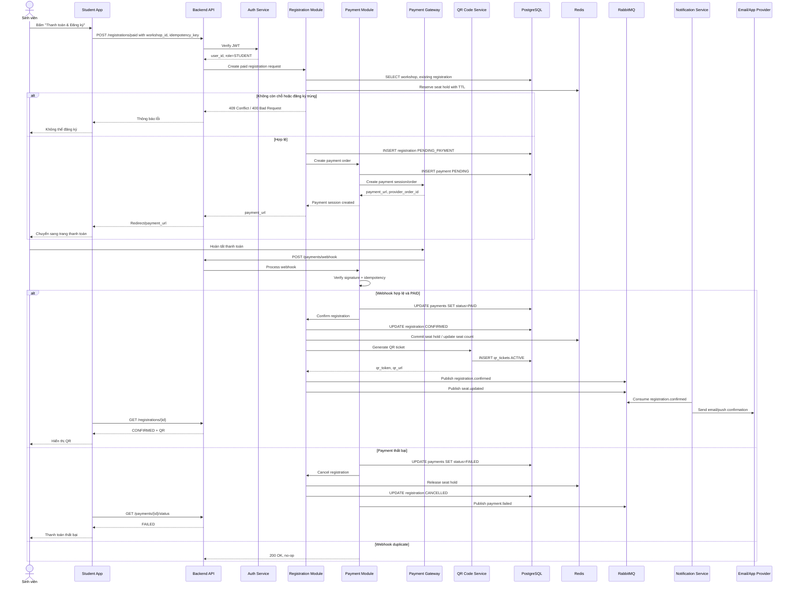
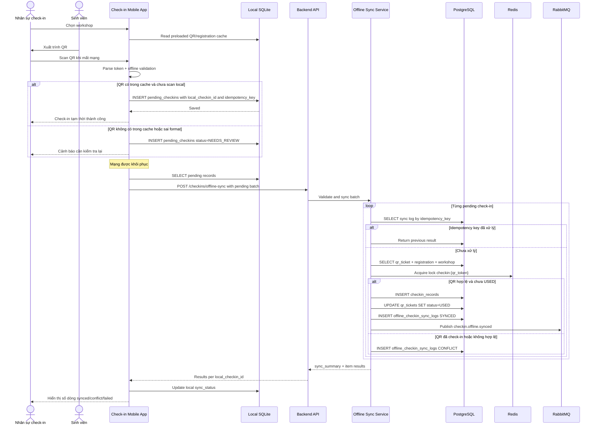
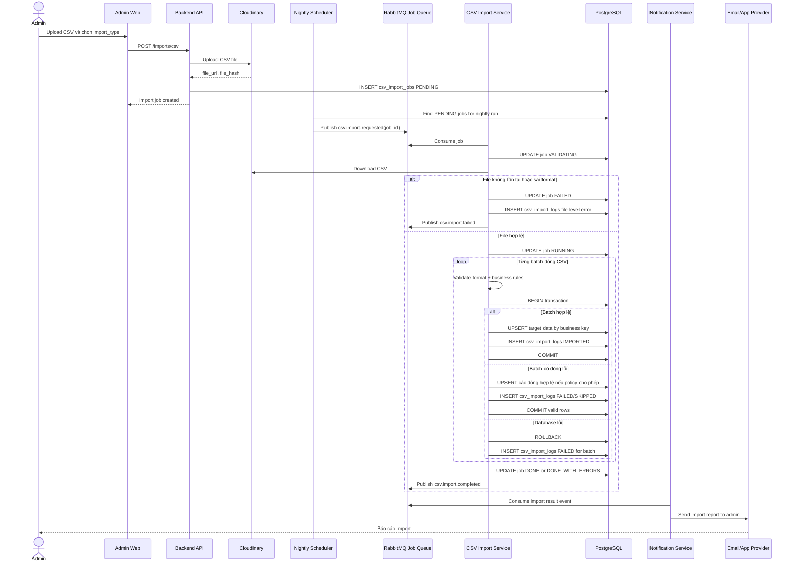

# UniHub Workshop - Business Flows

## 3.1 Luồng đăng ký workshop có phí

### Mục tiêu luồng

Cho phép sinh viên đăng ký workshop có thu phí, thanh toán qua Payment Gateway, sau đó nhận QR ticket khi thanh toán được xác nhận hợp lệ.

### Actor tham gia

- Sinh viên.
- Payment Gateway.
- Notification Provider.

### Thành phần hệ thống tham gia

- Student Web/Mobile App.
- Backend API.
- Authentication/Authorization Service.
- Workshop Management Module.
- Registration Module.
- Payment Integration Module.
- QR Code Service.
- Notification Service.
- PostgreSQL.
- Redis.
- Message Broker.

### Điều kiện bắt đầu

- Sinh viên đã đăng nhập.
- Workshop đang ở trạng thái PUBLISHED.
- Workshop có `price > 0`.
- Workshop còn chỗ.
- Sinh viên chưa đăng ký workshop này.
- Payment Gateway khả dụng.

### Kết quả thành công

- Payment có trạng thái PAID.
- Registration có trạng thái CONFIRMED.
- QR ticket được tạo và ACTIVE.
- Số chỗ còn lại giảm đúng 1.
- Sinh viên nhận notification qua app/email.

### Các bước xử lý chi tiết

1. Sinh viên mở chi tiết workshop có phí và bấm “Thanh toán & Đăng ký”.
2. Student App gọi Backend API với `workshop_id` và `idempotency_key`.
3. Backend xác thực token, kiểm tra role STUDENT.
4. Registration Module kiểm tra workshop còn PUBLISHED, chưa hủy, chưa hết chỗ, sinh viên chưa đăng ký trùng.
5. Hệ thống tạo registration ở trạng thái `PENDING_PAYMENT`, `payment_status=PENDING`.
6. Payment Integration Module tạo payment order/session với Payment Gateway. Số tiền lấy từ database, không lấy từ frontend.
7. Backend trả payment URL/session cho Student App.
8. Sinh viên hoàn tất thanh toán trên Payment Gateway.
9. Payment Gateway gửi webhook/callback về Backend API.
10. Payment Integration Module verify signature, provider transaction id và idempotency.
11. Nếu callback hợp lệ và payment thành công, hệ thống cập nhật payment thành PAID.
12. Registration Module confirm registration và commit seat.
13. QR Code Service tạo `qr_token` và QR image nếu cần.
14. Registration Module publish event `registration.confirmed` và `seat.updated`.
15. Notification Service consume event, gửi email/push xác nhận kèm hướng dẫn xem QR.
16. Student App poll hoặc nhận realtime update, hiển thị QR cho sinh viên.

### Mermaid sequence diagram

### Các lỗi có thể xảy ra giữa chừng

| Lỗi | Cách hệ thống phản ứng |
| --- | --- |
| Workshop hết chỗ | Registration Module trả 409 Conflict, không tạo payment mới. Nếu đã giữ seat tạm thì release hold. |
| Sinh viên đăng ký trùng | Unique (`user_id`, `workshop_id`) chặn trùng. Nếu cùng `idempotency_key`, trả kết quả cũ. |
| Payment thất bại | Payment chuyển FAILED, registration CANCELLED hoặc EXPIRED, seat hold được release. |
| Payment callback bị gọi nhiều lần | Payment Module kiểm tra provider_transaction_id/callback id. Callback trùng trả 200 OK nhưng không xử lý lại. |
| Payment callback bị trễ | Student App hiển thị PENDING_PAYMENT và poll status. Reconciliation job kiểm tra lại gateway nếu quá thời gian. |
| Payment thành công nhưng tạo QR lỗi | Payment vẫn PAID, registration có thể ở CONFIRMED_PENDING_QR hoặc CONFIRMED với QR job PENDING. Tạo job retry QR, alert admin nếu retry thất bại. |
| Notification gửi thất bại | Không rollback registration/payment. Notification Service retry và lưu delivery log; sinh viên vẫn có thể xem QR trong app. |
| User đóng app giữa chừng | Payment/registration không phụ thuộc vào app đang mở. Khi mở lại, app gọi API lấy trạng thái mới nhất. |
| Hết chỗ sau khi payment success | Nếu dùng seat hold TTL, ưu tiên giữ chỗ trong thời gian thanh toán. Nếu vẫn không confirm được, tạo refund job và thông báo sinh viên. |

## 3.2 Luồng check-in khi mất mạng và đồng bộ lại

### Mục tiêu luồng

Đảm bảo nhân sự check-in vẫn ghi nhận được sinh viên tham dự khi mất mạng, sau đó đồng bộ dữ liệu lên server một cách an toàn, không tạo check-in trùng.

### Actor tham gia

- Nhân sự check-in.
- Sinh viên đưa QR.

### Thành phần hệ thống tham gia

- Check-in Mobile App.
- Local SQLite.
- Backend API.
- Offline Check-in Sync Service.
- Check-in Service.
- PostgreSQL.
- Redis.
- Message Broker.

### Điều kiện bắt đầu

- Nhân sự check-in đã đăng nhập trước đó.
- App đã preload danh sách registration/QR hợp lệ cho workshop hoặc ít nhất có cache token cần thiết.
- Thiết bị mất mạng hoặc server timeout.
- Sinh viên có QR.

### Kết quả thành công

- Khi offline, check-in được lưu cục bộ với `sync_status=PENDING_SYNC`.
- Khi có mạng, backend xác thực lại QR và tạo `checkin_records` cho dòng hợp lệ.
- Dòng trùng hoặc xung đột được đánh dấu conflict, không tạo check-in sai.
- App cập nhật trạng thái local theo kết quả server trả về.

### Các bước xử lý chi tiết

1. Nhân sự check-in mở workshop trong app.
2. App đã có cache danh sách QR/registration hợp lệ từ lần preload trước sự kiện.
3. Nhân sự scan QR khi mạng mất.
4. App parse QR token và kiểm tra offline:
   - Token đúng định dạng.
   - Token có trong cache preload nếu có.
   - Workshop trong QR/cache khớp workshop đang check-in.
   - Token chưa được scan trên thiết bị này.
5. App tạo `local_checkin_id` và `idempotency_key`.
6. App lưu vào SQLite bảng `pending_checkins` với `sync_status=PENDING_SYNC`.
7. App hiển thị “Check-in tạm thời, sẽ đồng bộ khi có mạng”.
8. Khi mạng có lại, app gọi Sync API với batch pending records.
9. Backend xử lý từng record:
   - Kiểm tra idempotency key.
   - Tìm QR ticket theo token.
   - Kiểm tra registration CONFIRMED, workshop đúng, QR ACTIVE và chưa USED.
   - Nếu hợp lệ, tạo `checkin_records`, update `qr_tickets.status=USED`.
   - Nếu trùng hoặc không hợp lệ, ghi `offline_checkin_sync_logs` với conflict reason.
10. Backend trả kết quả từng dòng.
11. App cập nhật SQLite: SYNCED, CONFLICT hoặc FAILED.
12. Staff có thể xem danh sách conflict để xử lý thủ công nếu cần.

### Mermaid sequence diagram

### Các lỗi có thể xảy ra giữa chừng

| Lỗi | Cách hệ thống phản ứng |
| --- | --- |
| QR không tồn tại trong cache | App cảnh báo “Không xác minh được offline”, vẫn có thể lưu NEEDS_REVIEW nếu quy trình cho phép. Backend quyết định hợp lệ khi sync. |
| QR sai format | App từ chối hoặc lưu failed local, không gửi sync nếu không parse được token. |
| QR đã được check-in trước đó | Backend trả conflict `ALREADY_CHECKED_IN`, app cập nhật local record thành CONFLICT. |
| Local data quá cũ | Backend trả conflict `STALE_CACHE` hoặc `REGISTRATION_NOT_VALID`; app yêu cầu preload lại. |
| Đồng bộ bị mất mạng giữa chừng | App không xóa pending record. Lần retry sau gửi lại cùng idempotency key, backend trả kết quả cũ hoặc xử lý tiếp. |
| Một QR được scan trên nhiều thiết bị offline | Backend dùng unique `qr_ticket_id` và lock để chỉ record đầu tiên thành công. Các record còn lại nhận conflict. |
| Backend phát hiện workshop đã hủy | Không tạo check-in, log conflict `WORKSHOP_CANCELLED`, app hiển thị cần xử lý thủ công. |
| SQLite đầy hoặc lỗi | App cảnh báo staff, không xác nhận tạm nếu không lưu được local record. |

## 3.3 Luồng nhập dữ liệu từ CSV đêm

### Mục tiêu luồng

Import dữ liệu hàng loạt từ CSV vào hệ thống vào ban đêm, ví dụ danh sách sinh viên, phòng, diễn giả hoặc workshop do phòng ban cung cấp. Luồng phải validate dữ liệu, ghi log lỗi từng dòng và không làm hỏng dữ liệu cũ nếu import lỗi.

### Actor tham gia

- Admin hoặc hệ thống scheduler.
- Notification Provider để gửi báo cáo import.

### Thành phần hệ thống tham gia

- Admin Web App.
- Backend API.
- Object Storage.
- Scheduler.
- CSV Import Service.
- PostgreSQL.
- RabbitMQ / Job Queue.
- Notification Service.

### Điều kiện bắt đầu

- File CSV đã được upload vào Object Storage hoặc thư mục import.
- Admin đã tạo import job hoặc scheduler phát hiện file mới.
- Mapping cột CSV đã được cấu hình theo `import_type`.
- Hệ thống đang ở khung giờ import ban đêm hoặc được admin trigger thủ công.

### Kết quả thành công

- `csv_import_jobs` ghi nhận trạng thái DONE hoặc DONE_WITH_ERRORS.
- Dòng hợp lệ được insert/update vào database.
- Dòng lỗi được ghi vào `csv_import_logs` với row number và error message.
- Admin nhận báo cáo import.
- Dữ liệu cũ không bị mất nếu job lỗi một phần.

### Các bước xử lý chi tiết

1. Admin upload file CSV lên Admin Web hoặc hệ thống đặt file vào Object Storage.
2. Backend tạo `csv_import_jobs` với trạng thái PENDING, lưu `file_url`, `file_hash`, `import_type`.
3. Scheduler chạy ban đêm và publish job `csv.import.requested`.
4. CSV Import Service nhận job, chuyển trạng thái sang VALIDATING.
5. Service đọc file CSV từ Object Storage.
6. Validate format:
   - File tồn tại.
   - Encoding đọc được.
   - Header đúng template.
   - Số cột hợp lệ.
7. Validate nghiệp vụ từng dòng:
   - Field bắt buộc không rỗng.
   - Kiểu dữ liệu đúng.
   - Mã phòng/MSSV/workshop external id không sai format.
   - Không trùng business key trong cùng file.
   - Không tạo xung đột phòng/giờ nếu import workshop.
8. Ghi `csv_import_logs` cho từng dòng lỗi.
9. Với dòng hợp lệ, service insert/update theo business key trong batch transaction.
10. Nếu một batch lỗi database, rollback batch đó, ghi log cho các dòng liên quan và tiếp tục batch sau nếu an toàn.
11. Cập nhật tổng số dòng thành công/thất bại trong `csv_import_jobs`.
12. Notification Service gửi báo cáo cho admin: file nào, số dòng thành công, số dòng lỗi, link xem log.

### Mermaid sequence diagram

### Các lỗi có thể xảy ra giữa chừng

| Lỗi | Cách hệ thống phản ứng |
| --- | --- |
| File không tồn tại | Job chuyển FAILED, ghi log file-level, gửi báo cáo lỗi cho admin. |
| File sai format/header | Không import dòng nào, job FAILED hoặc DONE_WITH_ERRORS tùy mức độ, ghi lỗi header. |
| Dữ liệu trùng trong cùng file | Dòng sau bị SKIPPED/FAILED theo business key; log rõ dòng trùng với dòng nào. |
| Dữ liệu trùng với database | Nếu business key đã tồn tại và policy là upsert, cập nhật record; nếu policy là insert-only, log lỗi duplicate. |
| Thiếu field bắt buộc | Dòng đó FAILED, các dòng khác vẫn xử lý nếu format file tổng thể hợp lệ. |
| Một phần import thành công, một phần thất bại | Dùng batch transaction. Dòng hợp lệ commit, dòng lỗi ghi log. Job kết thúc DONE_WITH_ERRORS. |
| Database lỗi giữa chừng | Rollback batch đang xử lý, giữ nguyên các batch đã commit trước đó. Job có thể retry từ batch chưa xong nếu thiết kế checkpoint. |
| Import job bị chạy lại | Dùng `file_hash`, `import_type`, `business_key` và idempotency. Upsert phải deterministic để chạy lại không nhân đôi dữ liệu. |
| CSV chứa dữ liệu làm hỏng dữ liệu đang hoạt động | Import vào staging/validate trước, chỉ update field cho phép. Với workshop đã PUBLISHED và có đăng ký, thay đổi phòng/giờ/capacity phải đi qua rule giống Admin update. |

### Chiến lược transaction, idempotency và bảo toàn dữ liệu

- **Transaction:** Dùng transaction theo batch, ví dụ 100-500 dòng/batch. Không dùng một transaction quá lớn vì dễ lock lâu và khó retry.
- **Staging validation:** Với import phức tạp như workshop, nên parse vào staging memory/table trước, validate toàn bộ conflict phòng/giờ rồi mới upsert.
- **Idempotency:** Mỗi job có `file_hash`; mỗi dòng có `business_key`. Chạy lại cùng file không tạo bản ghi trùng.
- **Import log chi tiết:** `csv_import_logs` phải lưu `row_number`, `business_key`, `status`, `error_code`, `error_message`, `raw_row`.
- **Không làm hỏng dữ liệu cũ:** Không xóa hàng loạt theo CSV. Chỉ insert/update field rõ ràng. Nếu cần deactivate dữ liệu không còn trong CSV, phải có job riêng và review của admin.
