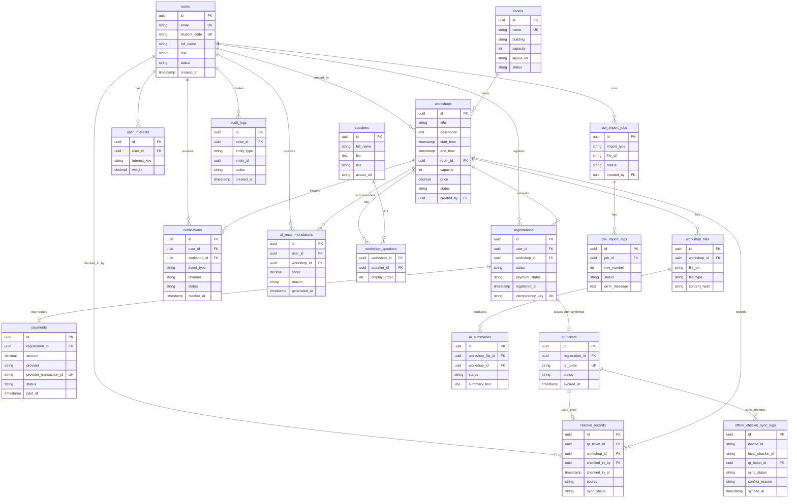

# UniHub Workshop - Database Design

## 2.1 Phân loại dữ liệu chính

| Nhóm dữ liệu                                | Mô tả                                                             | Bảng                                                                   |
| ------------------------------------------- | ----------------------------------------------------------------- | ---------------------------------------------------------------------- |
| User / Student / Organizer / Check-in Staff | Người dùng hệ thống và vai trò truy cập.                          | `users`                                                                |
| Workshop                                    | Thông tin workshop, thời gian, phòng, giá, trạng thái.            | `workshops`                                                            |
| Room                                        | Phòng tổ chức, sức chứa, vị trí, sơ đồ phòng.                     | `rooms`                                                                |
| Speaker                                     | Diễn giả và thông tin liên quan.                                  | `speakers`, `workshop_speakers`                                        |
| Registration                                | Sinh viên đăng ký workshop, trạng thái xác nhận và thanh toán.    | `registrations`                                                        |
| Payment                                     | Giao dịch thanh toán, callback từ gateway, trạng thái thanh toán. | `payments`, `payment_callbacks`                                        |
| QR Ticket                                   | Vé QR đại diện cho một registration hợp lệ.                       | `qr_tickets`                                                           |
| Check-in Record                             | Ghi nhận sinh viên đã tham dự workshop.                           | `checkin_records`                                                      |
| Offline Check-in Queue                      | Dữ liệu check-in tạm trên mobile và log đồng bộ trên server.      | Local SQLite `pending_checkins`, server `offline_checkin_sync_logs`    |
| Notification                                | Thông báo, template, preference và delivery log.                  | `notifications`, `notification_preferences`, `notification_deliveries` |
| AI Recommendation / User Interest           | Sở thích, tag và kết quả gợi ý workshop.                          | `user_interests`, `ai_recommendations`                                 |
| AI Summary                                  | Tóm tắt AI từ PDF theo yêu cầu trong `feature.md`.                | `workshop_files`, `ai_summaries`                                       |
| CSV Import Job / Import Log                 | Batch import dữ liệu từ CSV và log lỗi từng dòng.                 | `csv_import_jobs`, `csv_import_logs`                                   |
| Audit Log                                   | Lịch sử thay đổi dữ liệu quan trọng.                              | `audit_logs`                                                           |

## 2.2 Đề xuất loại database

### PostgreSQL cho dữ liệu giao dịch chính

PostgreSQL là lựa chọn chính cho UniHub Workshop vì dữ liệu có nhiều quan hệ và cần tính nhất quán cao:

- Một sinh viên không được đăng ký trùng cùng một workshop.
- Workshop không được vượt quá capacity.
- Payment webhook phải cập nhật payment, registration và QR theo state machine rõ ràng.
- QR chỉ được check-in thành công một lần.
- Admin cần truy vấn dashboard theo workshop, payment, check-in và notification.

PostgreSQL hỗ trợ transaction, foreign key, unique constraint, index, JSONB cho payload linh hoạt và query báo cáo đủ tốt cho quy mô sinh viên.

### Redis cho cache, lock và realtime

Redis nên dùng cho dữ liệu ngắn hạn:

- Cache số chỗ còn lại: `seat_available:{workshop_id}`.
- Distributed lock khi đăng ký/check-in.
- Session hoặc JWT blacklist.
- Rate limit API.
- Cache recommendation hoặc notification preference ngắn hạn.
- Pub/Sub cho realtime seat update nếu cần.

Redis không phải source of truth. Nếu Redis lệch dữ liệu, hệ thống phải resync từ PostgreSQL.

### SQLite trên mobile cho offline check-in

Check-in Mobile App cần local database để làm việc khi mất mạng. SQLite phù hợp vì nhẹ, dễ tích hợp với Flutter/React Native và đủ dùng cho danh sách QR preload cùng hàng nghìn pending check-in.

Local SQLite lưu dữ liệu tạm như:

- QR/registration cache đã preload trước sự kiện.
- Pending offline check-in với `local_checkin_id`, `idempotency_key`, `sync_status`.
- Sync result để staff biết dòng nào đã đồng bộ, dòng nào conflict.

### Cloudinary cho file

Cloudinary được sử dụng để lưu trữ và quản lý file:

- PDF workshop (tự động extract text, preview, CDN delivery).
- Sơ đồ phòng (hỗ trợ transformation, responsive image).
- Ảnh workshop/diễn giả (auto-optimize, resize, format conversion).
- QR image (generate URL-based QR nếu cần, hoặc lưu image).
- File CSV import/export báo cáo.
- Ưu điểm: CDN toàn cầu, xử lý ảnh tự động, không cần quản lý server, free tier phù hợp MVP.

Không nên lưu file lớn trực tiếp trong PostgreSQL vì làm database nặng và khó backup/scale.

### RabbitMQ cho async events

RabbitMQ nên dùng cho xử lý bất đồng bộ:

- Gửi notification.
- Xử lý PDF và AI summary.
- Gợi ý AI bất đồng bộ hoặc cache warming.
- Payment reconciliation/refund.
- CSV import ban đêm.
- Reporting snapshot.

## 2.3 ERD bằng Mermaid



## 2.4 Schema chi tiết

### 2.4.1 `users`

**Mục đích:** Lưu tất cả tài khoản trong hệ thống, bao gồm sinh viên, ban tổ chức, nhân sự check-in và admin.

| Field                      | Kiểu         | Ghi chú                                           |
| -------------------------- | ------------ | ------------------------------------------------- |
| `id`                       | UUID         | Primary key.                                      |
| `email`                    | varchar(255) | Unique, dùng để đăng nhập/liên hệ.                |
| `student_code`             | varchar(50)  | Nullable, unique khi role là STUDENT.             |
| `full_name`                | varchar(255) | Họ tên người dùng.                                |
| `phone`                    | varchar(30)  | Nullable.                                         |
| `major`                    | varchar(120) | Nullable, dùng cho sinh viên và recommendation.   |
| `class_name`               | varchar(80)  | Nullable.                                         |
| `role`                     | varchar(30)  | `STUDENT`, `ORGANIZER`, `CHECKIN_STAFF`, `ADMIN`. |
| `status`                   | varchar(30)  | `ACTIVE`, `INACTIVE`, `LOCKED`.                   |
| `legacy_user_id`           | varchar(80)  | ID từ hệ thống cũ nếu có.                         |
| `created_at`, `updated_at` | timestamp    | Audit thời gian.                                  |

**Primary key:** `id`.

**Unique constraint:** `email`, `student_code` nếu không null, `legacy_user_id` nếu không null.

**Index:** `idx_users_role`, `idx_users_major`, `idx_users_status`.

**Ghi chú nghiệp vụ:** Quyền truy cập nên kiểm tra theo `role`. Nếu cần phân quyền chi tiết hơn, có thể bổ sung bảng `permissions` sau.

### 2.4.2 `rooms`

**Mục đích:** Lưu thông tin phòng tổ chức workshop.

| Field                      | Kiểu         | Ghi chú                                 |
| -------------------------- | ------------ | --------------------------------------- |
| `id`                       | UUID         | Primary key.                            |
| `name`                     | varchar(120) | Tên phòng, unique.                      |
| `building`                 | varchar(120) | Tòa nhà.                                |
| `floor`                    | varchar(30)  | Tầng hoặc khu vực.                      |
| `capacity`                 | int          | Sức chứa tối đa.                        |
| `layout_url`               | text         | URL sơ đồ phòng trong object storage.   |
| `status`                   | varchar(30)  | `AVAILABLE`, `MAINTENANCE`, `INACTIVE`. |
| `created_at`, `updated_at` | timestamp    | Audit thời gian.                        |

**Primary key:** `id`.

**Unique constraint:** `name`.

**Index:** `idx_rooms_capacity`, `idx_rooms_status`.

**Ghi chú nghiệp vụ:** `workshops.capacity` không nên vượt quá `rooms.capacity` trừ khi admin có lý do đặc biệt và được ghi audit.

### 2.4.3 `workshops`

**Mục đích:** Lưu thông tin workshop sinh viên có thể xem và đăng ký.

| Field                                                      | Kiểu              | Ghi chú                                         |
| ---------------------------------------------------------- | ----------------- | ----------------------------------------------- |
| `id`                                                       | UUID              | Primary key.                                    |
| `title`                                                    | varchar(255)      | Tên workshop.                                   |
| `description`                                              | text              | Mô tả chi tiết.                                 |
| `category`                                                 | varchar(100)      | Track/domain.                                   |
| `tags`                                                     | text[] hoặc JSONB | Dùng cho tìm kiếm và recommendation.            |
| `start_time`                                               | timestamp         | Thời gian bắt đầu.                              |
| `end_time`                                                 | timestamp         | Thời gian kết thúc.                             |
| `room_id`                                                  | UUID              | FK đến `rooms.id`.                              |
| `capacity`                                                 | int               | Số chỗ cho workshop.                            |
| `price`                                                    | decimal(12,2)     | 0 là miễn phí, >0 là có phí.                    |
| `status`                                                   | varchar(30)       | `DRAFT`, `PUBLISHED`, `CANCELLED`, `COMPLETED`. |
| `created_by`                                               | UUID              | FK đến `users.id`, role ORGANIZER/ADMIN.        |
| `cancel_reason`                                            | text              | Lý do hủy nếu có.                               |
| `created_at`, `updated_at`, `published_at`, `cancelled_at` | timestamp         | Audit thời gian.                                |

**Primary key:** `id`.

**Foreign key:** `room_id -> rooms(id)`, `created_by -> users(id)`.

**Unique constraint:** Không bắt buộc unique title vì có thể trùng tên ở nhiều sự kiện.

**Index:** `idx_workshops_status`, `idx_workshops_time`, `idx_workshops_room_time`, `idx_workshops_category`.

**Ghi chú nghiệp vụ:** Cần validate `start_time < end_time`, không trùng phòng trong cùng thời gian, `capacity > 0`, `price >= 0`.

### 2.4.4 `speakers`

**Mục đích:** Lưu thông tin diễn giả.

| Field                      | Kiểu         | Ghi chú                            |
| -------------------------- | ------------ | ---------------------------------- |
| `id`                       | UUID         | Primary key.                       |
| `full_name`                | varchar(255) | Tên diễn giả.                      |
| `title`                    | varchar(255) | Chức danh.                         |
| `bio`                      | text         | Tiểu sử.                           |
| `avatar_url`               | text         | Ảnh đại diện.                      |
| `email`                    | varchar(255) | Nullable, chỉ admin/organizer xem. |
| `created_at`, `updated_at` | timestamp    | Audit thời gian.                   |

**Primary key:** `id`.

**Index:** `idx_speakers_name`.

**Ghi chú nghiệp vụ:** Tách speaker riêng để tái sử dụng diễn giả cho nhiều workshop.

### 2.4.5 `workshop_speakers`

**Mục đích:** Bảng liên kết nhiều-nhiều giữa workshop và speaker.

| Field              | Kiểu         | Ghi chú                            |
| ------------------ | ------------ | ---------------------------------- |
| `workshop_id`      | UUID         | FK đến `workshops.id`.             |
| `speaker_id`       | UUID         | FK đến `speakers.id`.              |
| `display_order`    | int          | Thứ tự hiển thị.                   |
| `role_description` | varchar(120) | Ví dụ: speaker, mentor, moderator. |

**Primary key:** (`workshop_id`, `speaker_id`).

**Foreign key:** `workshop_id -> workshops(id)`, `speaker_id -> speakers(id)`.

**Index:** `idx_workshop_speakers_speaker`.

### 2.4.6 `registrations`

**Mục đích:** Lưu đăng ký của sinh viên cho workshop.

| Field                      | Kiểu         | Ghi chú                                                  |
| -------------------------- | ------------ | -------------------------------------------------------- |
| `id`                       | UUID         | Primary key.                                             |
| `user_id`                  | UUID         | FK đến `users.id`, role STUDENT.                         |
| `workshop_id`              | UUID         | FK đến `workshops.id`.                                   |
| `status`                   | varchar(40)  | `PENDING_PAYMENT`, `CONFIRMED`, `CANCELLED`, `EXPIRED`.  |
| `payment_status`           | varchar(40)  | `NOT_REQUIRED`, `PENDING`, `PAID`, `FAILED`, `REFUNDED`. |
| `registered_at`            | timestamp    | Thời điểm đăng ký.                                       |
| `cancelled_at`             | timestamp    | Nullable.                                                |
| `idempotency_key`          | varchar(120) | Chống tạo trùng do bấm nhiều lần/retry.                  |
| `created_at`, `updated_at` | timestamp    | Audit thời gian.                                         |

**Primary key:** `id`.

**Foreign key:** `user_id -> users(id)`, `workshop_id -> workshops(id)`.

**Unique constraint:** (`user_id`, `workshop_id`) để một sinh viên không đăng ký trùng cùng workshop; `idempotency_key` unique nếu không null.

**Index:** `idx_registrations_workshop_status`, `idx_registrations_user`, `idx_registrations_payment_status`.

**Ghi chú nghiệp vụ:** Với workshop miễn phí, `status=CONFIRMED`, `payment_status=NOT_REQUIRED`. Với workshop có phí, chỉ chuyển `CONFIRMED` sau payment webhook hợp lệ.

### 2.4.7 `payments`

**Mục đích:** Lưu giao dịch thanh toán cho workshop có phí.

| Field                      | Kiểu          | Ghi chú                                             |
| -------------------------- | ------------- | --------------------------------------------------- |
| `id`                       | UUID          | Primary key.                                        |
| `registration_id`          | UUID          | FK đến `registrations.id`.                          |
| `amount`                   | decimal(12,2) | Số tiền phải thanh toán.                            |
| `currency`                 | varchar(10)   | Mặc định `VND`.                                     |
| `provider`                 | varchar(50)   | VNPay, MoMo, Stripe, v.v.                           |
| `provider_transaction_id`  | varchar(255)  | Mã giao dịch từ provider, unique nếu có.            |
| `provider_order_id`        | varchar(255)  | Mã order gửi sang provider.                         |
| `status`                   | varchar(40)   | `PENDING`, `PAID`, `FAILED`, `REFUNDED`, `EXPIRED`. |
| `paid_at`                  | timestamp     | Nullable.                                           |
| `idempotency_key`          | varchar(120)  | Unique.                                             |
| `created_at`, `updated_at` | timestamp     | Audit thời gian.                                    |

**Primary key:** `id`.

**Foreign key:** `registration_id -> registrations(id)`.

**Unique constraint:** `provider_transaction_id` nếu không null, `provider_order_id`, `idempotency_key`.

**Index:** `idx_payments_registration`, `idx_payments_status`, `idx_payments_provider_order`.

**Ghi chú nghiệp vụ:** Không lưu thông tin thẻ. Trạng thái PAID chỉ được set từ webhook/callback đã verify hoặc reconciliation đã xác minh.

### 2.4.8 `payment_callbacks`

**Mục đích:** Lưu toàn bộ callback/webhook từ cổng thanh toán để audit và xử lý idempotent.

| Field                         | Kiểu         | Ghi chú                                           |
| ----------------------------- | ------------ | ------------------------------------------------- |
| `id`                          | UUID         | Primary key.                                      |
| `payment_id`                  | UUID         | FK đến `payments.id`, nullable nếu chưa map được. |
| `provider`                    | varchar(50)  | Tên gateway.                                      |
| `provider_transaction_id`     | varchar(255) | Mã giao dịch provider gửi về.                     |
| `raw_payload`                 | JSONB        | Payload callback.                                 |
| `signature_valid`             | boolean      | Kết quả verify chữ ký.                            |
| `processing_status`           | varchar(40)  | `RECEIVED`, `PROCESSED`, `DUPLICATE`, `INVALID`.  |
| `received_at`, `processed_at` | timestamp    | Thời gian nhận và xử lý.                          |

**Primary key:** `id`.

**Unique constraint:** (`provider`, `provider_transaction_id`, `raw_payload_hash`) nếu provider có thể gửi nhiều event khác nhau cho cùng transaction.

**Index:** `idx_payment_callbacks_provider_tx`, `idx_payment_callbacks_status`.

### 2.4.9 `qr_tickets`

**Mục đích:** Lưu QR ticket đại diện cho một registration hợp lệ.

| Field             | Kiểu         | Ghi chú                                   |
| ----------------- | ------------ | ----------------------------------------- |
| `id`              | UUID         | Primary key.                              |
| `registration_id` | UUID         | FK đến `registrations.id`, unique.        |
| `qr_token`        | varchar(255) | Token ngẫu nhiên, unique.                 |
| `qr_image_url`    | text         | Nullable nếu generate on-the-fly.         |
| `status`          | varchar(40)  | `ACTIVE`, `USED`, `CANCELLED`, `EXPIRED`. |
| `issued_at`       | timestamp    | Thời điểm tạo.                            |
| `expired_at`      | timestamp    | Thời điểm hết hạn.                        |
| `used_at`         | timestamp    | Nullable.                                 |

**Primary key:** `id`.

**Foreign key:** `registration_id -> registrations(id)`.

**Unique constraint:** `registration_id`, `qr_token`.

**Index:** `idx_qr_tickets_status`, `idx_qr_tickets_expired_at`.

**Ghi chú nghiệp vụ:** QR không chứa thông tin nhạy cảm. Backend tra token để lấy registration và workshop.

### 2.4.10 `checkin_records`

**Mục đích:** Lưu check-in thành công hoặc record được đồng bộ từ offline.

| Field             | Kiểu         | Ghi chú                                                   |
| ----------------- | ------------ | --------------------------------------------------------- |
| `id`              | UUID         | Primary key.                                              |
| `qr_ticket_id`    | UUID         | FK đến `qr_tickets.id`.                                   |
| `workshop_id`     | UUID         | FK đến `workshops.id`.                                    |
| `checked_in_by`   | UUID         | FK đến `users.id`, role CHECKIN_STAFF/ORGANIZER/ADMIN.    |
| `checked_in_at`   | timestamp    | Thời điểm quét hoặc thời điểm offline scan.               |
| `source`          | varchar(30)  | `ONLINE`, `OFFLINE_SYNC`.                                 |
| `sync_status`     | varchar(30)  | `SYNCED`, `CONFLICT`, `FAILED`; online mặc định `SYNCED`. |
| `idempotency_key` | varchar(120) | Unique.                                                   |
| `device_id`       | varchar(120) | Thiết bị check-in.                                        |
| `created_at`      | timestamp    | Thời điểm server ghi nhận.                                |

**Primary key:** `id`.

**Foreign key:** `qr_ticket_id -> qr_tickets(id)`, `workshop_id -> workshops(id)`, `checked_in_by -> users(id)`.

**Unique constraint:** `qr_ticket_id` để một QR chỉ check-in thành công một lần; `idempotency_key`.

**Index:** `idx_checkin_records_workshop`, `idx_checkin_records_staff`, `idx_checkin_records_checked_in_at`.

**Ghi chú nghiệp vụ:** Không nên dùng unique (`qr_ticket_id`, `checked_in_at`) vì scan trùng ở thời điểm khác vẫn lọt. Unique đúng là trên `qr_ticket_id`.

### 2.4.11 `offline_checkin_sync_logs`

**Mục đích:** Lưu kết quả đồng bộ từng check-in offline từ mobile app.

| Field                   | Kiểu         | Ghi chú                                                 |
| ----------------------- | ------------ | ------------------------------------------------------- |
| `id`                    | UUID         | Primary key.                                            |
| `device_id`             | varchar(120) | ID thiết bị/app instance.                               |
| `local_checkin_id`      | varchar(120) | ID local trong SQLite.                                  |
| `idempotency_key`       | varchar(120) | Unique trên server.                                     |
| `qr_ticket_id`          | UUID         | FK đến `qr_tickets.id`, nullable nếu QR không tìm thấy. |
| `workshop_id`           | UUID         | FK đến `workshops.id`.                                  |
| `checked_in_by`         | UUID         | FK đến `users.id`.                                      |
| `offline_checked_in_at` | timestamp    | Thời điểm scan offline.                                 |
| `sync_status`           | varchar(40)  | `SYNCED`, `DUPLICATE`, `CONFLICT`, `FAILED`.            |
| `conflict_reason`       | text         | Lý do conflict.                                         |
| `synced_at`             | timestamp    | Thời điểm server xử lý.                                 |

**Primary key:** `id`.

**Foreign key:** `qr_ticket_id -> qr_tickets(id)`, `workshop_id -> workshops(id)`, `checked_in_by -> users(id)`.

**Unique constraint:** (`device_id`, `local_checkin_id`), `idempotency_key`.

**Index:** `idx_offline_sync_device_status`, `idx_offline_sync_workshop`, `idx_offline_sync_synced_at`.

**Ghi chú nghiệp vụ:** Log này giúp admin xem conflict sau sự kiện, không xóa ngay sau khi app sync.

### 2.4.12 `notifications`

**Mục đích:** Lưu notification cần gửi hoặc đã gửi cho user.

| Field         | Kiểu         | Ghi chú                                            |
| ------------- | ------------ | -------------------------------------------------- |
| `id`          | UUID         | Primary key.                                       |
| `user_id`     | UUID         | FK đến `users.id`.                                 |
| `workshop_id` | UUID         | FK đến `workshops.id`, nullable.                   |
| `event_type`  | varchar(80)  | `REGISTRATION_CONFIRMED`, `WORKSHOP_CHANGED`, v.v. |
| `channel`     | varchar(30)  | `EMAIL`, `PUSH`, `SMS`, `TELEGRAM`, `IN_APP`.      |
| `title`       | varchar(255) | Tiêu đề.                                           |
| `content`     | text         | Nội dung đã render.                                |
| `status`      | varchar(40)  | `PENDING`, `SENT`, `FAILED`, `SKIPPED`.            |
| `retry_count` | int          | Số lần retry.                                      |
| `sent_at`     | timestamp    | Nullable.                                          |
| `created_at`  | timestamp    | Thời điểm tạo.                                     |

**Primary key:** `id`.

**Foreign key:** `user_id -> users(id)`, `workshop_id -> workshops(id)`.

**Unique constraint:** (`user_id`, `event_type`, `channel`, `deduplication_key`) nếu dùng `deduplication_key`.

**Index:** `idx_notifications_user`, `idx_notifications_status`, `idx_notifications_event_type`.

### 2.4.13 `notification_preferences`

**Mục đích:** Lưu kênh thông báo sinh viên bật/tắt.

| Field         | Kiểu         | Ghi chú                                |
| ------------- | ------------ | -------------------------------------- |
| `id`          | UUID         | Primary key.                           |
| `user_id`     | UUID         | FK đến `users.id`.                     |
| `channel`     | varchar(30)  | EMAIL/PUSH/SMS/TELEGRAM.               |
| `destination` | varchar(255) | Email, phone, push token, Telegram ID. |
| `is_enabled`  | boolean      | Bật/tắt.                               |
| `updated_at`  | timestamp    | Thời điểm cập nhật.                    |

**Unique constraint:** (`user_id`, `channel`, `destination`).

### 2.4.14 `user_interests`

**Mục đích:** Lưu sở thích/tag của sinh viên để gợi ý workshop.

| Field          | Kiểu         | Ghi chú                                                    |
| -------------- | ------------ | ---------------------------------------------------------- |
| `id`           | UUID         | Primary key.                                               |
| `user_id`      | UUID         | FK đến `users.id`.                                         |
| `interest_key` | varchar(100) | Ví dụ: AI, backend, design, startup.                       |
| `weight`       | decimal(5,2) | Mức độ quan tâm.                                           |
| `source`       | varchar(40)  | `MANUAL`, `REGISTRATION_HISTORY`, `IMPORT`, `AI_INFERRED`. |
| `updated_at`   | timestamp    | Audit thời gian.                                           |

**Unique constraint:** (`user_id`, `interest_key`, `source`).

**Index:** `idx_user_interests_user`, `idx_user_interests_key`.

### 2.4.15 `ai_recommendations`

**Mục đích:** Lưu kết quả gợi ý workshop cho sinh viên.

| Field          | Kiểu         | Ghi chú                             |
| -------------- | ------------ | ----------------------------------- |
| `id`           | UUID         | Primary key.                        |
| `user_id`      | UUID         | FK đến `users.id`.                  |
| `workshop_id`  | UUID         | FK đến `workshops.id`.              |
| `score`        | decimal(6,4) | Điểm phù hợp.                       |
| `reason`       | text         | Lý do gợi ý để hiển thị hoặc debug. |
| `model_name`   | varchar(120) | Tên model/rule version.             |
| `generated_at` | timestamp    | Thời điểm sinh gợi ý.               |
| `expires_at`   | timestamp    | Hết hạn cache.                      |

**Unique constraint:** (`user_id`, `workshop_id`, `model_name`, `generated_at`) hoặc dùng recommendation batch id nếu cần.

**Index:** `idx_ai_recommendations_user_score`, `idx_ai_recommendations_workshop`.

**Ghi chú nghiệp vụ:** Recommendation không được ảnh hưởng trực tiếp đến capacity, payment hoặc quyền đăng ký.

### 2.4.16 `workshop_files`

**Mục đích:** Lưu file liên quan đến workshop, đặc biệt là PDF để AI summary.

| Field          | Kiểu         | Ghi chú                                 |
| -------------- | ------------ | --------------------------------------- |
| `id`           | UUID         | Primary key.                            |
| `workshop_id`  | UUID         | FK đến `workshops.id`.                  |
| `file_url`     | text         | URL object storage.                     |
| `file_type`    | varchar(30)  | `PDF`, `IMAGE`, `ROOM_LAYOUT`, `OTHER`. |
| `file_name`    | varchar(255) | Tên file gốc.                           |
| `content_hash` | varchar(128) | Dùng tránh xử lý lại file trùng.        |
| `uploaded_by`  | UUID         | FK đến `users.id`.                      |
| `uploaded_at`  | timestamp    | Thời điểm upload.                       |

**Index:** `idx_workshop_files_workshop`, `idx_workshop_files_hash`.

### 2.4.17 `ai_summaries`

**Mục đích:** Lưu kết quả tóm tắt AI từ tài liệu PDF.

| Field                      | Kiểu         | Ghi chú                                   |
| -------------------------- | ------------ | ----------------------------------------- |
| `id`                       | UUID         | Primary key.                              |
| `workshop_id`              | UUID         | FK đến `workshops.id`.                    |
| `workshop_file_id`         | UUID         | FK đến `workshop_files.id`.               |
| `status`                   | varchar(40)  | `PENDING`, `PROCESSING`, `DONE`, `ERROR`. |
| `summary_text`             | text         | Tóm tắt AI.                               |
| `manual_override_text`     | text         | Bản chỉnh tay của organizer nếu có.       |
| `error_message`            | text         | Lỗi nếu có.                               |
| `model_name`               | varchar(120) | Model/API đã dùng.                        |
| `created_at`, `updated_at` | timestamp    | Audit thời gian.                          |

**Index:** `idx_ai_summaries_workshop`, `idx_ai_summaries_status`.

### 2.4.18 `csv_import_jobs`

**Mục đích:** Theo dõi một lần import CSV ban đêm.

| Field                                     | Kiểu         | Ghi chú                                                                   |
| ----------------------------------------- | ------------ | ------------------------------------------------------------------------- |
| `id`                                      | UUID         | Primary key.                                                              |
| `import_type`                             | varchar(60)  | `STUDENTS`, `ROOMS`, `WORKSHOPS`, `SPEAKERS`.                             |
| `file_url`                                | text         | CSV trong Object Storage.                                                 |
| `file_hash`                               | varchar(128) | Chống import trùng file.                                                  |
| `status`                                  | varchar(40)  | `PENDING`, `VALIDATING`, `RUNNING`, `DONE`, `DONE_WITH_ERRORS`, `FAILED`. |
| `total_rows`                              | int          | Tổng số dòng.                                                             |
| `success_rows`                            | int          | Số dòng thành công.                                                       |
| `failed_rows`                             | int          | Số dòng lỗi.                                                              |
| `created_by`                              | UUID         | FK đến `users.id` hoặc system user.                                       |
| `started_at`, `finished_at`, `created_at` | timestamp    | Thời gian job.                                                            |

**Unique constraint:** (`import_type`, `file_hash`) nếu cùng file không được import lại nhiều lần. Nếu cho phép chạy lại, dùng thêm `rerun_of_job_id`.

**Index:** `idx_csv_import_jobs_status`, `idx_csv_import_jobs_type`.

### 2.4.19 `csv_import_logs`

**Mục đích:** Log kết quả xử lý từng dòng CSV.

| Field           | Kiểu         | Ghi chú                                                   |
| --------------- | ------------ | --------------------------------------------------------- |
| `id`            | UUID         | Primary key.                                              |
| `job_id`        | UUID         | FK đến `csv_import_jobs.id`.                              |
| `row_number`    | int          | Số dòng trong CSV.                                        |
| `business_key`  | varchar(255) | Khóa nghiệp vụ như MSSV, room name, workshop external id. |
| `status`        | varchar(40)  | `VALID`, `IMPORTED`, `SKIPPED`, `FAILED`.                 |
| `error_code`    | varchar(80)  | Mã lỗi.                                                   |
| `error_message` | text         | Mô tả lỗi.                                                |
| `raw_row`       | JSONB        | Dữ liệu dòng gốc để audit.                                |
| `created_at`    | timestamp    | Thời điểm ghi log.                                        |

**Unique constraint:** (`job_id`, `row_number`).

**Index:** `idx_csv_import_logs_job_status`, `idx_csv_import_logs_business_key`.

### 2.4.20 `audit_logs`

**Mục đích:** Ghi lịch sử thay đổi dữ liệu quan trọng.

| Field         | Kiểu        | Ghi chú                                            |
| ------------- | ----------- | -------------------------------------------------- |
| `id`          | UUID        | Primary key.                                       |
| `actor_id`    | UUID        | FK đến `users.id`, nullable cho system job.        |
| `entity_type` | varchar(80) | `WORKSHOP`, `REGISTRATION`, `PAYMENT`, v.v.        |
| `entity_id`   | UUID        | ID entity bị thay đổi.                             |
| `action`      | varchar(80) | `CREATE`, `UPDATE`, `CANCEL`, `CHECKIN`, `IMPORT`. |
| `old_values`  | JSONB       | Giá trị cũ.                                        |
| `new_values`  | JSONB       | Giá trị mới.                                       |
| `ip_address`  | inet        | Nullable.                                          |
| `created_at`  | timestamp   | Thời điểm ghi log.                                 |

**Index:** `idx_audit_logs_entity`, `idx_audit_logs_actor`, `idx_audit_logs_created_at`.

## 2.5 Quy tắc toàn vẹn dữ liệu

1. Một sinh viên không được đăng ký trùng cùng một workshop. Ràng buộc bằng unique (`user_id`, `workshop_id`) trong `registrations`.

2. Workshop không vượt quá capacity. Khi tạo registration CONFIRMED, hệ thống phải kiểm tra số registration CONFIRMED hiện tại nhỏ hơn `workshops.capacity`. Nên dùng transaction với row lock hoặc atomic update:

   ```sql
   UPDATE workshops
   SET confirmed_count = confirmed_count + 1
   WHERE id = :workshop_id
     AND confirmed_count < capacity;
   ```

3. Chỉ tạo QR khi đăng ký hợp lệ và:
   - Workshop miễn phí: registration đã CONFIRMED, `payment_status=NOT_REQUIRED`.
   - Workshop có phí: payment đã PAID từ callback/reconciliation hợp lệ.

4. Một QR chỉ được check-in thành công một lần. Ràng buộc bằng unique `checkin_records.qr_ticket_id` và trạng thái `qr_tickets.status=USED` sau khi check-in.

5. QR token không chứa dữ liệu nhạy cảm. Token nên là chuỗi random đủ dài, không đoán được, có expiry.

6. Offline check-in phải có idempotency key. Server dùng `offline_checkin_sync_logs.idempotency_key` hoặc (`device_id`, `local_checkin_id`) để tránh đồng bộ trùng.

7. Payment callback phải xử lý idempotent. `payments.provider_transaction_id` và `payment_callbacks` giúp phát hiện callback lặp. Callback lặp trả OK nhưng không tạo QR, registration hoặc notification mới.

8. Không tin dữ liệu từ frontend về payment. Frontend chỉ hiển thị trạng thái; trạng thái PAID chỉ đến từ Payment Gateway đã verify.

9. Workshop bị hủy phải làm mất hiệu lực QR chưa dùng, cập nhật registrations liên quan và publish notification. Nếu workshop có phí, tạo refund job.

10. Import CSV không được làm hỏng dữ liệu cũ. Dòng lỗi phải ghi `csv_import_logs`, dòng hợp lệ có thể insert/update theo business key. Job chạy lại phải an toàn nhờ `file_hash`, `business_key` và transaction theo batch.

11. Notification gửi thất bại không rollback registration/payment/check-in. Trạng thái notification được retry độc lập.

12. AI recommendation và AI summary không được chặn luồng transaction chính. Nếu AI lỗi, dữ liệu workshop/registration/payment vẫn nhất quán.
