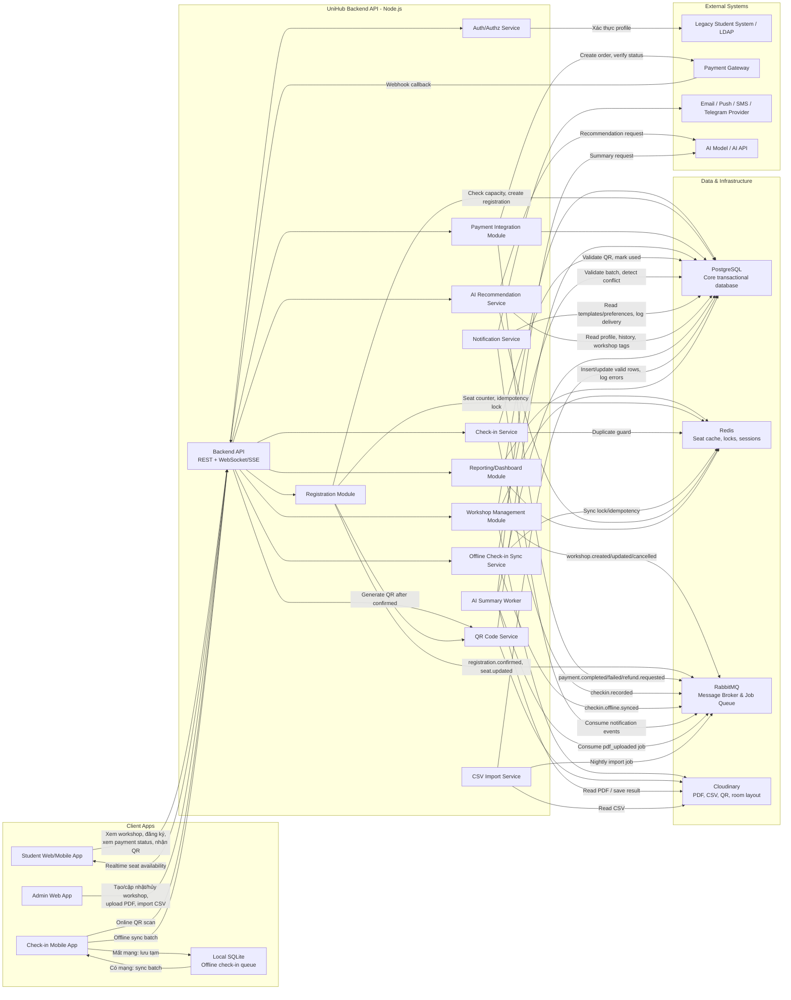

# UniHub Workshop - High-Level Architecture

## 1.1 Mục tiêu kiến trúc

Tài liệu này mô tả kiến trúc tổng quan của hệ thống UniHub Workshop ở mức high-level để nhóm phát triển, giảng viên và stakeholder có cùng cách hiểu về các thành phần chính, dữ liệu đi qua hệ thống và các điểm tích hợp bên ngoài.

Kiến trúc được thiết kế theo hướng thực tế, phù hợp để sinh viên triển khai theo từng giai đoạn:

- MVP có thể triển khai dưới dạng modular monolith bằng Node.js, chia rõ module nghiệp vụ.
- Các module có ranh giới đủ rõ để sau này tách thành service riêng nếu tải tăng.
- Các tác vụ không cần phản hồi ngay như gửi notification, xử lý AI, import CSV và đồng bộ offline được đưa qua queue/job để tăng độ ổn định.
- Dữ liệu giao dịch chính được lưu trong PostgreSQL để đảm bảo toàn vẹn, tránh overbooking và xử lý thanh toán/check-in an toàn.

## 1.2 Các thành phần chính

| Thành phần                           | Vai trò                                                                                                                                                          |
| ------------------------------------ | ---------------------------------------------------------------------------------------------------------------------------------------------------------------- |
| Student Web/Mobile App               | Giao diện cho sinh viên xem danh sách workshop, xem chi tiết, đăng ký miễn phí/có phí, theo dõi trạng thái thanh toán, nhận QR và nhận thông báo.                |
| Admin Web App                        | Giao diện cho ban tổ chức tạo, cập nhật, đổi phòng/giờ, hủy workshop, upload tài liệu, import CSV và xem dashboard.                                              |
| Check-in Mobile App                  | Ứng dụng cho nhân sự check-in quét QR. App hỗ trợ online check-in và offline check-in bằng local database.                                                       |
| Backend API                          | Entry point cho các client. Xác thực request, route đến module nghiệp vụ, áp dụng rate limit, CORS, validation và expose REST/WebSocket/SSE.                     |
| Authentication/Authorization Service | Đăng nhập, xác thực JWT/OAuth2, phân quyền theo vai trò STUDENT, ORGANIZER, CHECKIN_STAFF, ADMIN; tích hợp hệ thống trường/legacy nếu có.                        |
| Workshop Management Module           | Quản lý workshop, phòng, diễn giả, lịch, sức chứa, trạng thái DRAFT/PUBLISHED/CANCELLED, sơ đồ phòng và tài liệu liên quan.                                      |
| Registration Module                  | Xử lý đăng ký workshop miễn phí/có phí, kiểm tra trùng đăng ký, kiểm soát capacity, idempotency và trạng thái registration.                                      |
| Payment Integration Module           | Tạo payment session/order, nhận callback/webhook, xác thực chữ ký, cập nhật trạng thái payment, hỗ trợ reconciliation và refund khi cần.                         |
| QR Code Service                      | Tạo QR token và QR image sau khi registration hợp lệ; QR chỉ chứa token, không chứa dữ liệu nhạy cảm.                                                            |
| Notification Service                 | Nhận event và gửi thông báo qua email, app push, SMS/Telegram nếu cấu hình; có retry, log và template.                                                           |
| AI Recommendation Service            | Gợi ý workshop dựa trên ngành học, sở thích, lịch sử đăng ký, tag workshop và độ phổ biến. Module này không nằm trên luồng transaction đăng ký/thanh toán.       |
| AI Summary Worker                    | Xử lý tài liệu PDF do ban tổ chức upload: extract text, gọi AI model/API để tóm tắt, lưu kết quả vào database.                                                   |
| Offline Check-in Sync Service        | Nhận batch check-in từ app mobile khi có mạng lại, xử lý idempotency, duplicate và conflict.                                                                     |
| CSV Import Service                   | Batch job chạy ban đêm để import dữ liệu từ CSV, validate từng dòng, ghi log lỗi, hỗ trợ chạy lại an toàn. Đây là yêu cầu bổ sung của đề bài hiện tại.           |
| Database                             | PostgreSQL lưu dữ liệu giao dịch chính: users, workshops, registrations, payments, QR tickets, check-ins, notifications, AI data, CSV import logs và audit logs. |
| Cache                                | Redis dùng cho session/token blacklist, cache số chỗ còn lại, distributed lock, rate limit và cache ngắn hạn.                                                    |
| RabbitMQ | Message Broker & Job Queue dùng cho notification, payment events, offline sync, AI jobs, CSV import và reporting. |
| Cloudinary                           | Lưu file PDF, ảnh workshop, sơ đồ phòng, QR image, file CSV import và report export. Hỗ trợ CDN toàn cầu, auto-optimization và xử lý ảnh.                        |
| Legacy System                        | Hệ thống sinh viên hiện hữu hoặc LDAP/SSO của trường, dùng để xác thực hoặc lấy profile sinh viên.                                                               |
| Payment Gateway                      | Cổng thanh toán như VNPay, MoMo, Stripe. Hệ thống chỉ tin webhook/callback đã xác thực chữ ký.                                                                   |
| Email/App Notification Provider      | Dịch vụ gửi email, push notification, SMS hoặc Telegram.                                                                                                         |
| AI Model hoặc AI API                 | LLM/API phục vụ AI summary và AI recommendation. Nếu lỗi, hệ thống core vẫn hoạt động.                                                                           |

## 1.3 High-Level Architecture Diagram

## 1.4 Giải thích luồng dữ liệu

**Dữ liệu workshop**

Ban tổ chức tạo hoặc cập nhật workshop từ Admin Web App. Backend API chuyển request đến Workshop Management Module để validate role, thời gian, phòng, capacity, giá vé và trạng thái. Dữ liệu hợp lệ được lưu vào PostgreSQL. Ảnh, sơ đồ phòng, PDF hoặc file liên quan được lưu vào Object Storage. Khi workshop được công bố, cập nhật, đổi phòng/giờ hoặc hủy, module publish event để Notification Service gửi thông báo và Realtime Seat Service cập nhật UI.

**Dữ liệu đăng ký**

Sinh viên đăng ký từ Student App. Registration Module kiểm tra workshop còn PUBLISHED, chưa hủy, chưa hết hạn đăng ký, sinh viên chưa đăng ký trùng và còn chỗ. Với workshop miễn phí, registration có thể chuyển thẳng sang CONFIRMED trong transaction, sau đó QR Code Service tạo QR ticket. Với workshop có phí, hệ thống tạo registration ở trạng thái PENDING_PAYMENT và tạo payment order; chỉ khi Payment Gateway callback thành công thì registration mới chuyển sang CONFIRMED và QR mới được phát hành.

**Payment callback**

Payment Gateway gửi webhook về Backend API. Payment Integration Module phải xác thực chữ ký, kiểm tra provider_transaction_id, kiểm tra idempotency và ghi log callback. Nếu callback hợp lệ và chưa xử lý, payment được cập nhật thành PAID, registration chuyển sang CONFIRMED, seat hold được commit, QR được tạo và event notification được publish. Nếu callback bị gửi lại, hệ thống trả 200 OK nhưng không xử lý lặp.

**QR code**

QR được tạo sau khi registration đã hợp lệ:

- Workshop miễn phí: tạo ngay sau khi registration CONFIRMED.
- Workshop có phí: tạo sau khi payment webhook hợp lệ xác nhận thanh toán thành công.

QR chỉ chứa token ngẫu nhiên đủ dài, không chứa MSSV, email hoặc dữ liệu nhạy cảm. Khi check-in, backend tra token trong bảng QR ticket để biết registration tương ứng và kiểm tra trạng thái.

**Check-in online**

Check-in Mobile App gửi QR token đến Backend API. Check-in Service validate token, registration, workshop, thời gian và trạng thái QR. Nếu hợp lệ, service tạo checkin_record và đánh dấu QR ticket là USED trong cùng transaction hoặc transaction logic tương đương. Redis lock hoặc unique constraint đảm bảo một QR chỉ check-in thành công một lần.

**Check-in offline và đồng bộ lại**

Trước sự kiện, Check-in Mobile App có thể preload danh sách QR/registration hợp lệ theo workshop. Khi mất mạng, app chỉ validate offline ở mức có thể: định dạng QR, token nằm trong cache, workshop tương ứng. App lưu record vào SQLite với trạng thái PENDING_SYNC và idempotency key. Khi có mạng lại, app gửi batch lên Offline Check-in Sync Service. Backend validate lại theo dữ liệu mới nhất, tạo checkin_records nếu hợp lệ, đánh dấu conflict nếu QR đã dùng hoặc registration không hợp lệ, rồi trả kết quả từng dòng để app cập nhật local status.

**Notification**

Các module nghiệp vụ không gửi email/push trực tiếp. Khi có sự kiện như registration.confirmed, payment.completed, workshop.updated, workshop.cancelled hoặc checkin.recorded, module publish event vào RabbitMQ. Notification Service consume event, đọc template và preference, gửi qua provider phù hợp, ghi log từng lần gửi và retry khi thất bại.

**AI recommendation**

AI Recommendation Service đọc dữ liệu không nhạy cảm hoặc đã được giới hạn quyền: profile học tập cơ bản, ngành học, tag workshop, lịch sử đăng ký/check-in, sở thích sinh viên và metadata workshop. Service có thể gọi AI Model/API để xếp hạng workshop phù hợp. Kết quả được cache ngắn hạn trong Redis và lưu vào ai_recommendations nếu cần audit/hiển thị lại. Nếu AI lỗi, Student App vẫn xem và đăng ký workshop bình thường.

**AI summary từ PDF**

Theo `feature.md`, ban tổ chức upload PDF khi tạo/cập nhật workshop. Workshop Module lưu file vào Object Storage và publish job pdf_uploaded. AI Summary Worker extract text, gọi AI Model/API để tạo tóm tắt, lưu vào ai_summaries. Nếu lỗi, workshop vẫn hiển thị mô tả gốc và trạng thái summary là ERROR/PENDING.

## 1.5 Các điểm tích hợp quan trọng

| Điểm tích hợp                   | Mục đích                                                                                               | Thiết kế đề xuất                                                                                                                                                                                                      |
| ------------------------------- | ------------------------------------------------------------------------------------------------------ | --------------------------------------------------------------------------------------------------------------------------------------------------------------------------------------------------------------------- |
| Legacy System / LDAP            | Xác thực tài khoản trường, lấy MSSV, email, ngành học, lớp.                                            | Tích hợp qua Auth Service. Cache profile ngắn hạn trong Redis/PostgreSQL để giảm phụ thuộc khi legacy chậm. Nếu legacy lỗi, chỉ cho phép các luồng không yêu cầu xác thực mới hoặc dùng profile đã xác minh trước đó. |
| Payment Gateway                 | Thanh toán workshop có phí, refund và reconciliation.                                                  | Tất cả thanh toán đi qua Payment Integration Module. Không tin dữ liệu frontend. Webhook phải verify signature và xử lý idempotent. Lưu payment_callbacks để audit.                                                   |
| AI Model/API                    | Tóm tắt PDF và gợi ý workshop.                                                                         | Gọi bất đồng bộ cho AI summary; gọi đồng bộ có timeout ngắn hoặc cache cho recommendation. AI không được chặn đăng ký/thanh toán/check-in.                                                                            |
| Email/App Notification Provider | Gửi xác nhận đăng ký, QR, nhắc lịch, thay đổi/hủy workshop.                                            | Notification Service dùng channel abstraction. Mỗi event có template, preference, retry và delivery log. Telegram/SMS có thể thêm bằng adapter mới.                                                                   |
| CSV Import                      | Import dữ liệu ban đêm, ví dụ danh sách phòng, workshop, diễn giả hoặc sinh viên từ hệ thống vận hành. | File CSV được đưa vào Object Storage. Scheduler tạo import job. CSV Import Service validate, chạy batch transaction, ghi import log từng dòng, gửi báo cáo cho admin.                                                 |

## 1.6 Rủi ro kiến trúc và cách xử lý

| Rủi ro                                             | Ảnh hưởng                                                     | Cách xử lý                                                                                                                                                       |
| -------------------------------------------------- | ------------------------------------------------------------- | ---------------------------------------------------------------------------------------------------------------------------------------------------------------- |
| Payment callback bị trễ                            | Sinh viên đã thanh toán nhưng app vẫn thấy PENDING_PAYMENT.   | Hiển thị trạng thái đang chờ xác nhận, cho phép app poll payment status. Payment Service có job reconciliation hỏi lại gateway theo chu kỳ.                      |
| Sinh viên thanh toán nhưng hệ thống chưa cập nhật  | Sinh viên không nhận QR ngay, dễ khiếu nại.                   | Lưu payment PENDING, log callback, reconcile theo provider_transaction_id. Nếu gateway xác nhận PAID nhưng QR tạo lỗi, đưa vào job tạo QR lại và cảnh báo admin. |
| Payment callback bị gọi nhiều lần                  | Có thể tạo registration/QR trùng hoặc gửi notification trùng. | Dùng unique provider_transaction_id, payment idempotency key và trạng thái xử lý callback. Duplicate webhook trả 200 OK nhưng không tạo dữ liệu mới.             |
| Workshop hết chỗ trong lúc nhiều sinh viên đăng ký | Overbooking, sai capacity.                                    | Dùng PostgreSQL transaction + row lock hoặc Redis atomic lock/counter kết hợp constraint unique. Source of truth vẫn là PostgreSQL.                              |
| Check-in offline bị trùng dữ liệu                  | Một QR được scan nhiều lần trên một hoặc nhiều thiết bị.      | Mỗi offline scan có idempotency key. Backend có unique constraint theo qr_ticket_id và conflict log. App hiển thị conflict sau sync.                             |
| QR bị scan nhiều lần                               | Ghi nhận tham dự sai.                                         | QR ticket có trạng thái ACTIVE/USED/CANCELLED/EXPIRED. Check-in thành công phải update USED atomically. Scan lại trả trạng thái ALREADY_CHECKED_IN.              |
| AI service lỗi                                     | Không có recommendation hoặc summary.                         | AI là module phụ trợ. Có timeout, retry, cache kết quả cũ và fallback hiển thị danh sách workshop bình thường hoặc mô tả gốc.                                    |
| Legacy system không phản hồi                       | Không xác thực/lấy profile được.                              | Cache profile đã xác minh, timeout ngắn, circuit breaker, retry nền. Với user mới, báo lỗi rõ và cho phép thử lại.                                               |
| Notification gửi thất bại                          | Sinh viên không nhận xác nhận/thay đổi lịch.                  | Queue notification, retry theo exponential backoff, ghi notification_deliveries, fallback kênh khác nếu user bật nhiều kênh.                                     |
| CSV import lỗi giữa chừng                          | Dữ liệu cũ có thể bị hỏng hoặc import dở.                     | Dùng import job idempotent, staging validation, batch transaction, import log từng dòng. Không commit dòng lỗi; không xóa dữ liệu cũ nếu job fail.               |
